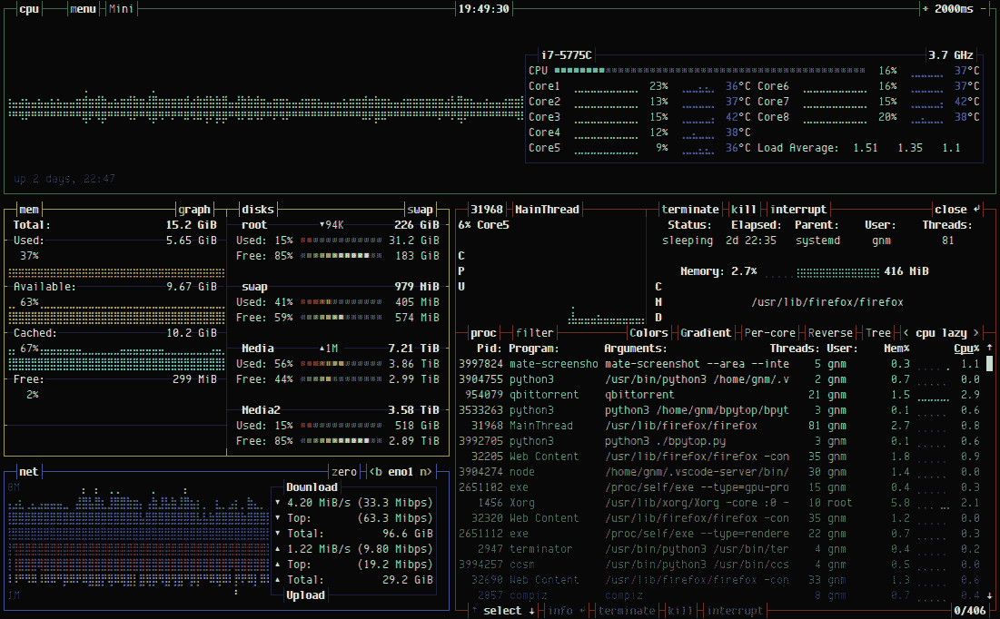
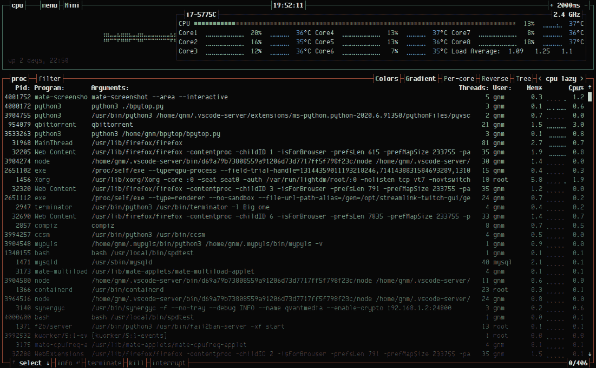
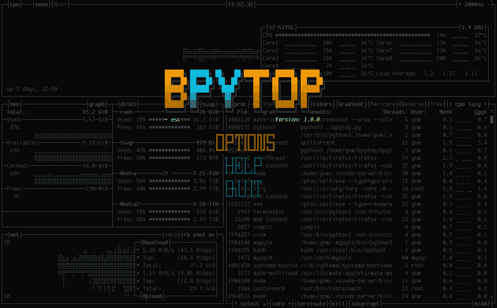
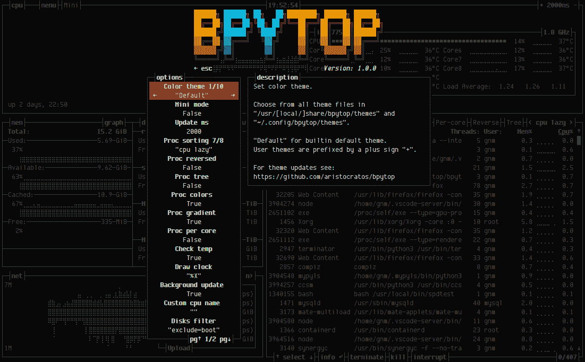

# BPYTOP : Linux/OSX/FreeBSD 资源监视器

> 原文：<https://kalilinuxtutorials.com/bpytop-linux-osx-freebsd-resource-monitor/>

BPYTOP 是一个资源监视器，显示处理器、内存、磁盘、网络和进程的使用情况和统计数据。

**特性**

*   易于使用，具有游戏灵感的菜单系统。
*   完全的鼠标支持，所有带有高亮键的按钮都是可点击的，鼠标滚动在进程列表和菜单框中工作。
*   快速和响应的用户界面与向上，向下键过程选择。
*   用于显示所选流程的详细统计数据的功能。
*   能够过滤流程，可以输入多个过滤器。
*   在排序选项之间轻松切换。
*   将 SIGTERM，SIGKILL，SIGINT 发送到选定的进程。
*   用于更改所有配置文件选项的 UI 菜单。
*   网络使用的自动缩放图。
*   如果有新版本，在菜单中显示消息
*   显示磁盘的当前读写速度

**主题**

Bpytop 使用与 bashtop 相同的主题文件，因此为 bashtop 创建的任何主题都可以工作。

查看[主题](https://github.com/aristocratos/bpytop/tree/master/themes)文件夹中的可用主题。

`**make install**`命令将默认主题放在`**/usr/local/share/bpytop/themes**`中。如果和`pip3`一起安装，主题将位于 python3 的 site-packages 文件夹中一个名为`**bpytop-themes**`的文件夹中。用户创建的主题应放置在 **`$HOME/.config/bpytop/themes`。**

让我知道你是否想贡献新的主题。

**先决条件**

**Mac Os X**

将无法在标准终端中正确显示！推荐的备选方案 [iTerm2](https://www.iterm2.com/)

也需要以超级用户身份运行，以显示不属于用户的进程的统计信息。

**Linux、Mac Os X 和 FreeBSD**

为了正确显示，终端支持:

*   24 位真彩色([参见支持真彩色的终端列表](https://gist.github.com/XVilka/8346728))
*   宽字符(在基于网络的终端中有时会有问题)

还需要 UTF8 语言环境和涵盖以下内容的字体:

*   Unicode 块“盲文图案”U+2800–U+28FF
*   Unicode 块“几何形状”U+25a 0–U+25FF
*   Unicode 块“制表符”和“块元素”U+2500–U+259 f

**通知**

Dropbear 似乎无法设置正确的区域设置。所以如果通过 ssh 访问 bpytop，推荐使用 OpenSSH。

**依赖关系**

*   **[Python3](https://www.python.org/downloads/)** (v3.6 或更高版本)
*   **[psutil 模块](https://github.com/giampaolo/psutil)** (v5.7.0 或更高版本)

**附加统计选项**

(可选 OSX)**[OS x-cpu-temp](https://github.com/lavoiesl/osx-cpu-temp)**需要显示 CPU 温度。

**截图**

*   **显示所选流程详情的主界面。**

*   **迷你模式下的主界面**

*   **主菜单**

*   **选项菜单**

**安装**

*   **PyPi(将始终拥有最新版本)**
*   **安装或更新至最新版本**

**pip3 安装 bpytop–升级**

*   **Arch Linux**

在 AUR 上市的名称为`**bpytop.git**`

[https://aur.archlinux.org/packages/bpytop/](https://aur.archlinux.org/packages/bpytop/)

*   **基于 Debian 的**

适用于 debian/ubuntu，来自 Azlux 的库

*   **FreeBSD 软件包**

在 [FreeBSD 端口](https://www.freshports.org/sysutils/bpytop/)中可用

安装预构建的包

**sudo pkg 安装 bpytop**

**Fedora/CentOS 8 套装**

[在 Fedora 和](https://src.fedoraproject.org/rpms/bpytop) [EPEL-8 资源库](https://fedoraproject.org/wiki/EPEL)中可用。

**安装**

**sudo dnf 安装 bpytop**

**抓包**

作者@kz6fittycent

[https://github.com/kz6fittycent/bpytop-snap](https://github.com/kz6fittycent/bpytop-snap)

*   **安装软件包**

sudo 管理单元安装 bpytop

*   **赋予权限**

sudo 卡扣连接 bpytop:mount-observe
sudo 卡扣连接 bpytop:network-control
sudo 卡扣连接 bpytop:hardware-observe
sudo 卡扣连接 bpytop:system-observe
sudo 卡扣连接 bpytop:process-control
sudo 卡扣连接 bpytop:physical-memory-observe

配置文件夹将位于`**~/snap/bpytop/current/.config/bpytop**`中

**手动安装**

*   **依赖安装 Linux**
    *   用您选择的包管理器安装 python3 和 git
    *   安装 psutil python 模块(可能需要 sudo)

**python3 -m pip 安装程序**

*   **依赖安装 OSX**
    *   如果尚未安装，请安装自制软件

**/bin/bash-c " $(curl-fsSL https://raw . githubusercontent . com/home brew/install/master/install . sh)"**

*   **如果尚未安装 python3，则安装 python 3**

brew 安装 python3 git

*   **安装 psutil python 模块**

**python3 -m pip 安装程序**

*   **安装可选的依赖关系 osx-cpu-temp**

**brew 安装 osx-cpu-temp**

*   **依赖项安装 FreeBSD**
    *   用 pkg 和 pip 安装

**sudo pkg 安装 git python3 py37-psutil**

*   **手动安装 Linux、OSX 和 FreeBSD**
    *   克隆并安装

**git 克隆 https://github.com/aristocratos/bpytop.git
CD bpytop
sudo make 安装**

*   要卸载它

**sudo make 卸载**

**命令行选项**

**用法:** bpytop [argument]

**参数:**
-f，–在完全模式下完全启动，显示所有框[默认]
-p，–在最小模式下启动，不显示内存和网络框
-s，–在最小模式下启动，不显示进程框
-v，–版本显示版本信息并退出
-h，–帮助显示此帮助消息并退出
–调试启动，日志级别设置为调试覆盖配置中设置的值

[**Download**](https://github.com/aristocratos/bpytop)