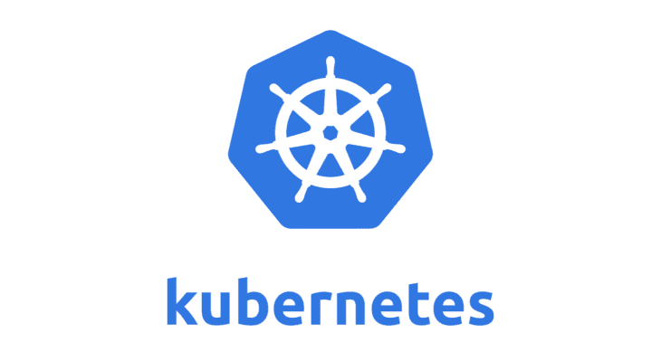

# 部署和保护 Kubernetes 集群

> 原文：<https://kalilinuxtutorials.com/deploying-securing-kubernetes-clusters/>

Kubernetes 是一个开源平台，允许您管理容器中的工作负载。这使您能够清楚地了解 Kubernetes 集群的状态，以及它如何对配置进行更改，以管理诸如自动回滚和转出、负载平衡、自我修复等元素。

这篇文章介绍了如何部署 Kubernetes 并确保集群的安全性。

## **部署 Kubernetes**

在部署 Kubernetes 时，有几种方法可以考虑，包括公共云、内部部署和裸机部署。Kubernetes 被创建为易于移植，以便您可以在迁移工作负载的同时轻松地进行切换。

随着 Kubernetes 的使用越来越多，组织发现公共云系统的提供商正在提供特定的 Kubernetes 管理服务。这使得您的 Kubernetes 控制平面更容易频繁更新。

话虽如此，这可能是一个昂贵的选择，因为用户经常每小时为服务付费。这也意味着你对 Kubernetes 的特定元素的总体控制力较弱。

由于 Kubernetes 的灵活性，这对一些人来说可能是一个主要的不利因素。这是一个旨在使用广泛的可定制功能的系统。这也是增加安全风险的因素之一，因为您必须确保保护您的集群。

因此，任何工程师都必须知道任何攻击点和更易受攻击的区域，以便他们可以更安全地部署您的 Kubernetes。

## **保护 Kubernetes 集群**

由于当涉及到集群时，有如此多的元素需要关注，所以您必须确保知道当它们相互接触时应该如何配置。这是用户容易犯错误的地方，也是容易遭受攻击的地方。

有了这么多的配置方面，就有了更多的错误配置和漏洞的空间。这是一个部署 Kubernetes security 的领域，由于越来越多的人使用它，这个领域最近才为人所知。

另一方面，开放系统意味着用户可以完全控制所有方面，并更深入地了解所有配置的工作原理。当 IT 工程师在没有更深层次的理解的情况下部署这项技术时，主要问题就出现了，这会产生更多的风险。

**更新您的软件**

要考虑的一个主要因素是为正在运行的集群更新软件的频率。由于活动集群上使用的软件版本已经过时，攻击者通常会找到侵入易受攻击区域的方法。

因此，防止这个问题的一个简单的步骤是保持在更新的顶部。这也意味着确保 Kubernetes 也是最新的，因为他们经常发布更新。由于 Kubernetes 提供了许多可定制的功能，这可能是一项令人厌倦的任务，但当涉及到补丁等方面时，您可以在 CI/CD 管道中创建自动化流程。

当使用云提供商进行部署时，您可能会发现这些软件更新已经为您完成了。并非所有的云提供商都提供这项服务，因此，请务必检查您选择的提供商是否注意到这一点，以及更新的频率。

**活动容器应用**

当容器应用程序与群集一起运行时，它会为攻击者提供访问应用程序中易受攻击区域的机会。因此，在 CI/CD 管道中创建容器时，应该使用容器注册表。这是一种执行扫描以识别易受攻击的区域的方法。

为了防止易受攻击的容器被自动部署，请确保您的策略是在 CI/CD 管道中创建的。这使您可以在部署有漏洞的容器应用程序之前对其进行必要的修补。

**控制配置**

API 请求是用来控制 Kubernetes 的，它是攻击者获得访问权限必须克服的第一道屏障。因此，您必须控制谁可以访问您的 Kubernetes 平台。

更进一步，您还可以为某些用户设置配置，使其只能执行某些操作。

**名称空间**

通过使用名称空间，可以更好地分隔应用程序。这些命名空间使您能够在运行的不同应用程序之间创建更多的分离。因此，您可以使用不同的策略，专门针对各种活动的应用程序来提高其安全性。

**传输层安全**

传输层安全性(TLS)可用于管理集群内不同服务的通信。TLS 非常适合将所有流量加密作为默认设置。

在部署 Kubernetes 集群之前启用 TSL 对于提高其在传输期间和活动时的安全性至关重要。

**Pod &网络安全策略**

当涉及到集成安全设置时，Pod 安全策略对服务帐户和用户进行了限制。这有助于阻止未经授权的用户以特权或根模式运行容器，在这种模式下，攻击者更容易到达主机卷。

因此，建议您创建应用程序时，让用户可以在非根模式下运行它们。安全策略允许集群管理员设置这些规则。

您可以将网络策略与名称空间集成，并使集群管理员能够限制应用程序之间的流量。这个系统就像是在你的容器之间安装的防火墙。

当网络策略被集成到命名空间中时，所有进入的流量都被默认拒绝。这使您可以更好地控制进入的流量类型，因为您可以手动启用应用程序之间的流量。

当涉及到云平台时，最好使用网络策略，因为它可以确保对容器和数据的访问受到限制。

## **结论**

既然您对部署和保护 Kubernetes 集群时经常出现的潜在风险和错误有了更多的了解，您就可以完全避免这些问题了。您可以实现本文中提到的各种技巧，并以适合您的特定应用程序的方式应用它们。