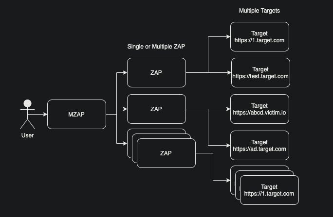
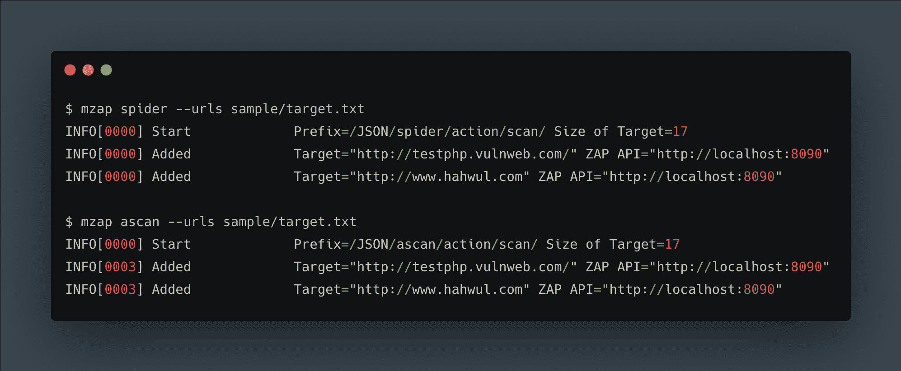
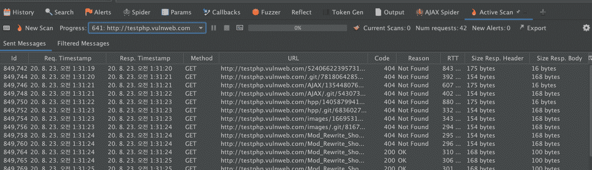

# MZAP:多目标 ZAP 扫描

> 原文：<https://kalilinuxtutorials.com/mzap/>

**MZAP** 是一个多目标 ZAP 扫描/ mzap 是一个在 ZAP 中扫描 N*N 的工具。

**概念**

**安装**

*   **go-get**

**$ go get-u github.com/hahwul/mzap**

*   **snapcraft**

**$ sudo snap install mzap–devmode**

*   **自制**

**$ brew tap hahwul/mzap
$ brew install mzap**

**用途**

**用法:**
mzap【命令】

可用命令:
ajaxspider 添加 AjaxSpider ZAP
ascan 添加 ActiveScan ZAP
帮助帮助关于任何命令
spider 添加 ZAP spider
停止扫描
版本显示版本

**标志:**
–apikey 字符串 ZAP API Key /如果禁用 API Key，则不使用此选项【T18

$ mzap spider–URLs sample/Target . txt
INFO[0000]Start Prefix =/JSON/spider/action/scan/Size of Target = 17
INFO[0000]Added Target = " http://testphp . vulnweb . com/" ZAP API = " http://localhost:8090"
INFO[0000]Added Target = " http://www . hah wul . com " ZAP API = " http://local

[**Download**](https://github.com/hahwul/mzap)