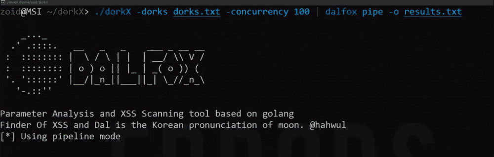
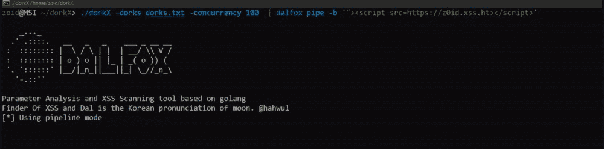

# DorkX:使用 Google Dork Scanner 管理不同的工具

> 原文：<https://kalilinuxtutorials.com/dorkx/>

**DorkX** 用 google dork Scanner 管道不同的工具。

**安装**

zoid@MSI ~/dorkX> git 克隆 https://github.com/ethicalhackingplayground/dorkX
zoid @ MSI ~/dorkX>CD dorkX
zoid @ MSI ~/dorkX>去构建 dorkx.go
zoid@MSI ~/dorkX >去构建 corsx.go
zoid@MSI ~/dorkX >去构建 csrfx.go
zoid@MSI ~/dorkX >去构建 zin.go

**用途**

*   **盲人 XSS**

zoid@MSI ~/dorkX >。/dorkX-dorks dorks . txt-concurrency 100 | dal fox pipe-b ' " > '

*   **XSS**

zoid@MSI ~/dorkX >。/dorkX-dorks dorks . txt | dalfox pipe
zoid @ MSI ~/dorkX>。/dorkx -dork "inurl:index.php？id" |达尔福克斯管道

*   **Cors**

zoid@MSI ~/dorkX >。/dorkx -dorks dorks.txt |。/corsx
zoid@MSI ~/dorkX >。/dorkx -dork "inurl:index.php？id" |。/corsx

*   **CSRF**

zoid@MSI ~/dorkX >。/dorkx -dorks dorks.txt |。/csrfx
zoid@MSI ~/dorkX >。/dorkx -dork "inurl:index.php？id" |。/csrfx

*   **有效载荷注入**

zoid@MSI ~/dorkX >。/dorkx -dorks dorks.txt |。/zin -pL
zoid@MSI ~/dorkX >。/dorkx -dork "inurl:index.php？id" |。/津-p

[**Download**](https://github.com/ethicalhackingplayground/dorkX)