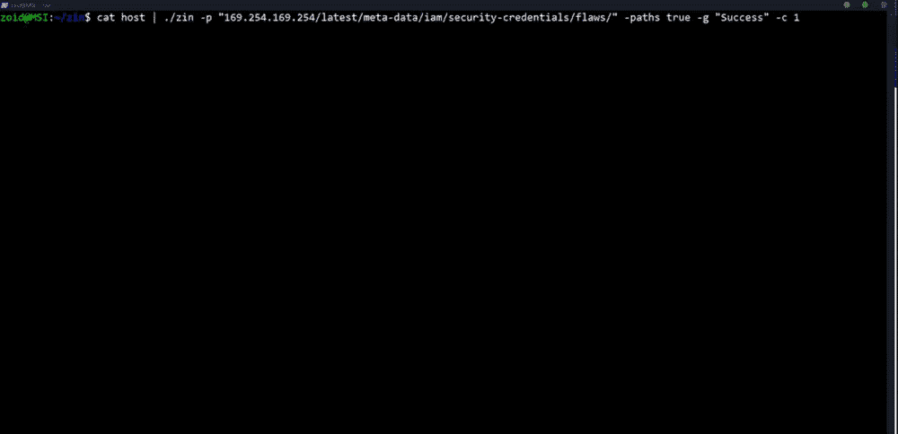

# Zin:一个用 Go 编写的 Bugbounties 的有效载荷注入器

> 原文：<https://kalilinuxtutorials.com/zin/>

**Zin** 是用 Go 写的 Bugbounties 的有效载荷注入器。

**特性**

*   将多个有效负载注入所有参数
*   将单个有效负载注入所有参数
*   将响应保存到输出文件夹中
*   显示状态代码和响应长度
*   能在回应中寻找模式
*   非常快
*   易于设置

**安装**

`**$ go get -u github.com/ethicalhackingplayground/Zin**`

**新功能**

*   响应中的模式匹配
*   匹配状态代码

**自变量**

**愿奖金到来**
-c int
并发性(默认为 20)
-g string
grep 任何匹配的响应
-p string
要使用的有效载荷
-pL string
要使用的有效载荷列表
-s int
按状态代码过滤(默认为 200)

*   **SSRF 例子**

**$ sub finder uber.com | gau | grep " = http " | Zin-c 80-p http://10 . 82 . 214 . 84:31386/foobar . js-g " SUP3R _ s 3c ret _ 1337 _ K3y "**

*   **XSS 例子**

**$ sub finder uber.com | gau | Zin-c80-p ' "><脚本>警戒(matchforthis)脚本> ' -g "matchforthis"**

*   **注入多个有效载荷**

**$ cat hosts | gau | grep "&" | Zin-c80-pL<payloadfile>**

*   **子域扫描**

**$ sub finder-dL domains–silent | gau | Zin-c80-p<有效载荷>**

*   **仅测试参数**

**$ echo“Google . com”| gau | grep”&“| Zin-c 80-p”>“T4”脚本>alert(match this)</脚本<”-g“match this”**

*   **多个主机**

**$ cat hosts | gau | Zin -c 80 -p <有效载荷>**

[**Download**](https://github.com/ethicalhackingplayground/Zin)