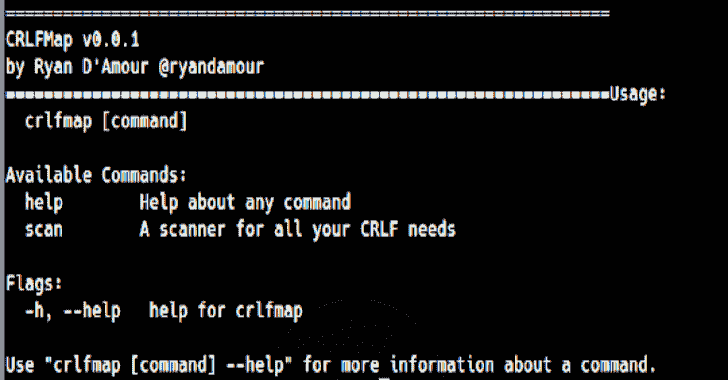

# CRLFMap 一个发现 HTTP 分裂漏洞的工具

> 原文：<https://kalilinuxtutorials.com/crlfmap/>

**CRLFMap** 是一款发现 HTTP 分裂漏洞的工具。

**为什么？**

*   我想用 Golang 编写一个并发工具
*   我希望能够模糊的参数和路径

**安装**

**去得到 github . com/ryandamour/CRL FMP**

**帮助**

**可用命令:**
帮助关于任何命令的帮助
扫描一台扫描仪以满足您的所有 CRLF 需求

**标志:**
-h，–帮助 crlfmap 的帮助

**扫描使用情况**

crlfmap scan–Domains Domains . txt–Output results . txt
**—————————————
v 0 . 0 . 1
——————————————**
::Domains:Domains . txt
::Payloads:Payloads . txt
::Threads:1【t8tLinux x86 _ 64)AppleWebKit/537.36(KHTML，像壁虎一样)Chrome/81 . 0 . 4044 . 138 Safari/537.36
::time out:10
::Delay:0
——————————————————————————————————————————————————————————
[+]http://localhost:3000

[**Download**](https://github.com/ethicalhackingplayground/crlfmap)