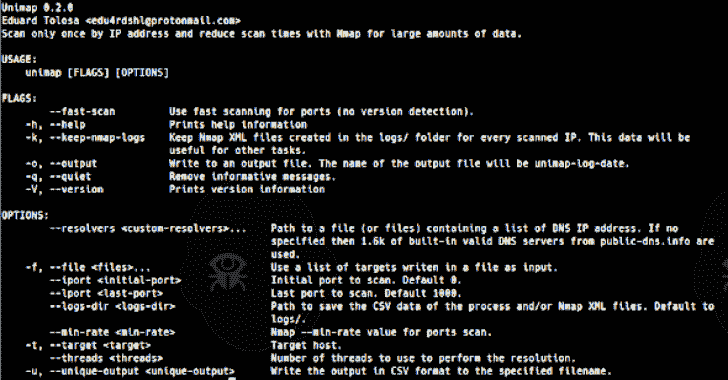

# Unimap:仅通过 IP 地址扫描一次

> 原文：<https://kalilinuxtutorials.com/unimap/>

通过 IP 地址仅扫描一次，并使用 **Nmap** 减少大量数据的扫描时间。 **Unimap** 是“**唯一 Nmap *扫描*** ”的缩写。该工具可以运行在 Linux，OSX，Windows 或 Android (Termux)没有问题。

**为什么？**

如果您计划对整个组织运行 Nmap，您需要考虑到肯定会有几十个、几百个甚至几千个子域指向同一个 IP 地址，并且会有一个点，在这个点上继续扫描几乎是不可能的。此外，您的 IP 可能会由于对同一远程主机地址的多次扫描而被阻止。

**如何？**

Unimap 使用自己的技术来初步解析所有子域的 IP 地址，一旦该过程完成，它将创建一个具有唯一 IP 地址的向量，并根据用户配置的线程数使用 Nmap 启动并行扫描，同时，它将分析使用 Nmap 创建的文件中的数据，以找出每个 IP 对应的信息。最后，Unimap 将与子域相关联的每个 IP 的信息关联起来。例如，如果您有 50 个指向同一个 IP 的子域，您将只进行一次 Nmap 扫描，但您将同时拥有与每个子域相关联的所有数据，在大型扫描中，这将节省数天或数周的时间。

**安装**

您需要在计算机中安装 Rust 和 Nmap，然后运行:

*   从[板条箱安装到](https://crates.io)。
*   或者

**1。git 克隆 https://github.com/Edu4rdSHL/unimap.git&&CD unimap**
#或者你可以从 https://github.com/Edu4rdSHL/unimap/releases/latest 下载一个版本
#解压后继续下一步。
2**。货物建造——发布**
#现在二进制文件已经完成。/target/release/unimap

**用途**

**Unimap 需要 root/管理员权限才能启动 [Nmap TCP SYN (Stealth)扫描](https://nmap.org/book/synscan.html)，我们使用它是出于准确性和性能原因。**如果您使用的是 Linux 或基于 Linux，只需使用 root shell 或使用 sudo 运行该工具，在 Windows 中，您可以以管理员身份打开命令提示符(CMD)并照常运行该工具。

*   标志不需要/接受值。

| 旗 | 描述 |
| --- | --- |
| –快速扫描 | 对端口使用快速扫描(无版本检测)，只扫描前 1000 个端口。 |
| -o，–输出 | 写入输出文件。输出文件的名称将是 unimap-log-$date。 |
| -k，-keep-nmap-logs | 为每个扫描的 IP 保存在日志/文件夹中创建的 Nmap XML 文件。这些数据将对其他任务有用。 |

*   选项需要值。

| [计]选项 | 描述 |
| --- | --- |
| –解析器 | 包含 DNS IP 地址列表的文件的路径。如果没有指定，则使用 public-dns.info 中的 1.6k 内置有效 DNS 服务器。 |
| -f，–文件 | 使用写在文件中的目标列表作为输入。 |
| -type-类型 | 如果要扫描自定义范围，请选择初始端口。 |
| lport | 最后一个端口，如果你想扫描一个自定义范围。 |
| –logs-dir | 保存流程 CSV 数据的路径。使用-o 选项进行自动扫描时非常有用。 |
| –最低速率 | 控制[Nmap–最小速率](https://nmap.org/book/man-performance.html)。默认为 30000。 |
| 目标 | 主机，如果您只想扫描一个并提取感兴趣的数据。 |
| –螺纹 | 线程数量。**请记住，相同数量的 Nmap 扫描将在。**默认为 30。 |
| -u，–唯一输出 | 将输出写入指定的文件名。 |

**例题**

1.  `**unimap -f targets.txt -u log.csv**`执行完全扫描，并将输出写入 log.csv。
2.  `**unimap -f targets.txt --fast-scan -o**`执行快速扫描并将日志文件保存到日志/文件夹。
3.  `**sudo unimap -f targets.txt --iport 1 --lport 1000 --min-rate 1000**`扫描 1-1000 的端口，检测服务和版本(如果您想要快速扫描，请使用–fast-scan 标志),安民速率为 1000。

**注意事项**

*   Unimap 预先配置为在更快的网络(云 VPS)上运行，如果您在没有太大容量的家庭网络中运行扫描，您将最终与网络断开连接。
*   这并不意味着你不能在家里使用 Unimap，只需调整`--threads`和`--min-rate`的数量(这是最重要的)。
*   我们不以任何方式包装 Nmap 或自行扫描端口，我们使用正确的 Nmap 选项来获得最佳性能，Nmap 是目前存在的速度更快的端口扫描器。
*   我们解析 Nmap 输出数据，为您提供更容易理解的输出，同时防止您多次扫描同一个 IP，**这是我们的主要目标**。

[**Download**](https://github.com/Edu4rdSHL/unimap)