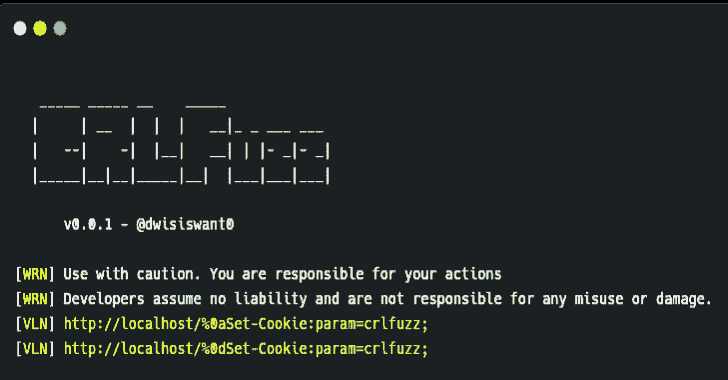

# CRLFuzz:一个用 Go 编写的快速扫描 CRLF 漏洞的工具

> 原文：<https://kalilinuxtutorials.com/crlfuzz/>

[](https://1.bp.blogspot.com/-Q1K2M1RgaRA/X2r6xDOnfRI/AAAAAAAAHnE/4i-lYHXtg5gQsGHg0W5tbNKgLPO-6lH9wCLcBGAsYHQ/s728/CRLFuzz%25281%2529.png)

CRLFuzz 是一个用 Go 编写的快速扫描 CRLF 漏洞的工具。

**安装**

*   **来自二进制**

安装很容易。你可以从[发布页面](https://github.com/dwisiswant0/crlfuzz/releases)下载一个预构建的二进制文件，解压并运行！或与

curl-sSfL https://git.io/crlfuzz | sh-s—-b/usr/local/bin

*   **来源于**

如果您安装并配置了 go1.13+编译器:

**go 111 module = on go get-v github.com/dwisiswant0/crlfuzz/cmd/crlfuzz**

为了更新工具，你可以使用`-u`标志和 go get 命令。

*   **来自 GitHub**

**git 克隆 https://github . com/dwisiswant 0/CRL fuzz
CD CRL fuzz/cmd/CRL fuzz
go build。
mv crlfuzz /usr/local/bin**

**用途**

*   **基本用法**
    *   简单地说，CRLFuzz 可以通过以下方式运行:

**crlfuzz -u "http://target"**

*   **标志**

**crlfuzz -h**

这将显示该工具的帮助。这里是它支持的所有开关。

| 旗 | 描述 |
| --- | --- |
| -u，–URL | 定义要模糊的单个 URL |
| -l，-列表 | 模糊文件中的 URL |
| -X，–方法 | 指定使用*(默认:GET)* 的请求方法 |
| -o，–输出 | 保存结果的文件 |
| -d，–数据 | 定义请求数据 |
| -H，–标题 | 将自定义标题传递给目标 |
| -x，–代理 | 使用指定的代理来模糊 |
| -c，–并发 | 设置并发级别*(默认:25)* |
| -s-无声 | 无声模式 |
| -v，–详细 | 详细模式 |
| -V，-版本 | 显示当前 CRLFuzz 版本 |
| 救命啊 | 显示它的帮助 |

*   **目标**

您可以用 3 种方式定义目标:

*   **单一网址**

**crlfuzz -u "http://target"**

*   **列表中的 URLs】**

**crlfuzz-l/path/to/URLs . txt**

*   **来自标准输入**

以防你想用其他工具锁住。

```
subfinder -d target -silent | httpx -silent | crlfuzz
```

*   **方法**

默认情况下，CRLFuzz 使用`GET`方法发出请求。如果你想改变它，你可以使用`-X`标志。

**crlfuzz-u " http://target "-X " GET "**

*   **输出**

您也可以将模糊化结果保存到带有`-o`标志的文件中。

**crlfuzz-l/path/to/URLs . txt-o/path/to/results . txt**

*   **数据**

如果您想使用 POST 发送数据请求，请删除。补丁或者其他方法，只需要使用`-d`标志即可。

**crlfuzz-u " http://target "-X " POST "-d " data = body "**

*   **添加标题**

你可能想使用自定义标题来添加 cookies 或其他标题部分。

**crlfuzz-u " http://target "-H " Cookie:…"-H "用户代理:…"**

*   **使用代理**

使用代理时，可以用前缀`protocol://`指定代理字符串，以指定替代的代理协议。

**crlfuzz-u " http://target "-x http://127 . 0 . 0 . 1:8080**

**并发**

并发是同时 fuzzing 的数量。CRLFuzz 提供的默认值是`25`，您可以使用`-c`标志来更改它。

**crlfuzz-l/path/to/URLs . txt-c 50**

*   **无声**

如果你用`-s`标志激活这个静默模式，你只会看到易受攻击的目标。

**crlfuzz-l/path/to/URLs . txt-s | tee vuln-URLs . txt**

*   **啰嗦**

与静默模式不同，如果`-v`标志出现错误，它将显示错误详细信息。

**crlfuzz-l/path/to/URLs . txt-v**

*   **版本**

用`-V`标志显示当前版本的 CRLFuzz。

**crlfuzz -V**

*   **图书馆**

可以把 CRLFuzz 当库用。

**package main
import(
" fmt "
" github . com/dwisiswant 0/crlfuzz/pkg/crlfuzz "
)
func main(){
target:= " http://target "
method:= " GET "
//生成一个有潜在 CRLF 漏洞的 URL
for _，url := range crlfuzz。GenerateURL(target) {
//扫描目标
vuln，err := crlfuzz。Scan(url，method，""，[]string{}，" ")
if err！= nil {
panic(err)
}
if vuln {
fmt。Printf("VULN！%s\n "，网址)
}
}
}**

[**Download**](https://github.com/dwisiswant0/crlfuzz)