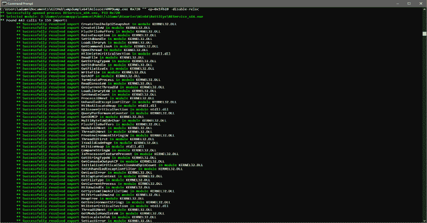
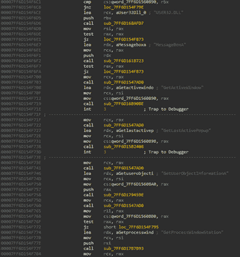
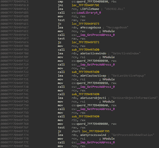

# VMPDump:一个动态 VMP 转储器和导入修复程序

> 原文：<https://kalilinuxtutorials.com/vmpdump/>

VMPDump 是一个动态 VMP 转储和进口固定器，由 VTIL 提供动力。适用于 VMProtect 3。X x64。

**前 vs 后**

**用途**

【VMPDump.exe`<Target PID>``"<Target Module>"``[-ep=<Entry Point RVA>]``[-disable-reloc]`

**论据**:

*   `<Target PID>`:目标进程的 ID，十进制或十六进制。
*   `<Target Module>`:应该被转储和修复的模块的名称。如果需要流程图像模块，这可以是空字符串(" ")。
*   `[-ep=<Entry Point RVA>]`:可选提供的入口点 RVA，十六进制形式。VMPDump 只是用这个值覆盖可选头中的入口点。
*   `[-disable-reloc]`:一个可选设置，指示 VMPDump 在输出映像中标记 relocs 已被剥离，强制映像加载到转储的 ImageBase。如果需要可运行的转储，这很有用。

在运行 VMPDump 之前，必须在目标进程中完成 VMProtect 初始化和解包。这意味着它必须处于或超过 OEP(原始入口点)。被转储和修复的图像将出现在过程图像模块目录中，名称为 **`<Target Module Name>.VMPDump.<Target Module Extension>`。**

它是如何工作的？

VMProtect 为每个导入调用或 jmp 注入存根。这些存根解析`.vmpX`部分中的“模糊”thunk，并添加一个固定常数来“消除”它。然后用 ret 指令分派调用或跳转本身。

VMPDump 扫描所有可执行部分来查找这些存根，并使用 VTIL x64 提升程序将它们提升到 VTIL。然后对这些存根进行分析，以确定哪种调用必须被替换，哪些字节必须被覆盖。

一旦检索到所有调用，VMPDump 就会创建一个新的导入表，并将 thunks 附加到现有的 IAT 中。对 VMP 导入存根的调用被替换为对这些 thunks 的直接调用。

注意，在变异的例程中，有时没有足够的字节来用直接的 thunk 调用替换 VMP 导入存根调用，因为后者要大 1 个字节。在这些情况下，该部分被扩展，并注入一个跳转到导入 thunk 的存根。然后，VMP 导入存根调用被替换为对所述注入存根的 5 字节相对调用或 jmp。

**大楼**

在 VS 中构建就像在 vcxproj 中将 include/library 目录替换为 VTIL-native liers/VTIL-Core/Keystone/Capstone 一样简单。

这个项目需要 C++20。

**问题&限制**

由于代码段是线性扫描的，特别是在高度变异和混乱的代码中，一些导入存根调用可以被跳过，因此无法解析。但是，VMPDump 包含了大多数 VMProtect 变异不一致的解决方法，因此即使在变异严重的代码中，它也应该会产生不错的结果。

如果您遇到这种情况，请将相关信息做成一个问题，我会看一下。

[**Download**](https://github.com/0xnobody/vmpdump)