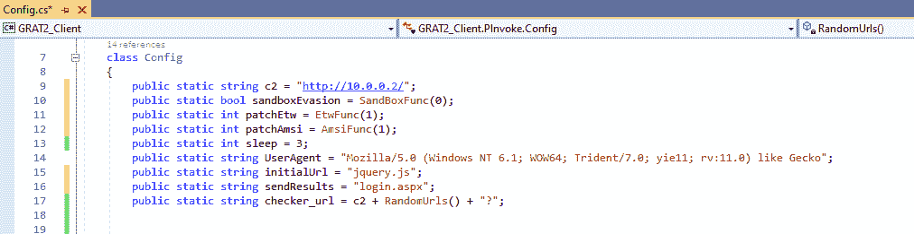
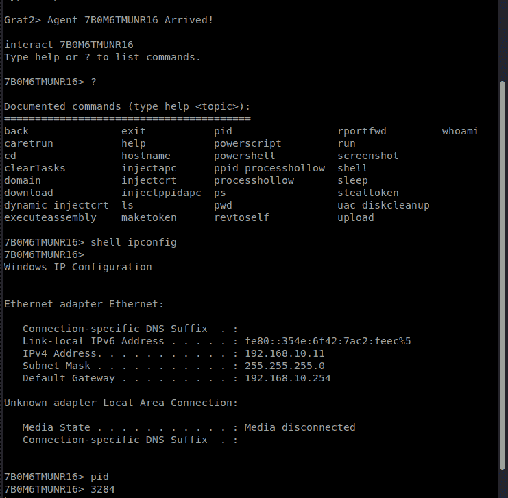

# GRAT2:用于学习目的的指挥和控制(C2)项目

> 原文：<https://kalilinuxtutorials.com/grat2/>

[ Project For Learning Purpose")](https://1.bp.blogspot.com/-FAj1sSJtyPo/X2ujmJhDJXI/AAAAAAAAHoo/9luKmx-gcKs2qh5HdQDjPz71NhJfrWtyQCLcBGAsYHQ/s728/GRAT2-2%25281%2529.png)

**GRAT2** 是一个用 python3 编写的命令和控制(C2)工具，客户端用。NET 4.0。主要的想法来自发起这个项目的[圣乔治·库米图](https://www.linkedin.com/in/georgios-koumettou/)。

**我们为什么开发 GRAT2？**

我们知道有许多 C2 工具，但是，我们开发这个工具是出于对 C2 和其他规避技术如何工作的好奇。仅此而已！😉

**当前特征**

*   **闪避技巧:**
    *   沙箱(检查机器是否在域中，如果不在则退出)。
    *   Windows (ETW)日志记录的修补程序事件跟踪。
    *   修补反恶意软件扫描界面(AMSI)。
    *   care trun–使用 explorer.exe 作为父 PID，通过 cmd.exe 以脱字符格式(^i^p^c^o^n^f^i^g)执行命令(避开一些 av/edr)。
*   **通信:**
    *   使用 XOR 和 base64 编码的 HTTP 通信。
    *   代理感知。
*   **模块:**
    *   **uac**–尝试使用带有父 PID 欺骗技术的静默磁盘清理来绕过 UAC。
    *   **make token**–删除当前令牌，并使用给定的凭证(域或本地)创建一个新令牌。
    *   **revtoself**–移除当前令牌。
    *   **steal token**–试图从正在运行的进程中窃取令牌并冒充用户(需要管理员权限)。
    *   **rportfwd**–尝试创建反向端口转发。
    *   **whoami**–显示当前用户。
    *   **主机名**–显示机器主机名。
    *   **域**–显示域 FQDN。
    *   **截图**–截图。
    *   **下载**–下载一个文件。
    *   **上传**–上传文件。
    *   **CD**–更改目录。
    *   **运行**–使用 explorer.exe 作为父 PID，通过 cmd.exe 执行命令。
    *   使用 explorer.exe 作为父 PID(避开一些 av/edr)，通过 cmd.exe 以插入符号格式(^i^p^c^o^n^f^i^g)执行命令。
    *   **睡眠**–设置新的睡眠时间。
    *   **出口**–出口。
    *   **外壳**–通过 cmd.exe 执行命令。
    *   **powershell**–使用非托管 powershell 执行 PowerShell 命令。
    *   **powerscript**–使用非托管 powershell 执行 PowerShell 脚本。
    *   **执行汇编**–尝试执行。内存中的 NET 程序集。
    *   **PS**–打印当前流程。
    *   **pwd**–打印当前目录。
    *   **ls**–目录列表。
    *   **Pid**–打印当前进程 ID。
*   **工艺注入技术:**
    *   **Dynamic _ inject CRT**–尝试使用动态调用将外壳代码注入到流程中。
    *   **ppid _ Process hollow**–试图使用进程中空和父 pid 欺骗(explorer.exe)技术将外壳代码注入进程。
    *   **Process hollow**–尝试使用进程中空技术将外壳代码注入进程。
    *   **injectppidapc**–尝试使用 QueueUserAPC 和父 PID 欺骗(explorer.exe)技术将外壳代码注入进程。
    *   **inject APC**–尝试使用 QueueUserAPC 技术将外壳代码注入到进程中。
    *   **inject CRT**–尝试使用创建远程线程技术将外壳代码注入远程进程。

参考 [GRAT2_Shellcodes](https://github.com/r3nhat/GRAT2/blob/master/GRAT2_Server/GRAT2_Shellcodes) 以便使用[圆环](https://github.com/TheWover/donut)生成与位置无关的外壳代码。

**待办事项**

*   HTTPS 通信频道。
*   实现 SOCKS5。
*   修复已知问题。

**配置您的个人资料**

*   **C2**–您的 GRAT2 服务器 IP 地址(**必填**)。
*   **沙盒规避**–如果启用(1)，GRAT2 将仅在加入域的计算机上执行，否则，GRAT2 将被终止。如果禁用(0)，GRAT2 将仅在未加入域的计算机上执行，否则将被终止(默认值:disabled)。
*   **patchEtw**–如果启用(1)，将修补 Windows 的事件跟踪(默认:启用)。
*   **patchAmsi**–如果启用(1)，将修补反恶意软件扫描接口(默认:启用)。
*   **睡眠**–设置睡眠时间(默认:3 秒)。
*   **UserAgent**–设置 user agent(默认:“Mozilla/5.0(Windows NT 6.1；WOW64 三叉戟/7.0；yie11rv:11.0)像壁虎”)。
*   **Initial URL**–初始 GRAT2 HTTP GET 请求(默认:jquery.js)。
*   **send results**–grat 2 HTTP POST 结果请求(默认:login.aspx)。**注意**如果您更改 initialUrl 或 sendResults 字符串，您必须分别更新第 42 行和第 78 行的 [GRAT2_Server/handlers.py](https://github.com/r3nhat/GRAT2/blob/master/GRAT2_Server/handlers.py#L42) 下的字符串。

**用途**

*   使用 Visual Studio 打开 GRAT2 客户端(GRAT2_Client.sln)项目，将解决方案配置从调试更改为发布，然后生成解决方案。
*   启动 GRAT2 服务器:

 Project For Learning Purpose")

*   运行 GRAT2 客户端可执行文件–grat 2 _ Client \ bin \ Release \ grat 2 _ Client . exe
*   与代理互动:

**免责声明**

该项目只能用于授权测试或教育目的。未经事先许可，在目标系统上使用本软件是非法的，因误用本软件而造成的任何损失，作者概不负责。

**信用:**[@那边](https://twitter.com/TheRealWover)、[@那边](https://twitter.com/TheRealWover) & [@FuzzySec](https://twitter.com/FuzzySec) 、[@ _ RastaMouse](https://twitter.com/_RastaMouse)&[@*xpn*](https://twitter.com/_xpn_)和 [@cobbr_io](https://twitter.com/cobbr_io)

[**Download**](https://github.com/r3nhat/GRAT2)