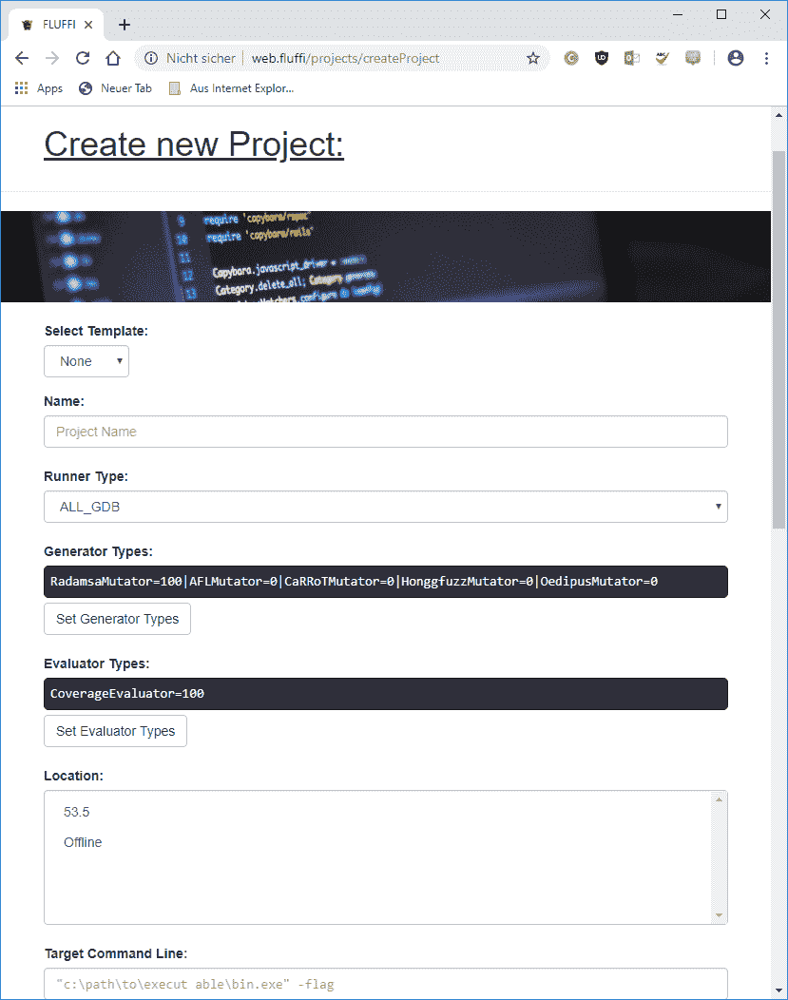

# FLUFFI:完全本地化的瞬时模糊实用程序

> 原文：<https://kalilinuxtutorials.com/fluffi/>

FLUFFI 是一个用于 pentesters 的分布式进化二进制模糊器。

**用途**

**1)添加跑步系统以获得乐趣**

所有模糊作业都在 FLUFFI 公用事业网络(FUN)的专用运行系统上运行。您可以自带系统或使用弗鲁菲 PXE 图像(推荐)。如何构建这些映像在这里有记录[。](https://github.com/siemens/fluffi/blob/master/docs/agents/pxe_images)

要添加新系统:

*   让你的系统充满乐趣
*   检查与`gm.fluffi`的连通性。问题:检查防火墙
*   决定该系统的主机名，并将其放在 [MAC2Host.csv](https://github.com/siemens/fluffi/blob/master/docs/srv/fluffi/data/smb/files/initial/MAC2Host.csv) 中。FUN 中的其他系统必须能够使用该主机名访问您的系统。
*   为 ansible 创建用户。为此，您需要创建一个与您在 ansible 的 [hosts](https://github.com/siemens/fluffi/blob/master/docs/srv/fluffi/data/polenext/projects/1/hosts) 文件中指定的用户名和密码相匹配的用户(参见[入门部分](https://github.com/siemens/fluffi/blob/master/docs/getting_started.md))。在 Linux 上，这个用户需要是 sudoer。在 Windows 上，该用户需要是本地管理员。
*   为 ansible 准备系统。为此，请在新的代理系统上运行以下命令:
    *   窗口:
        *   **T2`net use y: \\smb.fluffi\install\initial /user:nobody pass`**
        *   **T2`y:\initialConfiguration.bat`**
        *   **T2`net use y: /Delete /yes`**
    *   Linux:
        *   确保您的系统能够从 FUN 内部访问包镜像(另请参见 getting_started.md 中的[包镜像部分)。](https://github.com/siemens/fluffi/blob/master/docs/getting_started.md)
        *   **T2`apt-get install openssh-server smbclient net-tools`**
        *   **T2`smbclient '//smb.fluffi/install' -c 'cd initial; get MAC2Host.csv; get initialConfiguration.sh' -U anonymous%pass;`**
        *   **T2`chmod 777 initialConfiguration.sh`**
        *   **T2`/bin/bash initialConfiguration.sh`**
        *   **T2`rm MAC2Host.csv`**
        *   **T2`rm initialConfiguration.sh`**
*   告诉弗鲁菲这个系统。为此你有两个选择:要么把它作为一个新的 windows/linux/odroid 主机添加到 ansible 的 [hosts](https://github.com/siemens/fluffi/blob/master/docs/srv/fluffi/data/polenext/projects/1/hosts) 文件(持久的)，要么使用 FLUFFI 的 web GUI 中的`Add System`按钮。通过 web GUI 添加时，只需使用系统的主机名，无需任何域后缀。当通过 hosts 文件添加它时，该行需要看起来像这样:`**<hostname> ansible_ssh_host=<hostname>.fluffi**`。记住:在修改 hosts 文件时，需要重启 polemarch 和 fluffi_web 容器。
*   在`Systems`选项卡中为系统指定一个位置。在这里可以找到对位置概念的解释。

**1.1)部署 FLUFFI**

现在新的代理系统已经成为乐趣的一部分，需要为 FLUFFI 配置该系统。此外，FLUFFI 代理二进制文件需要复制到代理系统。

您可以通过在 FLUFFI 的 web GUI 中导航到“系统”选项卡，然后单击系统名称来完成此操作。现在你应该点击“初始设置”,让 Pelemarch/Ansible 为 FLUFFI 配置目标系统。

完成后，您应该转到“Deploy FLUFFI”选项卡，并部署那些对应于目标体系结构的 FLUFFI 二进制文件。如果您的目标是 X64 系统，您可能还希望复制 x86 二进制文件，以便能够在一台机器上模糊这两种体系结构。

2)准备你的目标

**2.1)让输入进入你的目标**

目前，FLUFFI 支持以下类型的目标:

**2.1.1)本地运行的文件解析二进制文件**

FUN 支持 x64/x86 (Linux/Windows)系统和 ARM/ARMarch64 系统(Linux)。如果您的二进制文件解析文件并在其中一个系统上运行，则不需要进一步的操作。

**请注意**许多目标可以转换成这种类型，或者通过改变源代码，或者通过修补二进制文件。

**2.1.2)需要模拟的文件解析二进制文件**

如果您的二进制文件解析文件，并且您知道如何使用 QEMU 用户模式模拟来模拟它，那么不需要进一步的操作。

**请注意**许多目标可以转换成这种类型，或者通过改变源代码，或者通过修补二进制文件。

**2.1.3)本地运行的服务器二进制文件**

您需要编写一个所谓的 Feeder，它允许 FLUFFI 向您的目标提供测试用例。这个 feeder 可以用你喜欢的任何语言编写。您需要调用的面向 FLUFFI 的接口由 **`SharedMemIPC.dll` / `libsharedmemipc.so`实现。**

已经有一些馈线预实现[这里](https://github.com/siemens/fluffi/blob/master/docs/core/helpers/Feeder):

*   在 [TCPFeeder](https://github.com/siemens/fluffi/blob/master/docs/core/helpers/Feeder/TCPFeeder) 已经实现了一个 C++ Feeder，它向 TCP 服务器(比如 HTTP 服务器)提供输入。如果您愿意，可以使用 [sslwrap](https://github.com/siemens/fluffi/blob/master/docs/core/helpers/Feeder/sslwrap) 连接到 SSL/TLS 服务器。
*   通过共享内存提供输入的 C++ Feeder 已经在 [SharedMemFeeder](https://github.com/siemens/fluffi/blob/master/docs/core/helpers/Feeder/SharedMemFeeder) 中实现。这个 Feeder 非常有用，特别是如果你想有效地模糊文件解析器的话。为此，首先确保文件解析器通过 SharedMemory 而不是从命令行读取要解析的文件。这允许您模糊许多测试用例，而不需要在每个测试用例之后重新启动目标。为此，要么以合适的方式构建目标，要么替换二进制文件的 main 函数(例如，使用 main4fuzz / PrepareExe4Fuzz)。
*   向以太网服务器提供输入的 C++ Feeder 已经在 [EthernetFeeder](https://github.com/siemens/fluffi/blob/master/docs/core/helpers/Feeder/EthernetFeeder) 中实现。
*   向 UDP 服务器提供输入的 C++ Feeder 已经在 [UDPFeeder](https://github.com/siemens/fluffi/blob/master/docs/core/helpers/Feeder/UDPFeeder) 实现了。
*   向 TCP 服务器(比如 HTTP 服务器)提供输入的 python Feeder 已经在 [NeFu](https://github.com/siemens/fluffi/blob/master/docs/core/helpers/Feeder/NeFu) 实现了。

如果你想测试你的馈线，你可以使用在[测试仪](https://github.com/siemens/fluffi/blob/master/docs/core/helpers/Feeder/Tester)上实现的馈线测试仪。

**2.1.4) GDB 目标**

你需要一个馈线(见最后一节)。此外，您需要一个与您的 GDB 服务器使用相同协议版本的 GDB 客户端。

**2.1.5) Windows 内核模块(如 Windows 驱动程序)**

你需要一个馈线(见最后一节)。再者，你需要为 FLUFFI 设置 [kFuzz。](https://github.com/siemens/fluffi/blob/master/docs/core/helpers/kfuzz)

其他所有事情

如果您还需要什么，请联系我们。如果需要，FLUFFI 可以扩展到多种目标类型。

**2.2)用模糊版本替换比较功能**

对于像 FLUFFI 这样基于黑盒覆盖的模糊化器来说，模糊化 memcmp 和 strcmp 这样的比较函数通常是一项非常困难的任务。

为了帮助 FLUFFI 处理这个问题，我们添加了 [fuzzcmp](https://github.com/siemens/fluffi/blob/master/docs/core/helpers/fuzzcmp) 助手。用一句话来说，这个助手所做的就是用 FLUFFI 可以很好处理的东西来代替标准的比较函数。

我们建议总是使用它！

**3)创建一个 FLUFFI FuzzJob**

如果你想创建一个 FuzzJob，请访问 FLUFFI 网页(目前可在`**http://web.fluffi/**`访问)。

这样做之后，您需要通过 **`FuzzJobs->Create FuzzJob`创建一个 FuzzJob。**

**名称**

该名称应该类似于“MiniWeb”或“MyXMLParser”。注意:目前该名称不能包含[-_ ]。

**流道类型**

目前定义了以下运行者(又名测试用例执行者)

*   `ALL_GDB`
*   `ALL_Lin_QemuUserSingle`
*   `ARM_Lin_DynRioMulti`
*   `ARM_Lin_DynRioSingle`
*   `ARM64_Lin_DynRioMulti`
*   `ARM64_Lin_DynRioSingle`
*   `X64_Lin_DynRioMulti`
*   `X64_Lin_DynRioSingle`
*   `X64_Win_DynRioMulti`
*   `X64_Win_DynRioSingle`
*   `X86_Lin_DynRioMulti`
*   `X86_Lin_DynRioSingle`
*   `X86_Win_DynRioMulti`
*   `X86_Win_DynRioSingle`

选择哪一个取决于你如何准备你的目标。`QemuUserSingle`运行器用于仿真二进制文件(参见 2.1.2 节)，`DynRioMulti`运行器用于服务器二进制文件(参见 2.1.3 节)，`DynRioSingle`运行器用于本地文件解析器(参见 2.1.1 节)，如果您使用 GDB(参见 2.1.4 节)或 WinDBG(参见 2.1.5 节)，则使用`ALL_GDB`。

**发电机类型**

FLUFFI 支持各种测试用例生成器。你可以想用多少就用多少。目前正在实施以下措施:

*   `RadamsaMutator`
*   `AFLMutator`
*   [CarrotMutator](https://github.com/siemens/fluffi/blob/master/docs/core/CaRRoT)
*   `HonggfuzzMutator`
*   [恋母者](https://github.com/siemens/fluffi/blob/master/docs/core/Oedipus)
*   `ExternalMutator`(允许轻松添加自定义赋值器):在这种情况下，您需要指定一个附加设置:`extGeneratorDirectory`该设置指向一个目录，FLUFFI 将在该目录中插入一个名为`FuzzJob.name`的文件，其中包含当前 FuzzJob 的名称。外部变异器的工作是:
    1.  想出一个唯一的 ID (UUID)
    2.  在`extGeneratorDirectory`中创建一个子目录，命名为 UUID
    3.  连接到 GM 数据库，并从`fuzzjob`表中提取 FuzzJob 数据库的连接参数
    4.  连接到 FuzzJob 的数据库，在 FuzzJob 的`nice_names_managed_instance`表中为所选的 UUID 取一个好听的名字
    5.  在 UUID 子目录中按照这个模式放置新的突变:`ParentGUID_ParentLocalID_GeneratorLocalID`。`GeneratorLocalID`需要是一个十进制数，对于当前的 mutator 实例是唯一的(即，您必须确保 touple ( `UUID`，`GeneratorLocalID`)是唯一的)。如果你愿意，你可以使用 FuzzJob 数据库中的任何信息来生成好的测试用例。
    6.  确保硬盘不会被填满(例如，在目录中设置文件的上限)
    7.  调整用于突变的测试用例的等级。经验法则:基于父代的每一次变异都应该将父代的等级降低一。

您需要设置多少个发电机应该具有哪种发电机类型的百分比。比如你只要`RadamsaMutators`，就把`RadamsaMutator` =100，其他都设为 0。

**评估者类型**

FLUFFI 支持各种测试用例评估器。你可以想用多少就用多少。目前正在实施以下措施:

*   `CoverageEvaluator`

您需要设置多少评估者应具有哪种评估者类型的百分比。例如，如果您只希望`CoverageEvaluators`设置`CoverageEvaluator` =100，其他都设置为 0。

**地点**

要运行模糊作业的位置。这可以在以后改变。

**选项**

模糊作业的选项。

**测试用例运行器**

runnerType 参数设置将使用哪个流道。可能的值见 [TestcaseRunner.cpp](https://github.com/siemens/fluffi/blob/master/docs/core/TestcaseRunner/TestcaseRunner.cpp) 中的`myAgentSubTypes`。

对于*_DynRioSingle:

*   **targetCMDLine** :启动目标的命令行(如 Windows 上的`"C:\FLUFFI\SUT\my target\mytarget.exe" -startnormal`或 Linux 上的`/home/<FluffiUser>/fluffi/persistent/SUT/my target/mytargetbin`)。需要绝对！如果你在命令行的某个地方指定了< INPUT_FILE >，FLUFFI 将用测试用例的文件名来替换它。否则，FLUFFI 会将测试用例的文件名附加到命令行的末尾。
*   **hangTimeout** :以毫秒为单位的持续时间，在此时间之后，如果测试用例还没有完成，它将被认为已经超时。
*   **suppressChildOutput** :许多目标输出到 stdout 或打开的窗口。出于调试目的，将其设置为 false 是有意义的。对于生产，它应该设置为 true。
*   **populationMinimization** :数据库会将覆盖块完全相同的人口项标记为重复项，从此忽略。默认设置为*假*，但也可以设置为*真*。
*   **treatAnyAccessViolationAsFatal**:一些目标捕捉访问冲突。这些访问冲突可能是正常操作的一部分，也可能不是。将此参数设置为 true 会使 FLUFFI 将每个访问冲突视为访问冲突崩溃，即使应用程序会捕获并处理它(默认为 false)。
*   **additionalEnvParam** :追加到目标进程环境的参数(仅限 Linux)，如`LD_PRELOAD=/my/shared/obj.so`。

对于*_DynRioMulti:

*   **targetCMDLine** :启动目标的命令行(如 Windows 上的`"C:\FLUFFI\SUT\my target\mytarget.exe" -startnormal`或 Linux 上的`/home/<FluffiUser>/fluffi/persistent/SUT/my target/mytargetbin`)。需要绝对！FLUFFI 将用随机生成的共享内存名替换< RANDOM_SHAREDMEM >。这在使用 [SharedMemFeeder](https://github.com/siemens/fluffi/blob/master/docs/core/helpers/Feeder/SharedMemFeeder) 时是有意义的，它期望一个共享内存名作为目标的最后一个参数。此外，FLUFFI 将用一个随机自由端口替换< RANDOM_PORT >。当应用程序绑定到可以通过命令行指定的 TCP 端口时，这是有意义的。设置它可以在一台机器上启动多个目标实例。
*   **hangTimeout** :以毫秒为单位的持续时间，在此时间之后，如果测试用例还没有完成，它将被认为已经超时。
*   **suppressChildOutput** :许多目标和进料器输出到 stdout 或打开的窗口。出于调试目的，将其设置为 false 是有意义的。对于生产，它应该设置为 true。
*   **populationMinimization** :数据库会将覆盖块完全相同的人口项标记为重复项，从此忽略。默认设置为*假*，但也可以设置为*真*。
*   **feederCMDLine** :启动 feeder 的命令行(如`"C:\FLUFFI\SUT\my target\TCPFeeder.exe" 80`、`"C:\FLUFFI\SUT\my target\TCPFeeder.exe"`(不设置端口会导致 feeder 扫描目标监听端口)，或`"C:\FLUFFI\SUT\my target\SharedMemFeeder.exe"`)。SharedMemory 位置的名称(在 Feeder 的源代码中访问)将自动添加(用于 FLUFFI < - > Feeder 之间的接口)。
*   **initializationTimeout** :以毫秒为单位的持续时间，在此之前，feeder 需要向 runner 报告它可以与目标对话。如果超时，目标和送纸器都将重新启动。
*   **starterCMDLine** :如果您希望 TestaceRunner 通过 *targetCMDLine* 直接启动目标，请将此选项留空(" ")。大多数情况下这就够了。示例:服务器、APIs 如果您需要将 TR 附加到目标(例如，因为目标是一个服务)，您需要在此处指定一个启动目标的程序(例如，启动服务并发出“已启动”信号)。这种启动器的例子有[进程启动器](https://github.com/siemens/fluffi/blob/master/docs/core/helpers/Starter/ProcessStarter)和[服务启动器](https://github.com/siemens/fluffi/blob/master/docs/core/helpers/Starter/ServiceStarter)。在这两种情况下，目标将只启动一次，直到崩溃发生(不是每个测试用例都启动一次)。在目标是服务的情况下，TR 需要附加到服务上。在这种情况下，TR 一直等到启动程序完成，然后寻找与在 *targetCMDLine* 中指定的路径和名称相同的进程。
*   **targetForks** :如果您的目标是 Linux，并且您用一个启动器和您的目标 Forks 启动它，您可能希望将这个参数设置为 true。否则，请保留该参数。在某些情况下，这是必要的，例如，如果您想要模糊一个服务，该服务分叉、关闭主进程并在子进程中继续。
*   **forceRestartAfter** :如果你的目标在一段时间后倾向于停止运行，但是你的 feeder 没有意识到这一点(如果没有 backchannel，例如当 fuzzing UDP 时，可能会发生这种情况)，你可以指定这个值在 X 次迭代后强制目标和 feeder 重新启动。
*   **treatAnyAccessViolationAsFatal**:一些目标捕捉访问冲突。这些访问冲突可能是正常操作的一部分，也可能不是。将此参数设置为 true 会使 FLUFFI 将每个访问冲突视为访问冲突崩溃，即使应用程序会捕获并处理它(默认为 false)。
*   **additionalEnvParam** :追加到目标进程环境的参数(仅限 Linux)，如`LD_PRELOAD=/my/shared/obj.so`。仅在未使用启动器时有效。

对于 ALL _ Lin _ QemuUserSingle:

*   **changerootTemplate** :您部署的根文件系统的路径。您可以相对于 TestcaseRunner 的位置或绝对位置来指定它。它将用于将 root 更改为运行模拟二进制文件，因此应该包含所有必要的库和文件，包括已知位置的目标二进制文件。目前，它还必须包含将用于仿真的 qemu-fluffi 二进制文件。请注意，该目录将不会直接用作 changeroot 目标。相反，它将被复制到一个单独的位置。这样原件就不会被修改，可以再次使用。
*   **target cmdline**:CHROOT 后在 ch root 环境内部执行的命令行。在 chroot 中使用绝对路径。
    *   **qemu 二进制路径**:通常相对于 ROOTFS】
    *   **qemu 跟踪选项(已弃用)** : `-trace events=/etc/qemu-events -d nochain`(通常不需要更改)
    *   **qemu-fluffi 参数，用于将信号转发到目标(碰撞信号否则)** : `-f`
    *   **qemu 开关将环境变量传递给目标** : `-E LD_PRELOAD=/my/shared/obj.so`
    *   **目标可执行文件的路径** : `/home/user/fuzztarget`
    *   **传递给目标**的参数:`-v -d --please-do-not-crash --config /home/user/conf.conf --read-in`
    *   注意，系统将把测试用例文件的路径作为最后一个参数传递(例如，上面例子中的`[...] --read-in /fluffi/testcase/00235.bin`)
*   **hangTimeout** :以毫秒为单位的持续时间，在此时间之后，如果测试用例还没有完成，它将被认为已经超时。
*   **suppressChildOutput** :许多目标输出到 stdout 或打开的窗口。出于调试目的，将其设置为 false 是有意义的。对于生产，它应该设置为 true。
*   **populationMinimization** :数据库会将覆盖块完全相同的人口项标记为重复项，从此忽略。默认设置为*假*，但也可以设置为*真*。
*   **treatAnyAccessViolationAsFatal**:一些目标捕捉访问冲突。这些访问冲突可能是正常操作的一部分，也可能不是。将此参数设置为 true 会使 FLUFFI 将每个访问冲突视为访问冲突崩溃，即使应用程序会捕获并处理它(默认为 false)。

为所有人 _GDB:

*   **targetCMDLine** :启动 GDB 的命令行(如 Windows 上的`"C:\FLUFFI\SUT\my target\gdb.exe"`或 Linux 上的`/home/<FluffiUser>/fluffi/persistent/SUT/my target/gdb`)。如果您对 FLUFFI 使用 [kFuzz，指定 GDBEmulator 二进制文件的路径。记住:命令行在任何情况下都需要是绝对的！](https://github.com/siemens/fluffi/blob/master/docs/core/helpers/kfuzz)
*   **hangTimeout** :以毫秒为单位的持续时间，在此时间之后，如果测试用例还没有完成，它将被认为已经超时。
*   **suppressChildOutput** :许多目标和进料器输出到 stdout 或打开的窗口。出于调试目的，将其设置为 false 是有意义的。对于生产，它应该设置为 true。
*   **populationMinimization** :数据库会将覆盖块完全相同的人口项标记为重复项，从此忽略。默认设置为*假*，但也可以设置为*真*。
*   **feederCMDLine** :启动加料器的命令行(如`"C:\FLUFFI\SUT\my target\TCPFeeder.exe" 80`)。共享内存位置的名称(在 Feeder 的源代码中访问)将被自动添加(用于 FLUFFI < - > Feeder 之间的接口)。重要提示:由于与 GDB 的通信是如何实现的，所以 feeder 必须忽略 Windows 上的 Ctrl+C(C 中的`SetConsoleCtrlHandler(NULL, true);`)；
*   **initializationTimeout** :以毫秒为单位的持续时间，在此之前，feeder 需要向 runner 报告它可以与目标对话。如果超时，目标和送纸器都将重新启动。
*   **starterCMDLine** :您需要在这里指定一个启动目标的程序(如`"C:\FLUFFI\SUT\my target\GDBStarter.exe -local C:\FLUFFI\SUT\my target\actual target.exe"`)，并创建一个 GDB 初始化文件，以便 GDB 可以连接到目标。启动器将只执行一次，直到崩溃发生(不是在每一次运行中)。GDB 启动器的例子在 [GDBStarter](https://github.com/siemens/fluffi/blob/master/docs/core/helpers/Starter/GDBStarter) 中实现。
*   **forceRestartAfter** :如果您的目标在一段时间后可能会停止运行，但是您的 feeder 没有意识到这一点(如果没有反向通道，就会发生这种情况，例如当模糊 UDP 时)，您可以指定该值，在 X 次迭代后强制目标和 feeder 重新启动。
*   **断点指令**:十六进制编码的目标架构的断点指令(如 x86/x64 上的 0xCC)。如果你不知道你的，grep 你的架构的 gdb 服务器资源，例如[这里](https://chromium.googlesource.com/chromiumos/third_party/gdb/+/3a0081862f33c17f3779e30ba71aacde6e7ab1bd/gdb/gdbserver)
*   **断点指令字节数**:断点指令的字节数。必须是 1、2 或 4

**请注意**:作业运行时，所有选项都可以更改。但是，您需要重新启动代理，因为它们只在启动时提取选项。

**目标模块**

FLUFFI 是一种基于覆盖的进化模糊器。为了降低覆盖范围内的噪声，仅使用此处列出的那些模块来计算覆盖范围。模块的例子有`test.dll`或`target.exe`。

创建或修改项目时，您可以将目标模块作为文件上传。它们的文件名和二进制文件将被保存，它们的路径将用一个`*`初始化。因此，您可以在项目视图中通过重命名文件名、路径和/或上传新的二进制文件来编辑它们。FLUFFI 本身只使用文件名，但有些生成器会使用二进制文件。

如果有多个同名但路径不同的模块，您可以通过指定路径来指定哪个模块应该用于覆盖率计算。如果留给`*`，模块的路径被忽略。

**请注意**:如果你用的是 GDB runner，模块名其实是段名。因此，一个例子是`target.exe/.text`

**目标上传**见下文第 4 节)。

**人口**

每个进化模糊器都需要一组已知良好的输入样本来开始。这些需要上传到这里。您可以一次指定多个。此外，您可以在项目运行时添加更多内容。

**基本块**

仅与全 GDB 跑步者相关。这些是将被考虑用于覆盖率收集的块。FLUFFI 需要以下格式的文件:

target.exe/.text,0x1
target.exe/.text,0x2
helper.dll/.text,0x100

如果你愿意，你也可以自己在数据库表`blocks_to_cover`中插入块(例如，通过使用[这个](https://github.com/siemens/fluffi/blob/master/docs/ida_scripts/exportBBs.py) IDA python 脚本)。

**测试用例生成器**

应该使用哪种生成器类型由 generator types 参数设置。它是所有要使用的类型的字符串，后跟它们的百分比。如果您只想使用一个 A 型发生器，设置`A=100`。如果要用两个概率相同的，设置`A=50|B=50`。有关可能的类型值，请参见 [TestcaseGenerator.cpp](https://github.com/siemens/fluffi/blob/master/docs/core/TestcaseGenerator/TestcaseGenerator.cpp) 中的`myAgentSubTypes`。

**请注意**本地管理器会尽可能贴近您的设置。然而，如果这是不可能的(例如，如果只有只实现了 A 类寄存器的发生器)，该比率可能不是所期望的。

**测试用例评估器**

应使用哪种赋值器类型由 evaluator types 参数设置。它是所有要使用的类型的字符串，后跟它们的百分比。如果您只想使用一个 A 型评估器，设置`A=100`。如果要用两个概率相同的，设置`A=50|B=50`。有关可能的类型值，请参见 [TestcaseEvaluator.cpp](https://github.com/siemens/fluffi/blob/master/docs/core/TestcaseEvaluator/TestcaseEvaluator.cpp) 中的`myAgentSubTypes`。

**请注意**本地管理器会尽可能贴近您的设置。然而，如果这是不可能的(例如，如果评估者只实现了 A 型寄存器)，比率可能不是所期望的。

**4)在目标机器上部署 FuzzJob**

所有模糊作业都在 FLUFFI 公用事业网络(FUN)的专用运行系统上运行。您的测试目标，应该被包装成一个*包*，需要被部署到这些运行系统中。

包是一个 zip 文件，包含一个`install.bat`、`install.ps1`或`install.sh`文件以及任意数据。当您部署这个包时，它被复制到 FLUFFI runner 系统，并被解压缩(在 Windows 上被解压缩到`C:\fluffi\SUT\<ZipFileName>\`，在 Linux 上被解压缩到`/home/<FluffiUser>/fluffi/persistent/SUT/<ZipfileName>\`，并执行相应的安装脚本。您应该准备好软件包，以便它安装目标以及目标本身所需的所有依赖项。

如果创建 Windows 包，应该使用 gflags 为目标二进制文件添加页堆检查。这允许 FLUFFI 更好地检测堆中的访问冲突。由于 gflags 在默认情况下被复制到所有代理系统，所以您只需要在您的`install.ps1`或`install.bat`中添加一行，例如:`C:\utils\GFlags\x86\gflags.exe /p /enable TargetBinary.exe`

这个包需要以某种方式复制到 FLUFFI ftp 服务器(ftp.fluffi)。你有两种选择。选择一是你使用匿名登录直接连接到 ftp 服务器，并把包放在 SUT 文件夹中。第二种选择是，在创建 FuzzJob 时上传包。然后，它将被放置在该文件夹中。此外，它将与 FuzzJob 相关联。

一旦包在 FTP 服务器上，您就可以将它部署到 runner 系统。您可以在`Systems`选项卡中选择一个系统或组，然后选择“部署 SUT/依赖关系”选项(SUT 代表测试中的软件)。

**5)启动 FLUFFI 代理**

目前有两种方法可以管理有多少代理(LM、TR、TE、TG)在哪个系统上运行，以及在哪个 FuzzJob 上工作。

**手动**

您可以直接连接到系统(SSH、RDP)，并在那里启动代理。

这样做的凭证可以在 polemarch 的 [hosts](https://github.com/siemens/fluffi/blob/master/docs/srv/fluffi/data/polenext/projects/1/hosts) 文件中找到。在 Windows 上，启动一个 LM(如果您的模糊作业还没有一个 LM，例如在同一位置的另一台机器上)和任意多个 tr/TGs/TEs，例如通过单击桌面上的图标。在 Linux 上，只需从命令行启动适当的代理二进制文件，确保添加位置名称作为代理的参数。

启动后，LMs 在 GlobalManager (GM)上注册，并不断请求在它们的位置上有一个尚未被管理的 FuzzJob。一旦这样的模糊作业变得可用，LM 将开始管理它。

TRs / TGs / TEs 将连接到 GM 并等待，直到分配给他们一个模糊任务。这可以在 web 应用程序的位置页面中完成。一旦分配了模糊作业，他们将连接到所在位置的 LM，管理该模糊作业。

重要提示:手动管理代理时，您需要禁用代理管理器，方法是在`Systems`选项卡上的`Settings`按钮中将它设置为`INACTIVE`。

**自动**

FLUFFI 实现了一个所谓的代理管理器。这个管理器检查应该在哪个机器上运行多少个代理，并强制执行这种情况。它每隔几分钟定期运行一次(所以在配置新实例后，您需要一点耐心)。

您可以通过 web GUI 控制正在运行的 FLUFFI 代理(LM、TR、TE、TG)的数量。

为此，您需要前往以下位置之一:

*   模糊作业概述页面上的`Config System Instances`部分
*   在`Systems`选项卡中的一个组的属性(点击一个组名)
*   在`Systems`选项卡中的系统属性(点击系统名称)

重要提示:当使用代理管理器管理代理时，您需要通过在`Systems`选项卡上的`Settings`按钮中将代理管理器设置为`ACTIVE`来启用代理管理器。将其设置为`KILL`将终止所有当前运行的代理。因此，您可以轻松地替换 FLUFFI 或 targets 二进制文件。

注意:代理管理器由两个组件实现:一个周期性的 [polemarch 任务](https://github.com/siemens/fluffi/blob/master/docs/srv/fluffi/data/polenext/manageAgents.py)和一个 [python REST 服务器](https://github.com/siemens/fluffi/blob/master/docs/srv/fluffi/data/ftp/files/restStarter)，它被部署到 runner 机器上并等待命令执行。后者是你永远不应该在不可信的环境中运行 FLUFFI 的原因之一。

**6)监控灭火剂**

你应该一直监控你的模糊工作。

首先，你要确保执行的次数和覆盖的块数是上升的。如果其中一个没有，那就是你的设置有问题。

此外，在`Managed Instances`视图中，确保:

1.  系统没有过载(例如 CPU>90%)，
2.  TG 队列不接近 0，并且
3.  TE 队列不会越来越长。

在查看模糊作业概述页面时，您可以通过单击`Managed Instances`按钮来停止运行代理。

最后，您应该关注日志消息。目前，FLUFFI 代理将所有错误消息存储在数据库中。然后，它们可以显示在 web 应用程序中(对于`Managed Instances`视图中的代理，LMs 有一个全局选项卡)。

[**Download**](https://github.com/siemens/fluffi)