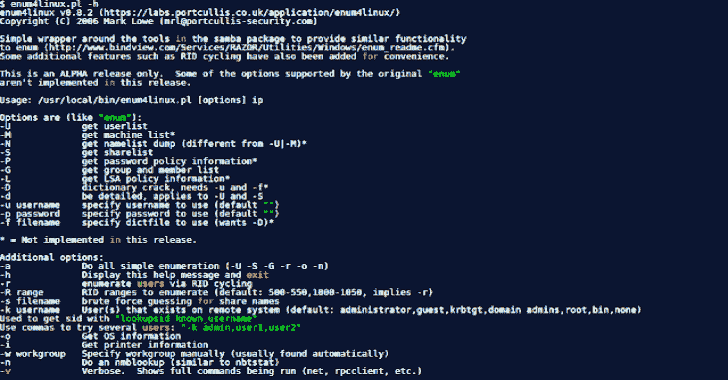
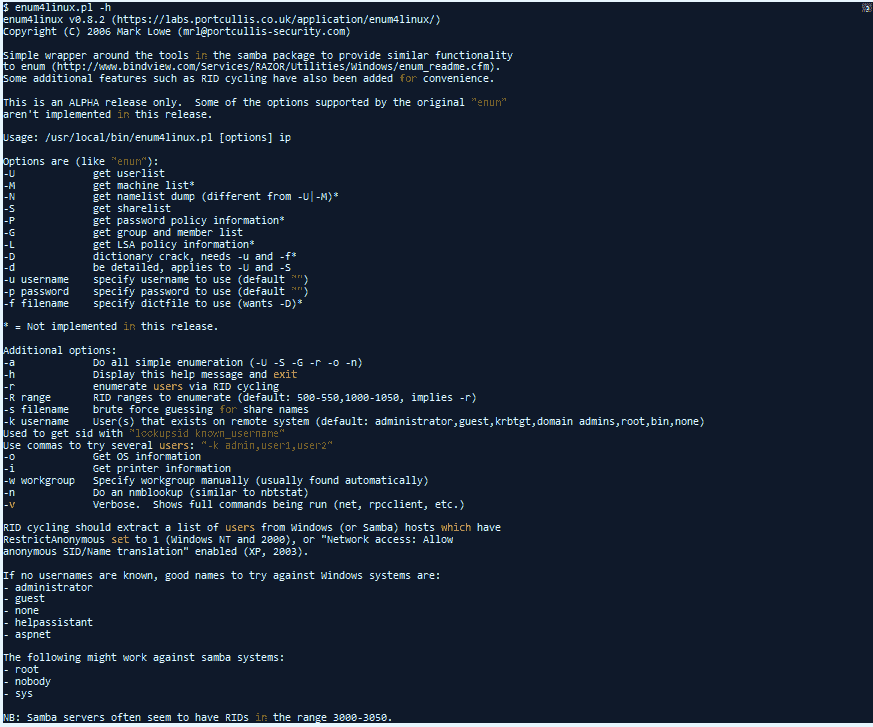

# enum 4 Linux:Enum.Exe 的 Linux 替代品

> 原文：<https://kalilinuxtutorials.com/enum4linux-a-linux-alternative-to-enum-exe/>

**Enum4Linux** 是 enum.exe 的 Linux 替代品，用于枚举来自 Windows 和 Samba 主机的数据。

它是一个从 Windows 和 Samba 系统中枚举信息的工具。它试图提供与 enum.exe 类似的功能，以前可以从 www.bindview.com 获得。

它是用 Perl 编写的，基本上是 Samba 工具 smbclient、rpclient、net 和 nmblookup 的包装器。

该工具的用法可以在下面找到，后面是示例，该工具的以前版本可以在页面底部找到。

**主要特征**

*   RID 循环(当 RestrictAnonymous 在 Windows 2000 上设置为 1 时)
*   用户列表(当 RestrictAnonymous 在 Windows 2000 上设置为 0 时)
*   群组成员信息列表
*   共享枚举
*   检测主机是在工作组还是在域中
*   识别远程操作系统
*   密码策略检索(使用 [polenum](https://labs.portcullis.co.uk/tools/polenum/)

**依赖关系**

您需要安装 Samba 包，因为这个脚本基本上只是 rpcclient、net、nmblookup 和 smbclient 的包装。

**用途**

[**Download**](https://github.com/CiscoCXSecurity/enum4linux)