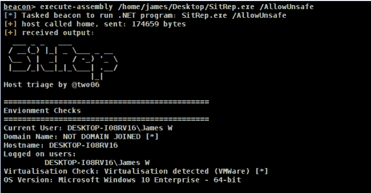
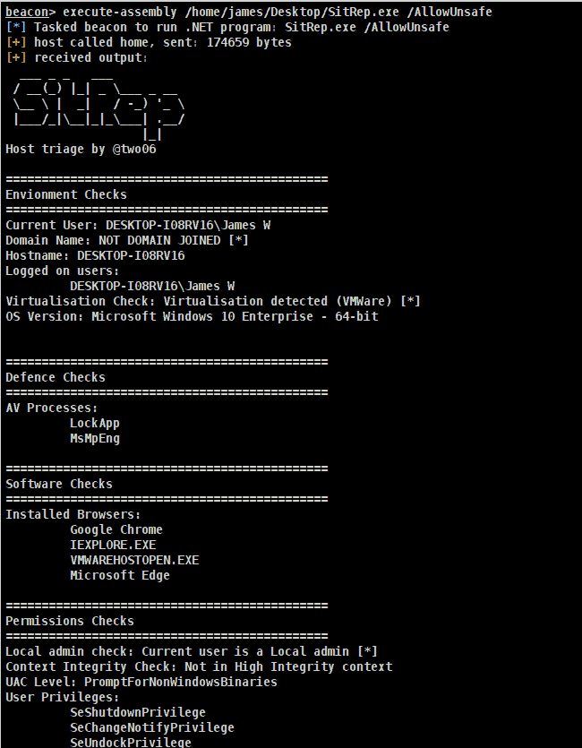

# Sitrep:可扩展、可配置的主机分类

> 原文：<https://kalilinuxtutorials.com/sitrep/>

SitRep 旨在提供一种轻量级的、可扩展的主机分流替代方案。检查在运行时从独立文件中动态加载。这允许操作员快速修改现有检查，或根据需要添加新检查。

支票按类别分组，并可标记为 OpSec 安全/不安全。仅当提供了/AllowUnsafe 标志时，才会加载不安全检查。

有趣的结果用“[*]”突出显示

**检查**

支票被分成几类。这允许它们在适当的组中显示。以下检查目前可用:

*   **环境**
    *   currentuser . cs–当前用户
    *   域名. cs–域名
    *   hostname . cs–主机名
    *   logged onusers . cs–列出所有登录的用户
    *   OS version . cs–操作系统版本信息
    *   virtual environment . cs–检查我们是否在虚拟化环境中运行
    *   user environment variables . cs–获取应用于当前进程的环境变量
    *   cs–从注册表中获取系统环境变量(HKLM)
    *   name servers . cs–获取每个网络接口的 DNS 服务器
*   **防御**
    *   AV processes . cs–检查是否有任何已知的 AV 进程正在运行
*   **权限**
    *   integrity . cs–获取当前流程的完整性级别
    *   local admin . cs–检查我们是否是本地管理员
    *   privileges . cs–列出我们当前的特权。
    *   uaclevel . cs–获得 UAC 等级
    *   userdomaingroups . cs–获取用户的域组成员身份
    *   computerdomaingroups . cs–获取计算机所属的域组
*   **软件**
    *   installed browsers . cs–列出终端上安装的浏览器
*   **凭证**
    *   Credential Manager . cs–为当前用户检索存储在 Windows 凭据管理器中的凭据
*   以下检查当前被标记为非 OpSec 安全:
    *   CredentialManager.cs
    *   ComputerDomainGroups.cs
    *   UserDomainGroups.cs

您应该检查此配置，并根据需要更新 OpSec 标记。

**禁用检查**

默认情况下，所有检查都处于启用状态。但是，由于检查是动态加载的，因此可以禁用它们。

*   **禁用检查**

CheckBase 包含一个布尔“Enabled”属性，默认为 true。这可以通过添加构造函数在派生类中设置。以下示例禁用了 CurrentUser 检查(CurrentUser.cs):

**public CurrentUser()
{
基地。Enabled = false
}**

*   **从构建中排除检查**

由于检查是动态加载的，因此无需其他修改就可以从构建中排除检查。最简单的方法是在 Visual Studio 中右击 check 类并选择“从项目中排除”。可以通过从同一上下文菜单中选择“包含在项目中”来重新添加检查。

这种方法的优点是从编译后的工件中移除代码。

**示例用法**

*   **运行所有检查**

**SitRep.exe/allow unsafe**

*   **仅运行 OpSec 安全检查(默认)**

**SitRep.exe**

SitRep 旨在通过执行组件(或等效组件)执行

**添加支票**

Checks 从 CheckBase 继承并实现 ICheck 接口。这加强了动态检查加载所需的模式。可以根据需要添加其他方法和类。

ICheck 接口公开下列属性和方法:

*   IsOpsecSafe(bool)–指示检查是否被视为 OpSec 安全
*   display order(int)–在显示组中显示该检查结果的顺序
*   check()–为运行实际检查而调用的方法

派生类必须重写 CheckBase 中定义的“ToString()”方法。当显示每个检查的输出时，调用此方法。

对本机方法的访问是通过“native methods”文件夹中的类提供的。每个类都以它与之交互的 dll 命名。

检查负责提供自己的错误处理。当前的检查将整个“检查”方法包装在一个 try-catch 块中，鼓励使用这种模式。

下面是一个空白支票的例子。

使用情况报告。界面；
使用系统；
名称空间 SitRep。checks . Software
{
class example check:check base，ICheck
{
public bool IsOpsecSafe =>true；
public int display order =>1；
公共枚举。检查类型检查类型= >枚举。Enums . CheckType.Credential
public void Check()
{
try
{
throw new NotImplementedException()；
}
catch
{
Message = "检查失败[*]"；
}
}
公共覆盖字符串 ToString()
{
抛出新的 NotImplementedException()；
}
}
}

[**Download**](https://github.com/mdsecactivebreach/sitrep)