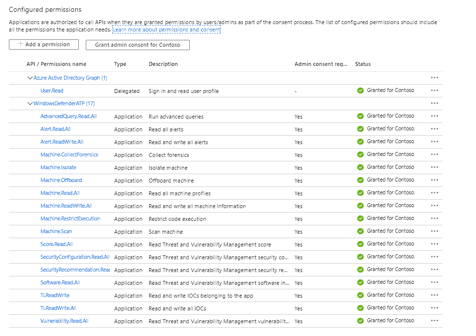

# PSMDATP:用于管理 Microsoft Defender 高级威胁保护的 PowerShell 模块

> 原文：<https://kalilinuxtutorials.com/psmdatp/>

[](https://1.bp.blogspot.com/-VHCIJ_IHr9c/X23yWTTXr9I/AAAAAAAAHqk/fXpsAo5SE20Pof7EcynIZNzKWnmuaKmUwCLcBGAsYHQ/s728/PSMDATP%25281%2529.png)

欢迎使用 Microsoft Defender 高级威胁防护 PowerShell 模块: **PSMDATP**

此模块是易于使用的 cmdlets 和函数的集合，旨在简化与 Microsoft Defender 高级威胁保护 API 的交互。

**动机**

我为 MDATP 创建了这个 PowerShell 模块，原因如下:

1.  提升我的 PowerShell 技能
2.  提供一种通过 PowerShell 与 MDATP 交互的简单方法，因为我更喜欢自动化而不是手动任务

**先决条件**

*   Windows PowerShell 5.1(正在测试 PowerShell 7)
*   通过在 AzureAD 中注册应用程序来配置访问授权

**App 权限**

以下是您必须授予的应用程序权限示例。我将很快提供关于单个 cmdlets 和所需权限的更多细节



**入门**

要开始使用该模块，请打开 PowerShell 终端，通过运行以下简单命令从 PSGallery 安装该模块:

**安装模块 PSMDATP -Scope CurrentUser**

**App 注册**

**初始配置**

当你在 AzureAD 中安装了模块并注册了应用程序后，你会在模块文件夹中找到一个文件**TEMPLATE _ poshmtpconfig . JSON**。将这个文件重命名为 **PoshMTPConfig.json** ，并输入您的 API 设置。然后将文件复制到模块文件夹的根目录下。

*   **举例** ***:***

```
"C:\Users\User1\Documents\WindowsPowerShell\Modules\PSMDATP"
───PSMDATP
│   │   PoshMTPconfig.json
│   │
│   └───0.0.2
│           PSMDATP.psd1
│           PSMDATP.psm1
│           TEMPLATE_PoshMTPconfig.json
```

目前，PSMDATP PowerShell 模块只需要 API_MDATP 信息

```
{
    "API_MDATP":  {
                      "AppName":  "WindowsDefenderATPPSMDATP",
                      "OAuthUri":  "https://login.windows.net/<YOUR TENANT ID>/oauth2/token",
                      "ClientID":  "CLIENT ID",
                      "ClientSecret":  "<CLIENT SECRET>"
                  },
    "API_MSGRAPH":  {
                        "AppName":  "xMSGraph",
                        "OAuthUri":  "https://login.windows.net/<YOUR TENANT ID>/oauth2/token",
                        "ClientID":  "<CLIENT ID>",
                        "ClientSecret":  "<CLIENT SECRET>"
                    }
}
```

**重要**

我将假设您熟悉 MDATP，并且理解在设备上触发动作的后果。在适用的情况下，cmdlets 支持使用 ***-whatif*** 参数。按键前要三思！

**运行您的第一个命令**

*   **包含的 cmdlets 列表**

让我们首先来看看 PSMDATP 模块中包含的 cmdlets

**获取命令模块 PSMDATP |选择名称**

你会看到类似这样的东西

Add-MDATPDeviceTag
Add-mdatpdipindicator {
Get-mdatpadalert
Get-MDATPCollectionPackageUri
Get-MDATPDeviceAction
Get-MDATPDeviceTag
Get-mdatpdipindicator
Get-mdatpneumation
Get-mdatpneumation
Get-MDATPTvmRecommendation
Get-mdatptmvunability
Remove-MDATPDevice【T12

有关本模块中包含的 cmdlet 的更多详细信息，请查看[cmdlet 文档页面](https://github.com/alexverboon/PSMDATP/blob/master/docs/PSMDATP.md)

*   **检索 MDATP 警报**

运行以下命令检索过去 30 天的警报

**Get-mdatpadalert-past hours 720**

*   **列出 MDATP 设备**

运行以下命令列出所有 MDATP 注册的设备

**Get-MDATPDevice -All**

[**Download**](https://github.com/alexverboon/PSMDATP)