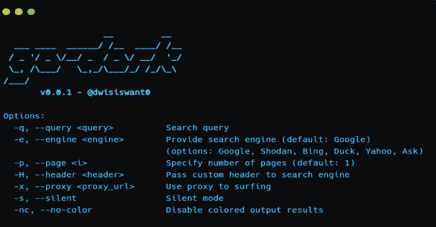

# Go-Dork:用 Go 编写的最快的傻瓜扫描器

> 原文：<https://kalilinuxtutorials.com/go-dork/>

**Go-Dork** 是用 Go 编写的最快的呆子扫描器。

**安装**

*   [从发布页面下载](https://github.com/dwisiswant0/go-dork/releases)预构建的二进制文件，解压并运行！或者
*   如果您安装并配置了 go 编译器:

**【github.com/dwisiswant0/go-dork/…】go 111 module = on go get-v**

**用途**

*   **基本用法**

简单地说，go-dork 可以用以下命令运行:

**> go-dork -q "inurl:'…'"**

*   **标志**

**> go-dork -h**

这将显示该工具的帮助。这里是它支持的所有开关。

| 旗 | 描述 |
| --- | --- |
| -q/–查询 | 搜索查询*(必需)* |
| -e/–发动机 | 提供搜索引擎(默认:谷歌) |
|  | *(选项:谷歌、Shodan、必应、鸭子、雅虎、问问)* |
| -p/–第页 | 指定页数(默认值:1) |
| -H/–标题 | 将自定义标题传递给搜索引擎 |
| -x/–代理 | 使用代理上网 |
| -s/–静音 | 静默模式，仅打印输出结果 |
| -NC/–无色 | 禁用彩色输出结果 |

*   **查询**

**>go-dork-q " inurl:……"**

查询也可以用 stdin 输入

**>猫呆呆. txt | go-dork -p 5**

*   **定义引擎**

搜索引擎可以从可用的引擎:谷歌，Shodan，冰，鸭，雅虎，问。但是，如果没有定义`-e`标志，它将默认使用 Google 搜索引擎。

**> go-dork -e bing -q。php？id="**

这将通过 Bing 引擎进行搜索。

*   **分页**

默认情况下，go-dork 选择第一页，您可以使用`-p`标志进行定制。

**>go-dork-q " intext:' jira ' "-p 5**

它将从第 1 页到第 5 页依次搜索。

*   **添加标题**

也许你想在 Shodan 引擎上使用一个搜索过滤器，你可以使用自定义头来添加 cookies 或者其他头部分。

**>go-dork-q " org:' Target ' http . favicon . hash:116323821 " \ engine shod an-H " Cookie:……"-H " User-Agent:……"**

*   **使用代理**

使用代理，如果谷歌或其他引擎遇到验证码，这也是有用的。

**>go-dork-q " intitle:' BigIP ' "-p2-x http://127 . 0 . 0 . 1:8989**

*   **与其他工具连锁**

如果你想用另一个工具链接`go-dork`结果，使用`-s`标志。

**>go-dork-q " inurl:'/secure ' intext:' jira ' site:org "-s | nucleus-t workflows/jira-exploit aiton-workflow . YAML**

[**Download**](https://github.com/dwisiswant0/go-dork)