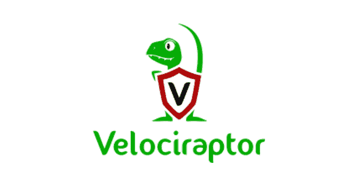

# Velociraptor:端点可见性和收集工具

> 原文：<https://kalilinuxtutorials.com/velociraptor/>

**Velociraptor** 是一款使用 Velocidex 查询语言(VQL)查询来收集基于主机的状态信息的工具。要了解有关迅猛龙的更多信息，请阅读以下网站上的文档:

[https://www.velocidex.com/docs/](https://www.velocidex.com/docs/)

**快速启动**

如果你想简单地了解迅猛龙是什么:

*   从您喜欢的平台(Windows/Linux/MacOS)的发布页面下载二进制文件。
*   启动图形用户界面

**$迅猛龙 gui**

这将打开 GUI、前端和本地客户端。您可以像往常一样从客户端(它只是运行在您自己的机器上)收集工件。

一旦你为全面部署做好准备，请在[https://www.velocidex.com/docs/getting-started](https://www.velocidex.com/docs/getting-started)查看各种部署选项

**通过 Docker 运行迅猛龙**

要通过 Docker 运行 Velociraptor 服务器，请遵循以下说明:[https://github.com/weslambert/velociraptor-docker](https://github.com/weslambert/velociraptor-docker)

**在本地运行迅猛龙**

迅猛龙也是一个有用的局部分流工具。您可以使用 GUI 创建自包含的本地收集器:

*   如上所述启动 GUI(`**velociraptor gui**`)。
*   选择`**Server Artifacts**`工具条菜单，然后选择 **`Build Collector`。**
*   选择并配置您想要收集的工件，然后选择`**Uploaded Files**`选项卡并下载您定制的收集器。

**从源构建**

要从源代码构建，请确保您安装了来自[https://golang.org/dl/](https://golang.org/dl/)的最新 Golang(目前至少是 Go 1.14):

$ git 克隆 https://github.com/Velocidex/velociraptor.git
$ CD 迅猛龙
**#这将构建 GUI 元素。您需要先安装节点。例如，在 Windows 上从 https://nodejs.org/en/download/.获得它，你还需要从 https://www.java.com 安装 JAVA，因为 js 编译器需要它。**
$ CD gui/static/
$ NPM install
**#如果 gulp 不在您的路径上，您需要使用 node:node node _ modules \ gulp \ bin \ gulp . js compile**
$ gulp compile
$ CD-
**#运行它，这将构建一个发布版本(即它将 GUI 文件嵌入到二进制文件中)。如果您不关心阿桂，简单的“make”将构建一个裸调试二进制文件。**
$ go 运行 make.go -v 发布
$ go 运行 make.go -v windows

如果您想重新构建 protobuf，您需要安装 protobuf 编译器(这仅在编辑任何`***.proto**`文件时有必要):

**$ wget https://github . com/protocol buffers/proto buf/releases/download/v 3 . 13 . 0/protocol-3 . 13 . 0-Linux-x86 _ 64 . zip
$ unzip protocol-3 . 13 . 0-Linux-x86 _ 64 . zip
$ sudo mv include/Google//usr/local/include/
$ sudo mv bin/protocol/usr/local/bin/
$ go get-u github.com/golang/protobuf/protoc-gen-go/
/make_proto.sh**

**获取最新版本**

我们有一个相当频繁的发布时间表，但如果你看到一个你真正感兴趣的新功能提交，我们很乐意在正式发布前进行更多的测试。

我们有一个由 GitHub actions 管理的 CI 渠道。您可以通过单击 GitHub 项目上的 actions 选项卡来查看管道。有两种工作流程:

*   **Windows 测试:**该工作流构建 Velociraptor 二进制文件的最小版本(没有 GUI ),并在其上运行所有测试。我们还在这个管道中测试各种 windows 支持功能。这一渠道建立在每次公关的每一次推动之上。
*   **Linux 构建所有拱门:**这个管道为许多支持的架构构建完整的二进制文件。它仅在 PR 合并到主分支时运行。

如果您在 GitHub 上派生项目，只要您在您的派生上启用 GitHub 操作，管道就会在您自己的派生上运行。如果你需要为一个新特性准备一个 PR 或者修改一个现有的特性，你可以在把 PR 发送给我们之前，用它来构建你自己的二进制文件，在所有的架构上进行测试。

[**Download**](https://github.com/Velocidex/velociraptor)