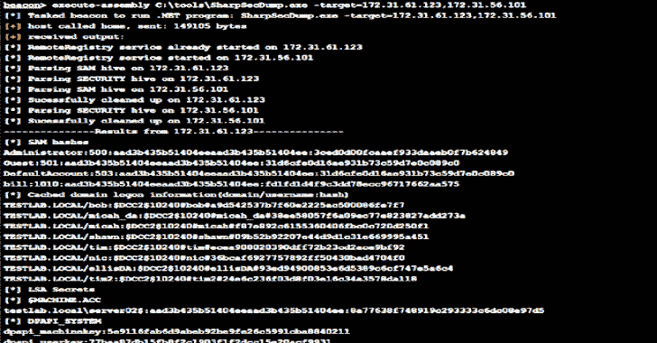

# SharpSecDump:。远程 SAM + LSA 秘密转储的网口

> 原文：<https://kalilinuxtutorials.com/sharpsecdump/>

**SharpSecDump** 是 impacket 的 secretsdump.py 的远程 SAM + LSA 秘密转储功能的. Net 端口，默认情况下在当前用户的上下文中运行。请仅在您拥有或有权测试的环境中使用。

**用途**

`**SharpSecDump.exe -target=192.168.1.15 -u=admin -p=Password123 -d=test.local**`

**所需标志**

*   **-目标**-要扫描的 IP/主机名的逗号分隔列表。请不要在地址之间包含空格。还可以通过将目标设置为 127.0.0.1 来转储本地系统上的哈希。

**可选标志**

*   **-u**–要使用的用户名，如果您想使用备用凭据运行。必须使用-p 和-d 标志
*   **-p**–要使用的明文密码，如果要使用备用凭据运行。必须使用-u 和-d 标志
*   **-d**–要使用的域，如果要使用备用凭据运行(。对于本地域)。必须使用-u 和-p 标志
*   **-Threads**-用于同时枚举多个远程主机的线程(默认值:10)

**注释**

该项目已针对 Win 7、10、Server 2012 和 Server 2016 进行了测试。旧版本(win 2003 / xp)可能无法使用此工具。

默认情况下，如果您试图从本地系统转储配置单元，您将需要从高完整性上下文中运行。但是，当目标是远程系统时，这不是必需的。

这目前支持 SAM +安全注册表配置单元转储来检索缓存的凭据数据。但是，它还不支持 NTDS.dit 解析/ dcsync。如果你在一个. Net 项目中寻找 dcsync 功能，我推荐 [sharpkatz](https://github.com/b4rtik/SharpKatz) 。

如果系统配置为不允许 RPC over TCP(需要 RPC over named pipe 这不是默认设置),则在 Windows 退回到 RPC/NP 之前会有 21 秒的延迟，但仍会允许连接。这似乎是使用利用 SCManager 远程绑定到服务的 API 调用的一个限制。

**学分**

这段代码是来自[@阿格索利诺](https://twitter.com/agsolino)的 [impacket](https://github.com/SecureAuthCorp/impacket) 和 [@skelsec](https://twitter.com/SkelSec) 的 [pypykatz](https://github.com/skelsec/pypykatz) 的功能移植。所有的荣誉都归功于他们从注册表配置单元中解析和解密信息的最初步骤。

使用的注册表配置单元结构来自 [gray_hat_csharp_code](https://github.com/brandonprry/gray_hat_csharp_code) 作者[@ Brandon pry](https://twitter.com/BrandonPrry)。

最后，这个脚本的最初想法是基于我正在为 [@Carlos_Perez](https://twitter.com/Carlos_Perez) 开发的 [Posh_SecModule](https://github.com/darkoperator/Posh-SecMod) 的部分移植，很大一部分初始 SAM 解析代码来自那个项目。

[**Download**](https://github.com/G0ldenGunSec/SharpSecDump)