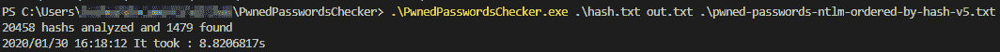

# PwnedPasswordsChecker:检查密码哈希的工具

> [https://kallinuxxtauthorities . com/pwnedppassword checker/](https://kalilinuxtutorials.com/pwnedpasswordschecker/)

**PwnedPasswordsChecker** 是一个工具，用于检查已知密码的哈希(SHA1 或 NTLM 格式)是否出现在我已经被 Pwned 泄漏的列表中以及出现的次数。

你可以在这里下载 SHA1 [的哈希编码版本，或者在这里](https://downloads.pwnedpasswords.com/passwords/pwned-passwords-sha1-ordered-by-hash-v6.7z)下载 NTLM [的哈希编码版本](https://downloads.pwnedpasswords.com/passwords/pwned-passwords-ntlm-ordered-by-hash-v6.7z)

一旦列表下载完毕，就需要使用我的另一个工具[将它转换成二进制文件](https://github.com/JoshuaMart/HIBP_PasswordList_Slimmer)

此脚本仅适用于按哈希排序的 HIBP 版本，并且条目哈希必须是小写的，最好按哈希排序

**用途**

。/PwnedPasswordsChecker { input hashlist } { HashType } { output file } { compressed hibp hashlist }
。/PwnedPasswordsChecker。\ NTLM _ 列表. txt NTLM。\Output.txt。\ntlm_hibp_compressed.bin

输出格式 **: `{hash}:{occurence}`**

**安装**

从[发布页面](https://github.com/JoshuaMart/PwnedPasswordsChecker/releases)下载 Windows 或 Linux 的编译版本

如果您希望自己编译它，您需要在系统上安装 golang 并执行以下命令:

**git 克隆 https://github.com/JoshuaMart/PwnedPasswordsChecker&CD PwnedPasswordsChecker
go build main . go**

**截图**

由于使用了“压缩”格式，该工具在性能上有了很大提高，新旧版本之间的使用示例包含 20，000 个哈希列表(英特尔酷睿 I7 8565U):

