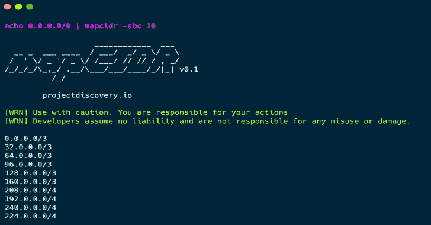

# MapCIDR:为给定子网/CIDR 范围执行多项操作的小实用程序

> 原文：<https://kalilinuxtutorials.com/mapcidr/>

MapCIDR 是一个小的实用程序，可以对给定的子网/CIDR 范围执行多种操作。

开发该工具是为了减轻大规模扫描操作的负载分配，它既可以用作库，也可以用作独立的 CLI 工具。

**特性**

*   简单和模块化的代码基础使其易于贡献。
*   **CIDR 分布**为分布式扫描。
*   **标准输入**和**标准输出**支持集成到工作流中

**安装**

*   **来源于**

go 111 module = auto go get-u github.com/projectdiscovery/mapcidr/cmd/mapcidr

*   **来自 Github**

git 克隆 https://github.com/projectdiscovery/mapcidr.git; CD mapcidr/cmd/mapcidr；去建吧。；cp mapcidr /usr/local/bin

**用途**

**map IDR-h**

这将显示该工具的帮助。这里是它支持的所有开关。

| 旗 | 描述 | 例子 |
| --- | --- | --- |
| -cidr | 要处理的单个 CIDR | mapcidr-cid 173 . 0 . 84 . 0/24 |
| -sbc | 按 CIDR 计数切片 | mapcidr -sbc 10 格式的文件 |
| -sbh | 按主机计数切片 | mapcidr -sbh 10000 |
| -我 | 包含 CIDRs 列表的文件 | mapcidr -l cidr.txt |
| 表示“具有…性质的” | 要写入输出的文件(可选) | mapcidr -o output.txt |
| -沉默 | 使输出静音 | mapcidr -silent |
| -版本 | 打印 mapcidr 客户端的当前版本 | mapcidr-版本 |

**运行 mapCIDR**

为了获取给定 CIDR 的 IP 列表，请使用以下命令。

**mapcidr-cid 173 . 0 . 84 . 0/24
echo 173 . 0 . 84 . 0/24 | mapcidr**

**CIDR 的切片**

要按 CIDR 计数将给定的 CIDR 或 CIDR 列表分割成多个相等的较小子网，请使用以下命令。

**▎mapcidr-CIDR 173 . 0 . 84 . 0/24-SBC 10-无声**
**▎echo 173 . 0 . 84 . 0/24 | mapcidr-SBC 10-无声**

**主机切片**

要对给定的 CIDR 进行切片，使每个 CIDR 中的主机数量相等，请使用以下命令。

**mapcidr-cid 173 . 0 . 84 . 0/16-sbh 20000-silent
echo 173 . 0 . 84 . 0/16 | mapcidr-sbh 20000-silent**

**注意:**只有当每个子网所需的存储片或主机数量是 2 的幂时，才有可能获得完美的拆分。否则，该工具将尝试自动找到最佳分割策略，以获得所需的结果。

**使用 mapCIDR 作为库**

可以在你的围棋程序中直接使用这个库。以下代码片段概述了如何将 cidr 划分为子网，以及如何将其划分为包含一定数量主机的子网

package main
import(
" fmt "
" github . com/project discovery/mapcidr "
)
func main(){
//将 cidr 分成两个子网
subnets1 := mapcidr。SplitN("192.168.1.0/24 "，2)
for *，subnet := range subnets1 { fmt。Println(subnet) } //将 CIDR 分成两个子网，每个子网包含 128 台主机 2 := mapcidr。SplitByNumber("192.168.1.0/24 "，128)用于*，子网:=范围子网 2 {
fmt。Println(subnet)
}
//列出 CIDR
中的所有 IP，_ := mapcidr。Ips("192.168.1.0/24")
for _，ip := range ips {
fmt。Println(ip)
}
}

mapCDIR 是由[项目发现](https://projectdiscovery.io)团队和🖤一起制作的。

[**Download**](https://github.com/projectdiscovery/mapcidr)