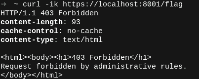
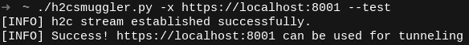
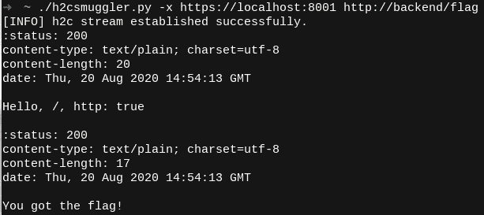

# h2cSmuggler : HTTP 请求通过 HTTP/2 明文走私(H2C)

> 原文：<https://kalilinuxtutorials.com/h2csmuggler/>

[")](https://1.bp.blogspot.com/-X2z4Dfls67s/X3xlDDzA_vI/AAAAAAAAHug/0RY_CEeWbBMjwc7aUsusV7mobhnluM7QwCLcBGAsYHQ/s728/h2cSmuggler%25281%2529.png)

**h2cSmuggler** 通过与兼容 h2c 的后端服务器建立 HTTP/2 明文(h2c)通信，允许绕过代理规则和访问控制，从而通过不安全的边缘服务器`proxy_pass`配置走私 HTTP 流量。

请看我下面的详细报道:

*   漏洞的技术分类
*   默认不安全的服务
*   补救指南

这里:[https://labs . bishop fox . com/tech-blog/h2c-走私-请求-走私-via-http/2-cleartext-h2c](https://labs.bishopfox.com/tech-blog/h2c-smuggling-request-smuggling-via-http/2-cleartext-h2c)

**怎么考？**

任何转发 h2c 升级头的代理端点都会受到影响。因为 h2c 旨在仅在明文信道上执行，所以在 HTTPS 服务上的检测通常会产生真正的阳性结果。

相比之下，HTTP 服务可能会导致误报。例如，支持 h2c 的代理可以响应升级，而不是将其转发给 h2c 后端。

使用`--scan-list`选项来测试一个或多个 web 服务器，以查找受影响的`proxy_pass`端点。考虑使用从目录枚举中发现的目录列表，例如:

**urls.txt**

**https://www.example.com/
https://www.example.com/api/
https://www.example.com/auth/
https://www.example.com/admin/
https://www.example.com/payments/
……为简洁起见略……**

使用端点列表和线程总数运行 h2cSmuggler:

`**./h2csmuggler.py --scan-list urls.txt --threads 5**`

或者，可以使用以下设备进行单独测试:

`**./h2csmuggler.py -x https://www.example.com/api/ --test**`

*   **用其他流行工具检测:**
    *   [打嗝扩展(主动扫描检查)](https://github.com/BishopFox/h2csmuggler/blob/master/extensions/BurpExtension/h2cSmugglingCheck.py)
    *   细胞核-模板(即将推出！[要求解决此问题](https://github.com/projectdiscovery/nuclei/issues/256#issuecomment-679038443)

**剥削**

一旦确定了可用于隧道的受影响的端点，现在就可以访问或强行访问后端服务器上的内部端点，并提供自定义动词或头。在下面的[演示中，我们演示了通过使用 h2c 走私绕过代理拒绝规则来访问内部`/flag`端点。](https://github.com/BishopFox/h2csmuggler#test-environment-and-demo)

要进行修复，请不要转发用户为`Upgrade`或`Connection`标头提供的值。更多指导见[技术岗位](https://labs.bishopfox.com/tech-blog/h2c-smuggling-request-smuggling-via-http/2-cleartext-h2c)。

**安装说明**

唯一的依赖项是 Python hyper-h2 库:

**pip3 安装 h2**

**测试环境&演示**

测试环境将允许您在一个受控的环境中试验 h2cSmuggler。`docker-compose`将模拟通向支持 h2c 的 Golang 后端的三个代理链:

TCP 端口:描述
= = = = = = = = = = = = = = = = = = =
8000:HTTP h2c 后端
8001: HAProxy - > h2c 后端(不安全的默认配置)
8002: nginx - > h2c 后端(不安全的自定义配置)
8003:Nuster->ha proxy->h2c 后端(多层代理的不安全配置)

[1]使用`docker-compose`生成证书并启动环境:

**#生成证书**
。/configs/generate-certificates . sh

**#激活服务**
docker-撰写

所有代理拒绝对 h2c 后端上可访问的`/flag`端点的访问。让我们尝试通过运行在端口 8001 上的 HAProxy 服务器访问被禁止的端点:

我们可以使用 h2cSmuggler 通过使用`--test`(或`-t`)来确认代理的不安全配置:

现在，让我们使用 h2cSmuggler 来执行 h2c 升级，通过代理隧道传输我们的 HTTP/2 流量，并从后端请求`/flag`端点，绕过代理的访问控制:

对于正在发生的事情的更深入的解释，请查看[技术文章](https://labs.bishopfox.com/tech-blog/h2c-smuggling-request-smuggling-via-http/2-cleartext-h2c)。

**用途**

h2cSmuggler 使用熟悉的类似 curl 的语法来描述走私的请求: