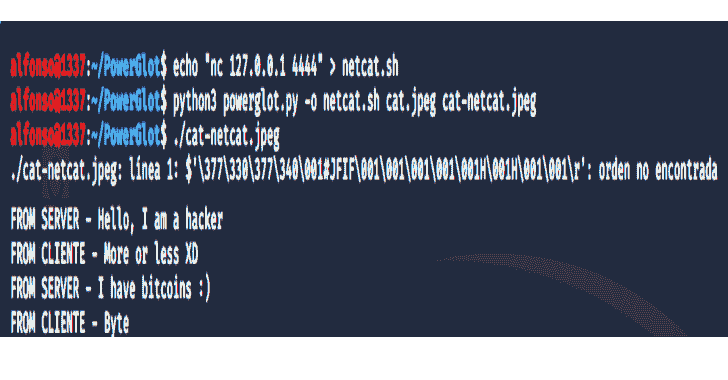
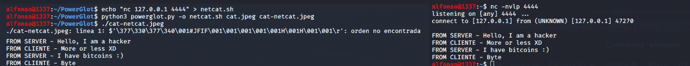

# Powerglot:使用多语种编码攻击性 Powershell 脚本

> 原文：<https://kalilinuxtutorials.com/powerglot/>

**Powerglot** 使用多种语言对几种脚本进行编码，例如攻击性的 powershell 脚本。不需要装载机来运行有效负载。

在红队演习或进攻任务中，通常通过使用隐写术来屏蔽有效负载，尤其是为了避免网络级保护，这是 powershell 中开发的最常见的有效负载脚本之一。最近的恶意软件和 APT 利用了其中的一些功能:APT32、APT37、Ursnif、Powload、LightNeuron/Turla、Platinum APT、Waterbug/Turla、Lokibot、dukes(幽灵行动)、Titanium 等。

Powerglot 是一款基于 polyglots 的多功能多平台攻防工具。Powerglot 允许主要在数字图像中屏蔽脚本(powershell、shellscripting、php 等)，尽管其他文件格式也在开发中。与通常的攻击性工具或恶意软件不同，Powerglot 不需要任何加载程序来执行“信息隐藏”，最大限度地减少了对目标系统的干扰。

PowerGlot 在进攻任务中有明确的用途，但它也被定义为发现和蓝队工具。据我们所知，它是第一个通用和完整的开源工具，允许使用多语种搜索屏蔽信息的存在，这些信息可能有助于实现系统中的持久性或隐藏恶意软件(隐写恶意软件、权限提升、横向移动、反向外壳等)。)

**特性**

*   编码 powershell/shell 脚本/php/..在一个多语言的图像中。不需要加载程序来恢复/执行隐藏信息(有效载荷)。PowerGlot 支持多种格式。主要是 JPEG 和 PDF 格式。其他格式正在开发中。
*   Powerglot 是一个完整的开源工具，用于检测(恶意)polyglots，特别是一些公共工具如 Truepolyglot 或 stegoSploit 的结果。我们以几种格式工作:JPEG，PNG，GIF，BMP，ZIP，PDF，MP3 等。

**安装**

# git 克隆 https://github.com/mindcrypt/powerglot
# python 3 power glot

**用途&参数**

一些使用 polyglots 和 Powerglot 隐藏有效载荷的例子；

#示例 1–在 JPEG 图像中隐藏 powershell/php/shell 脚本

# python 3 powerglot . py-o payload . PS1 cat.jpg cat-hidden1.jpg
# python 3 powerglot . py-o webshell.php cat.jpg cat-hidden2.jpg
# python 3 powerglot . py-o shell . sh cat.jpg cat-hidden3.jpg

#示例 2–在 JPEG 图像中隐藏权限提升的 shell 脚本(linenum . sh)

# python 3 powerglot . py-o linenum。
#我们可以通过几种方式执行脚本:

a)cat cat-linenum | bash
b)chmod+x cat-linenum.jpeg； 。/cat-linenum.jpeg

#示例 3–在 JPEG 图像中隐藏隐蔽通道 with netcat

#攻击者
# echo " NC 127 . 0 . 0 . 1 4444 ">netcat . sh
# python 3 powerglot . py-o netcat . sh cat.jpeg cat-netcat.jpeg
# NC-nvlp 4444

#受害者
# chmod+x cat-netcat.jpg |。/cat-netcat.jpg

在我们的文件系统中检测多语言的一些例子

# python 3 powerglot . py-d ./
–=【检测多种语言】–=
…………………………………………..
【可疑文件】-[。/cat-end-extra2.jpg ]..
【可疑文件】-[。/cat-end-extra 3 . jpg][Polyglot Stegosploit][EOF 签名:*/–>

【可疑文件】-[。/cat-end-extra1.jpg ]..

**未来的工作。做什么**

*   我们正在努力支持不同的文件格式，以便用多种语言对信息进行编码。目前，我们支持 JPEG 和 PDF 中的几种技术。
*   我们正致力于整合不同格式的多语言检测规则。目前，检测 JPEG 文件中是否存在 StegoSploit(在 FFD9 后添加*/–>

**作者&执照**

这个项目是由阿方索·穆尼奥斯博士和亚伯拉罕·帕萨马尔开发的。代码是在 GNU 通用公共许可证 v3 下发布的。

[**Download**](https://github.com/mindcrypt/powerglot)