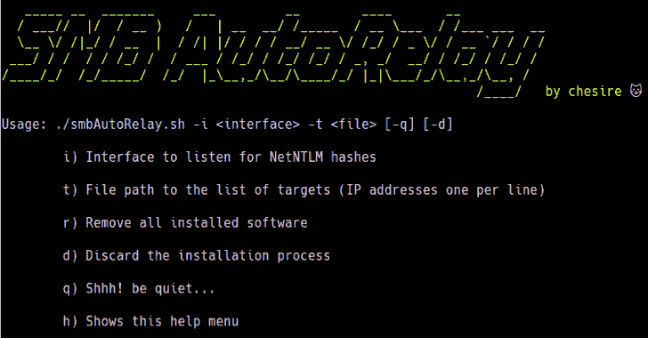

# 中小企业自动接力:中小企业/NTLM 接力技术的自动化，用于 Pentesting 和 Red 团队练习

> 原文：<https://kalilinuxtutorials.com/smb-autorelay/>

**SMB AutoRelay** 为 active directory 环境中的 pentesting 和 red teaming 练习提供 SMB/NTLM 中继技术的自动化。

**用途**

**语法:`./smbAutoRelay.sh -i <interface> -t <file> [-q] [-d]`。**

**举例:`./smbAutoRelay.sh -i eth0 -t ./targets.txt`。**

> 请注意，目标文件应该只包含您想要尝试 SMB/NTLM 中继技术的每个目标的 IP 地址，每行一个。

**运行`./smbAutoRelay.sh [-h]`查看其他选项。**

*   **安装在当前目录中的软件【需要正常运行】**
    *   [应答者](https://github.com/lgandx/Responder)
    *   [撞击](https://github.com/SecureAuthCorp/impacket)
*   **通过`apt`安装的软件，如果没有安装*需要正常运行***
    *   tmux
    *   rlwrap
    *   大蟒
    *   python3
    *   网猫
    *   wget
    *   xterm
    *   网络工具

**TODOs**

*   增加捕获和破解 NetNTLM 哈希的可能性。
*   添加它以使用终端配置文件

**免责声明**

我对这个工具的误用不负任何责任。你要自担风险。在运行它之前，确保你在一个受控的环境中，并且在那里你被允许进行这种练习。请善良🙂

[**Download**](https://github.com/chesire-cat/smbAutoRelay)