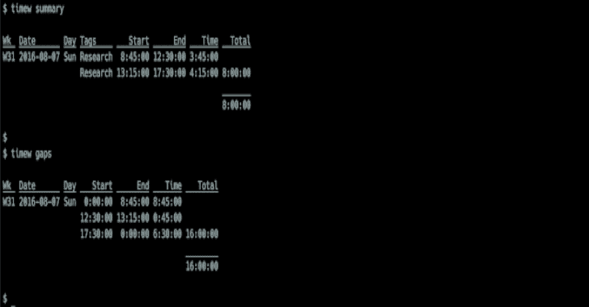

# 时间战士:命令行时间报告

> 原文：<https://kalilinuxtutorials.com/timewarrior/>

**Timewarrior** 是一个时间跟踪工具，它提供简单的秒表功能和复杂的基于日历的回填功能，以及灵活的报告功能。这是一个可移植的、支持良好的、非常活跃的开源项目。

**安装**

*   **从包装**

感谢社区，这里有可用的二进制包。

*   **建造时间战士**

**自己建造 Timewarrior 需要**

**git
cmake
make
C++编译器，目前 gcc 4.8.1+或 clang 3.3+为全 C++11 支持
Python 3，用于运行 testsuite**

有两种方法可以检索 Timewarrior 源:

*   从 Github 克隆存储库，`**git clone --recurse-submodules https://github.com/GothenburgBitFactory/timewarrior cd timewarrior**`
*   或者下载带有 curl 的 tarball，`**curl -O https://github.com/GothenburgBitFactory/timewarrior/releases/download/v1.4.2/timew-1.4.2.tar.gz**`并展开 tarball `**tar xzf timew-1.4.2.tar.gz cd timew-1.4.2**`

构建 Timewarrior，可选地运行测试套件(注意:tarball 不包含测试)，并安装它。

**cmake-DC make _ BUILD _ TYPE = release
make
【make 测试】
sudo make 安装**

这将文件复制到正确的位置(默认在`**/usr/local**`下)，并安装手册页。

如果您想在 **`/usr/local`以外的位置安装 Timewarrior，请在`cmake`** 命令中添加可选参数 **`-DCMAKE_INSTALL_PREFIX=/path/to/your/install/location`。****`make install`**命令可能不需要`**sudo**`，这取决于您选择的安装位置。

**文档**

有大量的在线文档。你会在 timewarrior.net/docs/找到所有的细节。

在那里你可以找到文档、下载、新闻等等。

[**Download**](https://github.com/GothenburgBitFactory/timewarrior)