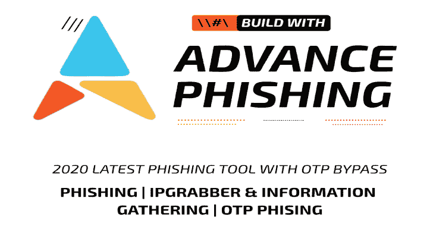

# AdvPhishing:这是一款高级网络钓鱼工具！OTP 网络钓鱼

> 原文：<https://kalilinuxtutorials.com/advphishing/>

**AdvPhishing** 是一款高级网络钓鱼工具，可绕过 OTP 网络钓鱼。

**特殊 OTP 旁路视频工作正常**

| 社交媒体黑客 | 环 |
| --- | --- |
| 安装条款 | [https://www.youtube.com/watch?v=LO3hX1lLBjI](https://www.youtube.com/watch?v=LO3hX1lLBjI) |
| Whatsapp OTP | [https://www.youtube.com/watch?v=pyB63ym3QYs](https://www.youtube.com/watch?v=pyB63ym3QYs) |
| 谷歌 OTP | [https://www.youtube.com/watch?v=MhSb4My1lZo](https://www.youtube.com/watch?v=MhSb4My1lZo) |
| Paytm OTP | [https://www.youtube.com/watch?v=3TB_sISTw9U](https://www.youtube.com/watch?v=3TB_sISTw9U) |
| Instagram OTP | [https://www.youtube.com/watch?v=VmkV1rrw2-w](https://www.youtube.com/watch?v=VmkV1rrw2-w) |
| 电话支付 OTP | [https://www.youtube.com/watch?v=ZgaoLubKBBo](https://www.youtube.com/watch?v=ZgaoLubKBBo) |
| 电报 OTP | [https://www.youtube.com/watch?v=BhGyGkIDhO0](https://www.youtube.com/watch?v=BhGyGkIDhO0) |

**技术**

当受害者输入他的凭证，你需要去原来的网站，并使用这些凭证发送真正的动态口令给受害者。一旦他进入动态口令，这样动态口令也将与你在一起，你将被允许在他之前登录帐户。

**教程【卡利】**

https://www.youtube.com/watch?v=A0cfbrz5mKE&feature=youtu.be

**安装【TERMUX APP–ANDROID】**

*   https://github.com/Ignitetch/AdvPhishing.git
*   cd 广告仿冒/
*   chmod 777 *
*   。/Android-Setup.sh
*   。/AdvPhishing.sh

**安装【KALI】**

*   https://github.com/Ignitetch/AdvPhishing.git
*   cd 广告仿冒/
*   chmod 777 *
*   。/Linux-Setup.sh
*   。/AdvPhishing.sh

**可用的隧道选项**

1.  本地主机
2.  NGROK ( [https://ngrok.com/](https://ngrok.com/) )

**测试时间:-**

*   kali Linux–2020.1 a(版本)
*   Parrot OS 滚动版(版本)
*   Ubuntu–18.04(版本)
*   Arch Linux
*   Termux 应用程序

**先决条件**

*   sudo—[必须]
*   服务器端编程语言（Professional Hypertext Preprocessor 的缩写）
*   阿帕奇 2
*   ngrok Token

**语言**

*   Bash 脚本

**即将到来的贡献**

皇家黑客

**截图**

**免责声明**

仅用于教育目的。使用 Adv-Phishing 完全是最终用户的责任。开发人员不承担任何责任，也不对本程序造成的任何误用或损坏负责。

[**Download**](https://github.com/Ignitetch/AdvPhishing)