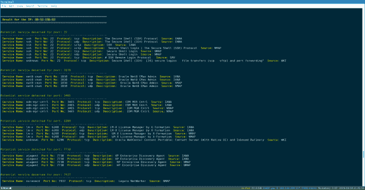

# OFFPORT_KILLER:该工具旨在自动识别潜在的服务运行

> 原文：<https://kalilinuxtutorials.com/offport_killer/>

**OFFPORT_KILLER** 工具旨在自动识别运行在人工识别的端口之后的潜在服务，或仅在本地运行的服务。

该工具非常有用:

*   当 nmap 或任何扫描工具不可用时，以及在您执行手动端口扫描，然后想要识别在已识别端口后面运行的服务，并且
*   此外，如果您能够通过(netstat、运行进程 SNMP 或其他)识别本地运行的服务。

使用几个数据库，例如来自 NMAP、IANA 和 linux 机器的数据库。

该工具可以被 pentesters，系统管理员，CTF 玩家，学生，系统审计员和巨魔使用:)。

**用途**

*   **例子**

**。/off port _ killer . sh-I input file . txt-r report . txt-e/tmp/**

**自变量**

*   -i:输入文件(格式 IP:端口)
*   -r:报告名称(保存输出)
*   救命啊

**步骤**

*   步骤 1:执行手动端口扫描(使用 nc、tcpdump 或其他工具)或识别本地运行的服务
*   步骤 2:创建一个格式为 IP:PORT 的文件(其中 IP 是目标 IP 地址，PORT 是标识的端口)。
*   步骤 3:使用使用参数-i 创建的文件运行工具

注意:为每个端口创建一个条目，可以在文件中输入多个 IP。

**inputfile.txt**

192 . 168 . 1 . 12:1830
192 . 168 . 1 . 12:7738
192 . 168 . 1 . 14:22
192 . 168 . 1 . 14:7738
192 . 168 . 1 . 15:3465

**读取输出**

在保持外观(颜色)的同时读取输出，尤其是当 cat 不合适且输出过长时。

*   less -R report.txt

**免责声明**

这个脚本仅用于教育目的。未经允许请勿使用。通常的免责声明适用，尤其是 me (TH3xACE)对直接或间接使用这些程序提供的信息或功能所造成的任何损害不承担责任。作者或任何互联网提供商对这些程序或其衍生程序的内容或误用不承担任何责任。通过使用这些程序，您接受任何损害(数据丢失、系统崩溃、系统受损等)的事实。)使用脚本造成的后果不是我的责任。

[**Download**](https://github.com/TH3xACE/OFFPORT_KILLER)