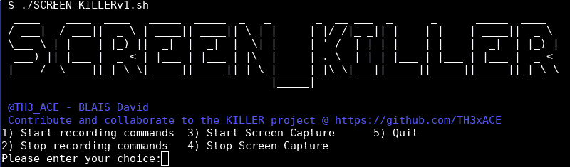

# SCREEN_KILLER:在 Pentest 项目和 OSCP 期间跟踪进度的工具

> 原文：<https://kalilinuxtutorials.com/screen_killer/>

**SCREEN_KILLER** 脚本用于在 pentest 约定和 OSCP 期间捕获屏幕截图。

**重要提示:**考试不再允许截图功能，但考试允许终端登录。

如果您喜欢该工具，并且出于我个人的动机想开发其他工具，请打+1 星*

这个工具可以被圣灵降临者、CTF 玩家、学生和巨魔使用:)。

* *警告:SCREEN_KILLER 是 KILLER 项目的一部分。SCREEN_KILLER 仍在开发中，可能会有一些问题，如果您发现任何问题，请创建一个问题。**

其他工具将在接下来的几个月中添加到杀手级项目中，敬请关注。也欢迎想法、错误报告和贡献！

**概述**

这是一个工具，可以采取屏幕截图为自定义的时间(秒)，也可以记录所有的终端命令。

这意味着您可以跟踪为任意数量的终端运行的所有命令。

*   重要提示:目前的工具只适用于 bash 终端。暂时不会在 CSH 的 ZSH 工作(如果有兴趣，请放弃这个问题)。

**特性**

**部分功能**

*   自动屏幕捕获
*   命令记录

**用途**

要求:必须安装 scrot(apt-get install scrot)。记得 chmod +x all。sh 表示执行权限。

**。/screen_killer.sh**

建议以 root 用户身份运行该工具，但是您也可以 sudo。/screen_killer.sh 它应该工作，但我还没有测试所有的功能。

然后选择您想要运行的功能。重要的是在一天结束时停止捕捉。

[https://www.youtube.com/embed/AjCy7yep8I4?feature=oembed&enablejsapi=1](https://www.youtube.com/embed/AjCy7yep8I4?feature=oembed&enablejsapi=1)

[https://www.youtube.com/embed/hsyd9OUOgZo?feature=oembed&enablejsapi=1](https://www.youtube.com/embed/hsyd9OUOgZo?feature=oembed&enablejsapi=1)

**免责声明**

通常的免责声明适用，尤其是 me (TH3xACE)对直接或间接使用这些程序提供的信息或功能所造成的任何损害不承担责任。作者或任何互联网提供商对这些程序或其衍生程序的内容或误用不承担任何责任。通过使用这些程序，您接受任何损害(数据丢失、系统崩溃、系统受损等)的事实。)使用脚本造成的后果不是我的责任。

[**Download**](https://github.com/TH3xACE/SCREEN_KILLER)