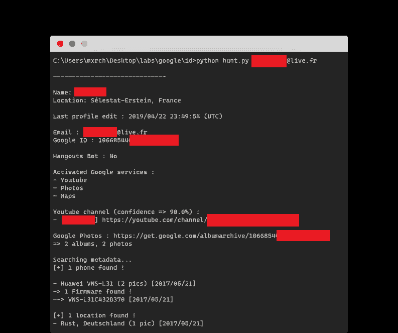
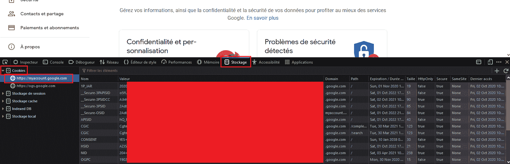
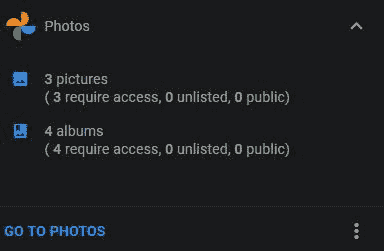
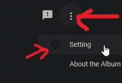
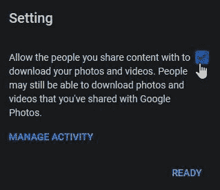

# GHunt:从谷歌账户提取信息的工具

> 原文：<https://kalilinuxtutorials.com/ghunt/>

GHunt 是一个利用电子邮件从任何谷歌账户提取信息的工具。

它目前可以提取:

*   所有者姓名
*   上次编辑配置文件的时间
*   谷歌 ID
*   如果帐户是一个 Hangouts 机器人
*   已激活的谷歌服务(YouTube、照片、地图、News360、Hangouts 等。)
*   可能的 YouTube 频道
*   可能的其他用户名
*   公开照片(P)
*   手机型号(P)
*   手机固件(P)
*   已安装的软件(P)
*   谷歌地图评论(百万)
*   可能的物理位置(米)

标有 **(P)** 的功能要求目标帐户在 Picasa 上具有默认设置`Allow the people you share content with to download your photos and videos`，或者已经使用了与他们的 Google 帐户关联的 Picasa。
更多信息[此处](https://github.com/mxrch/GHunt#%EF%B8%8F-protecting-yourself)。

那些标有 **(M)** 的要求目标的谷歌地图评论是公开的(它们是默认的)。

**截图**

**最新消息**

*   **02/10/2020** :自从几天前，当我们试图访问某人的 Google 相册公共相册时，谷歌返回了 404，我们只能在我们有他的相册的链接时才能访问它。
    要么这是一个错误，这将被修复，要么这是一个保护，我们需要找到如何绕过。
*   **03/10/2020** :成功绕过。🕺 (commit 01dc016)
    它要求“个人资料照片”相册是公开的(这是默认的)

**安装**

*   **码头工人**

您可以通过以下方式构建 Docker 映像:

**docker build–build-arg UID = $(id-u $ { USER })–build-arg GID = $(id-g $ { USER })-t ghunt。**

任何脚本都可以通过以下方式调用:

**docker run-v $(pwd)/resources:/usr/src/app/resources-ti ghunt check _ and _ gen . py
docker run-v $(pwd)/resources:/usr/src/app/resources-ti ghunt hunt . py**T3

**手动安装**

*   确保您安装了 Python 3.6.1+。(我是用 Python 3.8.1 开发的)
*   需要一些 Python 模块，它们包含在`requirements.txt`中，将安装在下面。

*   **Chromedriver &谷歌 Chrome**

该项目使用 Selenium 并自动下载适合您的 Chrome 版本的正确驱动程序。⚠️，所以一定要安装谷歌浏览器。

*   **要求**

在 GHunt 文件夹中，运行:

**python -m pip 安装要求. txt**

如果需要，请根据您的操作系统调整该命令。

**用途**

对于第一次运行和以后的运行，你需要检查你的 cookies 的有效性。
为此，运行`check_and_gen.py`。
如果您没有存储 cookie(例如:首次启动)，您将被要求提供 4 个所需的 cookie。如果它们有效，它将生成认证令牌和 Google Docs & Hangouts 令牌。

然后，您可以像这样运行该工具:

**python hunt . py myemail@gmail.com**

⚠️:我建议你专门为此创建一个空账户，或者使用一个你从不登录的账户，因为根据你的浏览器/位置，重新登录用于 cookies 的谷歌账户可能会取消它们的授权。

我在哪里可以找到这 4 种饼干？

1.  登录 accounts.google.com
2.  之后，打开 Dev Tools 窗口，导航到 Storage 标签页(Firefox 上的 Shift+F9)(Chrome 上叫“应用程序”)
    如果不知道怎么打开，只要右击任意位置，点击“Inspect Element”即可。
3.  然后你会找到你需要的每一块饼干，包括 4 块。

**保护自己**

关于从您的 Google 相册帐户收集元数据:

鉴于谷歌在[你的谷歌账户仪表盘](https://myaccount.google.com/intro/dashboard)上显示**“X 要求访问】**，你可能会想象你必须明确授权另一个账户才能访问你的照片；但事实并非如此。
任何账户都可以访问你的相册(默认):

以下是如何检查和修复你易受攻击的事实(你很可能是这样的):
用你的谷歌账户登录，然后去 https://get.google.com/albumarchive/的。你将会被**自动**重定向到你正确的相册网址(`https://get.google.com/albumarchive/YOUR-GOOGLE-ID-HERE`)。之后，点击左上角的三个点，点击**设置**

然后，取消选中那里唯一的选项:

另一方面，如果目标账户**曾经使用过以任何方式链接到其谷歌账户的 **Picasa** ，那么**也将**易受攻击。关于这方面的更多细节，请阅读 PinkDev1 对[第 10 期](https://github.com/mxrch/GHunt/issues/10)的评论。目前，唯一(已知)的解决方案是从你的相册中删除 Picasa 相册。**

[**Download**](https://github.com/mxrch/ghunt)