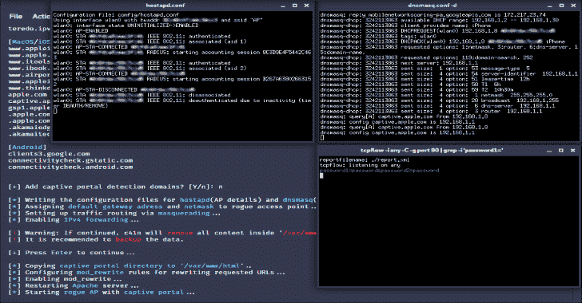

# C41N:自动化流氓接入点设置工具

> 原文：<https://kalilinuxtutorials.com/c41n/>

**c41n** 是一款自动化流氓接入点设置工具。 **c41n** 提供几种类型的流氓接入点的自动设置，以及邪恶的孪生攻击。

**It** 使用用户定义的特征(接入点的接口、名称和通道)设置接入点，为接入点设置 DHCP 服务器，并为用户提供 HTTP 流量嗅探功能，或使用凭据嗅探设置强制网络门户。

**安装**

安装包括克隆 repo、运行将安装依赖项的脚本，以及使 **c41n** 可执行。脚本只适用于 apt 包管理器(基于 Debian 的发行版)。

**# git 克隆 https://github.com/MS-WEB-BN/c41n/
# CD c41n
# sudo bash install . sh
# sudo chmod+x c41n**

依赖项也可以通过 apt-get 包管理器(基于 Debian 的发行版)手动安装(没有脚本):

**# sudo apt-get install net-tools hostapd dnsmasq TCP flow**

**用途**

**c41n** 可以在交互和快速模式下运行。

在 ***交互模式*** 下运行 **c41n** :

**#。/c41n**

**快速模式**:

启动流氓 AP:

**#。/c41n < AP 接口> <互联网连接接口> < AP 名称> < AP 通道>**

启动流氓 AP +嗅探 HTTP 流量:

**#。/c41n 嗅探< AP 接口> <互联网连接接口> < AP 名称> < AP 通道>**

启动流氓 AP +强制网络门户:

**#。/c41n 圈养< ap 接口> <互联网连接接口> < AP 名称> < AP 通道> <重定向参数>**

重定向参数可以有以下值:

0:仅重定向预定义的域。1:重定向所有流量。domains_file:重定向预定义的域+指定文件中的域(由新行分隔)。

**例子**:

[ **1** 在 wlan0 接口上启动流氓 AP，从 eth0 接口路由流量，AP 名称:' AP '，AP 通道:' 1 '

**#。/c41n wlan0 eth0 AP 1**

[ **2** ]启动流氓 AP 并嗅探 wlan0 接口上的 HTTP 流量，路由来自 wlan1 接口的流量，AP 名称:' Access_Point '，AP 信道:' 6 '

**#。/c41n 嗅探 wlan0 wlan1 接入点 6**

[ **3** ]使用 wlp6s0 接口上的强制网络门户启动 Rogue AP，从自定义文件(/home/name/Documents/domains . txt)重定向默认域和域，从 eth1 接口路由流量，AP 名称:“路由器”，AP 通道:“9”

**#。/c41n 受控 wlp6s0 eth1 路由器 9/home/name/Documents/domains . txt**

**免责声明**

使用 **h4rpy** 完成的任何动作和/或活动都由您全权负责。滥用 **h4rpy** 可能导致相关人员受到刑事指控。如果有人因滥用 **h4rpy** 违法而被提起刑事诉讼，作者将不负任何责任。