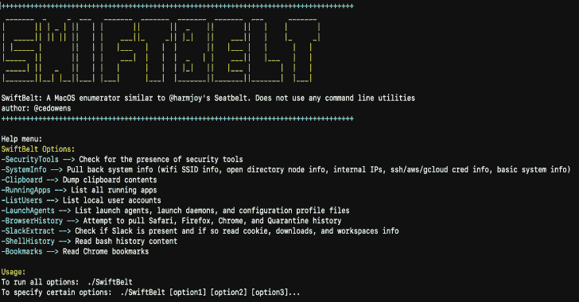

# SwiftBelt:一个受 Harmjoy 的 Windows 启发的 macOS 枚举工具

> 原文：<https://kalilinuxtutorials.com/swiftbelt/>

**SwiftBelt** 是一个 macOS 枚举器，灵感来自@harmjoy 基于 Windows 的安全带枚举工具。SwiftBelt 不使用任何命令行实用程序，而是使用 Swift 代码(利用 Cocoa 框架、基础库、OSAKit 库等。)来执行系统枚举。

一旦您获得对 macOS 主机的访问权，就可以利用这一点来执行枚举。我有意不包括任何导致弹出的功能(例如:钥匙圈枚举)。

感谢 Ramos04 贡献代码寻找各种目标 See 工具和 mattreduce 贡献代码为 zshell 历史以及 azure creds。

**步骤**

您可以在此 repo 的根目录下运行随附的 SwiftBelt mach-o 二进制文件，也可以编辑 Swift 代码并重新构建新的二进制文件。

*   **使用附带的马赫数:**
    *   注意:我没有签署包含的 mach-o。因此，您需要采取以下步骤来删除隔离属性以便运行:下载后，复制到所需的主机并清除隔离属性($ xattr -c SwiftBelt)并设置为可执行($ chmod +x SwiftBelt)
    *   要查看帮助菜单:。/SwiftBelt -h

**帮助菜单**

*   **SwiftBelt 选项:**
    *   **安全工具**–>检查是否有常用的 macOS 安全工具(至少是我熟悉的那些)
    *   **system info**–>拉回系统信息(wifi SSID 信息、open directory 节点信息、内部 IPs、ssh/aws/gcloud/azure-cli cred 信息、基本系统信息)。如果主机上有，该工具将显示 ssh 密钥、已知主机文件、aws 凭证文件和 gcloud 令牌信息的内容
    *   **剪贴板**–>转储剪贴板内容
    *   **running apps**–>列出所有正在运行的应用
    *   **列表用户**–>列出本地用户账户
    *   **启动代理**–>列出启动代理、启动守护进程和配置文件
    *   **browser history**–>尝试获取 Safari、Firefox、Chrome 和隔离历史记录(仅供参考:如果 Chrome 或 Firefox 正在运行，该工具将无法读取锁定的数据库来提取信息)
    *   **Slack extract**–>检查是否存在 Slack，如果存在，读取 cookie、下载和工作区信息(利用科迪·托马斯的研究)
    *   **shell history**–>读取 shell (Bash 或 Zsh)历史内容
    *   **书签**–>读取 Chrome 保存的书签

**用途**

*   要运行所有选项:。/SwiftBelt
*   指定某些选项:。/swift belt[选项 1][选项 2][选项 3]…

*   **举例:*。/SwiftBelt-system info-Clipboard-security tools…***

*   **编辑 Swift 代码并重建您自己的 mach-o:**
    *   在 Xcode 中打开 SwiftBelt 的 xcodeproj 文件
    *   根据需要在 Xcode 中编辑 main.swift 代码中的代码
    *   从终端 cd 进入 SwiftBelt 目录并运行:“swift build”以生成二进制文件。二进制文件将被放到。SwiftBelt 文件夹内的构建/调试文件夹，并将被命名为 SwiftBelt
    *   复制到所需的主机并清除隔离属性($ xattr -c SwiftBelt)并设置为可执行($ chmod +x SwiftBelt)
    *   执行

**检测**

尽管此工具不使用任何命令行实用程序(很容易检测到)，但它确实会从系统上的几个文件中读取数据，这些数据可以被任何利用端点安全框架的工具检测到(这些文件读取数据尤其会被 ESF 内的 ES_EVENT_TYPE_NOTIFY_OPEN 事件捕获)。

[**Download**](https://github.com/cedowens/SwiftBelt)