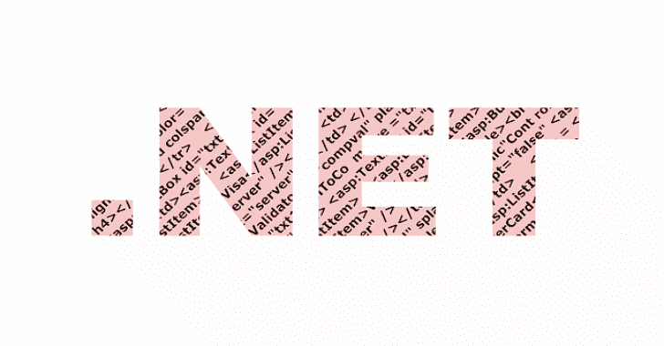

# NashaVM:一个虚拟机。NET 文件&它的运行时是用 C++/CLI 编写的

> 原文：<https://kalilinuxtutorials.com/nashavm/>

莎娜是一个虚拟机。NET 文件及其运行时是在 [C++/CLI](https://en.wikipedia.org/wiki/C%2B%2B/CLI) 中制作的

**安装**

**git 克隆 https://github.com/Mrakovic-ORG/NashaVM–递归
cd NashaVM\NashaVM
nuget 恢复
msbuild**

**依赖关系**

*   [dnlib](https://github.com/0xd4d/dnlib)
*   [。NET 框架 4.0](https://www.microsoft.com/pt-br/download/details.aspx?id=17851)
*   [Visual C++可重用](https://www.microsoft.com/en-us/download/details.aspx?id=48145)

**已知问题**

*   与基于 Linux 的操作系统不兼容

**常见问题解答**

*   这个项目是为了什么？
    *   这个项目是为了保护和隐藏混合引擎中的托管操作码，使逆向工程师更难查看或篡改您的应用程序。
*   这个项目会被维护吗？
    *   部分是。它已经发布，因此在社区的帮助下，我们可以使项目成长和改进。
*   莎娜是代码混淆者吗？
    *   不，莎娜是一个指令虚拟机，这意味着它可以被解释为混淆器，而不是。您的代码将受到保护，但方式不同。
*   我能做些什么？
    *   如果您有问题，您可以开一张票，我们将调查有问题的问题。
    *   如果你没有编程知识但你愿意支持你可以在**BC 1 qfedg 6 qty 0 l 8 hk 8 qu 9d 4 akj 86 MH 7 yqfwzcjvn 7**(BTC)捐款
    *   如果你愿意用这个回购制作你自己的项目，[遵循设置和安装指南](https://github.com/Mrakovic-ORG/NashaVM#Installation)并确保信任我们的工作，否则你将面临 **Mrak 杀人犯**所有笑话分开，因为我们是由 [GNU](https://github.com/Mrakovic-ORG/NashaVM/blob/master/LICENSE) 许可证授权的，严格禁止个人这个项目而不披露来源。
    *   你也可以加入我们的 [Discord 服务器](https://discord.gg/JhCWDF4)

[**Download**](https://github.com/Mrakovic-ORG/NashaVM)