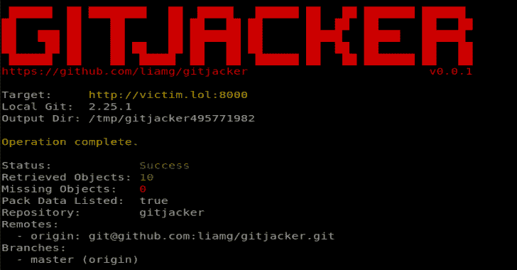

# GitJacker:从错误配置的网站泄漏 Git 库

> 原文：<https://kalilinuxtutorials.com/gitjacker/>

**Gitjacker** 下载 git 库，并从错误上传了`.git`目录的站点中提取它们的内容。即使目录列表被禁用，它仍将设法恢复存储库的重要部分。

仅用于教育/渗透测试。

更多信息请访问 https://Liam-galvin . co . uk/security/2020/09/26/leaking-git-repos-from-misconfigured-sites . html

**安装**

**curl-s " https://raw . githubusercontent . com/limg/git jacker/master/scripts/install . sh " | bash**

…或者抓取一个[预编译的二进制文件](https://github.com/liamg/gitjacker/releases)。

您需要安装`git`才能使用 Gitjacker。

[**Download**](https://github.com/liamg/gitjacker)