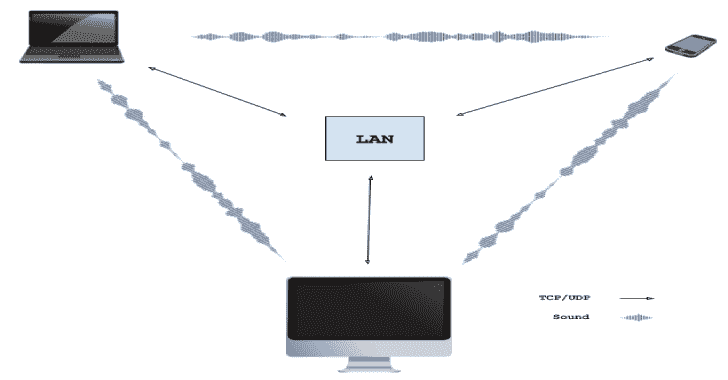
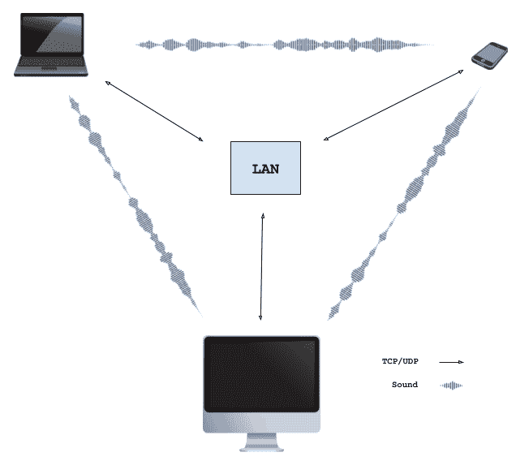

# Wave-Share:通过声音进行无服务器、点对点、本地文件共享

> 原文：<https://kalilinuxtutorials.com/wave-share/>

使用声音的 **WebRTC** 信令的概念验证。适用于所有带麦克风和扬声器的设备。在浏览器中运行。

附近的设备通过一系列音频信号交换必要的会话描述协议(SDP)数据来协商 **WebRTC** 连接。协商成功后，在浏览器之间建立本地 WebRTC 连接，允许通过 LAN 交换数据。

观看实际操作(2 分钟视频):

[https://www.youtube.com/embed/d30QDrKyQkg?feature=oembed&enablejsapi=1](https://www.youtube.com/embed/d30QDrKyQkg?feature=oembed&enablejsapi=1)

它是如何工作的？

WebRTC 技术允许运行在不同设备上的两个浏览器相互连接并交换数据。不需要安装插件或下载应用程序。为了启动连接，对等体交换联系信息(ip 地址、网络端口、会话 id 等)。).这个过程被称为“发信号”。WebRTC 规范没有定义任何信令标准——联系交换可以通过任何协议或技术来实现。

在这个项目中，信号是通过声音发出的。信号序列看起来像这样:

*   对等体 A 通过将会话数据编码成音频音调来广播对 WebRTC 连接的提议
*   附近的对等体捕获对等体 A 发出的声音，并解码 WebRTC 会话数据
*   想要与对等体 A 建立连接的对等体 B 用音频应答来响应。答案中编码了对等体 B 的联系信息。此外，对等体 B 开始尝试连接到对等体 A
*   对等体 A 接收来自对等体 B 的应答，解码传输的联系数据，并允许对等体 B 连接
*   连接已建立

所描述的信令序列不涉及信令服务器。因此，使用通过声音的信令的应用可以例如由静态网页提供服务。唯一的要求是控制音频输出/捕获设备。

当前方法的一个明显的限制(特征)是只有附近的设备(例如，在同一房间内)可以彼此建立连接。此外，这些设备必须连接在同一个本地网络中，因为 NAT 不可用。

**声音发送/接收**

通过声音传递的数据包含初始化 WebRTC 连接所需的联系信息。该数据以[会话描述协议(SDP)](https://en.wikipedia.org/wiki/Session_Description_Protocol) 格式存储。由于声载数据在带宽和健壮性方面有很大的限制，所以希望传输尽可能少的数据。因此，SDP 被从所有不相关的信息中剥离，并且仅传输建立连接所需的必要数据。目前，包含最小所需 SDP 数据的声音包具有以下格式:

| 大小，[B] | 描述 |
| --- | --- |
| one | SDP 的类型–提供还是回答 |
| one | 以字节表示的数据包大小(不包括 ECC 字节) |
| four | 传输对等方的 IP 地址 |
| Two | 将用于通信的网络端口 |
| Thirty-two | 会话数据的 SHA-256 指纹 |
| Forty | ICE 凭证–16 字节用户名+ 24 字节密码 |
| Thirty-two | 用于在发送期间纠正错误的 ECC 纠正字节 |

音频包的总大小是 112 字节。利用当前的音频编码算法，SDP 包可以在 5-10 秒内传输(取决于所使用的 Tx 协议)。使用较慢的协议可以在嘈杂的环境中或通信设备相距较远的情况下提供更可靠的传输。

**数据到声音编码**

目前的方法使用多频[频移键控(FSK)](https://en.wikipedia.org/wiki/Frequency-shift_keying) 调制方案。要传输的数据首先被分成 4 比特的块。在每个时刻，使用 6 个音调传输 3 个字节，每个 4 位数据块一个音调。这 6 个音调在 4.5 千赫的范围内发出，分成 96 个等间距的频率:

| 频率，[赫兹] | 值，[位] | 频率，[赫兹] | 值，[位] | … | 频率，[赫兹] | 值，[位] |
| --- | --- | --- | --- | --- | --- | --- |
| `F0 + 00*dF` | 区块 0: `0000` | `F0 + 16*dF` | 组块 1: `0000` | … | `F0 + 80*dF` | 组块 5: `0000` |
| `F0 + 01*dF` | 区块 0: `0001` | `F0 + 17*dF` | 组块 1: `0001` | … | `F0 + 81*dF` | 组块 5: `0001` |
| `F0 + 02*dF` | 区块 0: `0010` | `F0 + 18*dF` | 组块 1: `0010` | … | `F0 + 82*dF` | 组块 5: `0010` |
| … | … | … | … | … | … | … |
| `F0 + 14*dF` | 区块 0: `1110` | `F0 + 30*dF` | 组块 1: `1110` | … | `F0 + 94*dF` | 组块 5: `1110` |
| `F0 + 15*dF` | 区块 0: `1111` | `F0 + 31*dF` | 组块 1: `1111` | … | `F0 + 95*dF` | 组块 5: `1111` |

对于所有协议:`dF = 46.875 Hz`。对于非超声协议:`F0 = 1875.000 Hz`。对于超声波协议:`F0 = 15000.000 Hz`。

**获取本地 IP 地址**

为了方便起见，使用了一个简单的 WebRTC hack 来自动检测您机器的本地 IP 地址，因此您不必手动提供。然而，出于安全原因，最新的 WebRTC 规范阻止了这种可能性，因此在某些时候，这种“特性”将在所有浏览器中停止工作。例如，[在 Safari](https://stackoverflow.com/questions/46925857/get-the-client-ip-address-with-javascript-on-safari) 上不再起作用。

**建造**

*   **网页组装模块`wave.wasm`**

您将需要一个 Emscripten 编译器。此外，你需要用 Emscripten 建造的 [FFTW](http://www.fftw.org) 。运行`compile.sh`脚本。

*   **CLI 工具`wave-share`**

这是一个简单的工具，使用解释过的`wave-share` sound tx/rx 协议接收和发送数据。在标准输入上键入一些文本，然后按回车键进行传输。

**#build
git 克隆 https://github.com/ggerganov/wave-share
CD wave-share&&mkdir build&CD build
cmake..
使

#运行
。/wave-share**

下面是演示如何使用 CLI 工具的简短视频:

[https://www.youtube.com/embed/TcfjCMCyqF0?feature=oembed&enablejsapi=1](https://www.youtube.com/embed/TcfjCMCyqF0?feature=oembed&enablejsapi=1)

**需要改进的已知问题/材料**

*   不适用于:IE、IE Edge、iOS 上的 Chrome/Firefox、macOS 上的 Safari
*   超声波传输在大多数设备上不起作用。大概是硬件限制？
*   存在多个本地网络时，当前无法选择使用哪一个。总是使用第一个
*   传输过程中偶尔会有声音断裂。需要优化 Tx 代码
*   生成的 emscripten 的大小。js 太大(~1MB)。用纯 JS 重写？
*   在移动设备上，使用 Firefox，即使在关闭标签页后，页面仍然可以在后台运行

[**Download**](https://github.com/ggerganov/wave-share)