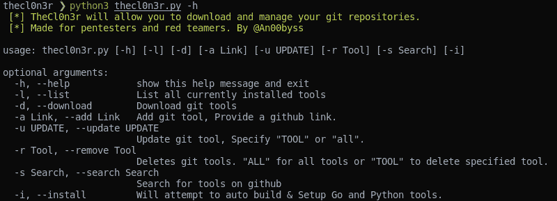
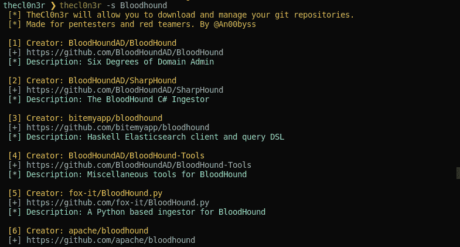
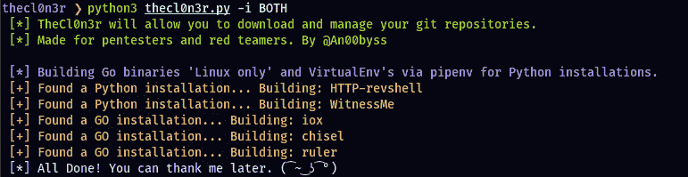
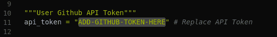

# 用于下载和管理 Git 库的工具

> 原文：<https://kalilinuxtutorials.com/thecl0n3r/>

Cl0n3r 将允许您下载和管理您的 git 库。在我的体验中，大约 90%的渗透测试工具主要可以在 github 上找到。这样做的目的是让下载、更新和删除这些 git 库变得更容易。如果转移到一个新的测试系统，让转移正在使用的相同工具集变得更简单。

**用途**

**搜索 Github**

**列出当前安装的工具**

**构建 GO 二进制文件&安装 Python 工具**

**特性**

*   下载 repos
*   更新回购
*   删除回购
*   搜索 github repos
*   安装 Go 和 Python 工具。
*   保持一切井然有序
*   包括一些基本的入门工具

**快速设置**

*   如果您在中已经有了正在使用的工具列表，只需将它添加到 clon 3 r 目录下的 tool_list.txt 文件中，然后“python 3 the clon 3 r . py-d”
*   当移动到新系统时，只需复制 tool_list.txt 文件并重新下载… Cake😉

**要求**

*   Python3
*   Pipenv
*   去
*   Github 访问令牌

**安装管道**

*   [https://pypi.org/project/pipenv/](https://pypi.org/project/pipenv/)

**安装 GO**

*   [https://golang.org/doc/install](https://golang.org/doc/install)

**安装**

**git 克隆 https://github.com/an00byss/TheCl0n3r
CD the clon 3 r
pip 3 install-r requirements . txt
python 3 the clon 3 r . py**

**注**

必须将 Github 访问令牌添加到“api_token”变量中。

[**Download**](https://github.com/an00byss/TheCl0n3r)