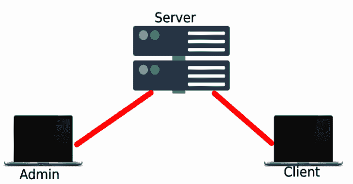
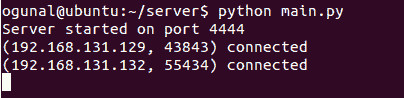
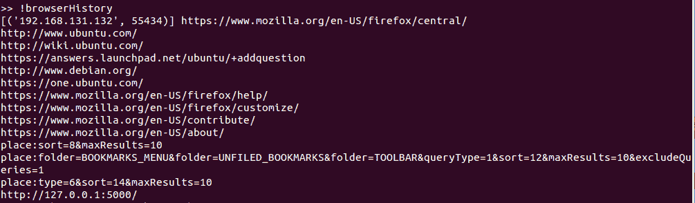

# 简单的实时数据收集

> 原文：<https://kalilinuxtutorials.com/simple-live-data-collection/>

简单的实时数据收集。

它是如何工作的？

*   构建服务器
*   通过管理员和客户端连接到服务器
*   要收集信息，通过管理员将请求发送到服务器，然后发送到客户端

**安装**

**git 克隆 https://github.com/LetsDefend/Simple-Live-Data-Collection**

**服务器**

**光盘服务器
python main.py**

**管理员**

**cd 管理
python main.py**

**客户端**

**cd 客户端
python main.py**

更改 main.py 文件中的“HOST”变量

**截图**

[**Download**](https://github.com/LetsDefend/Simple-Live-Data-Collection)