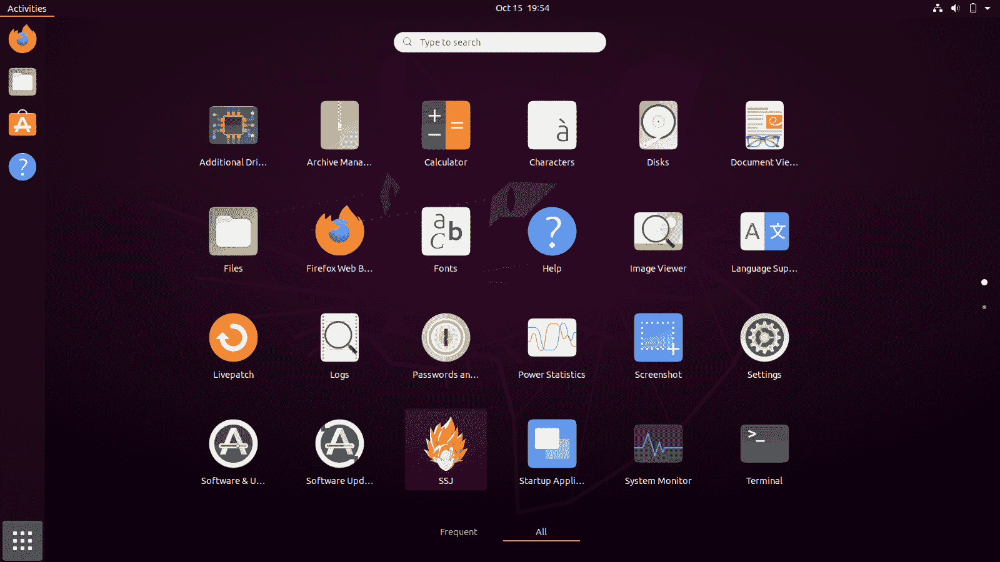
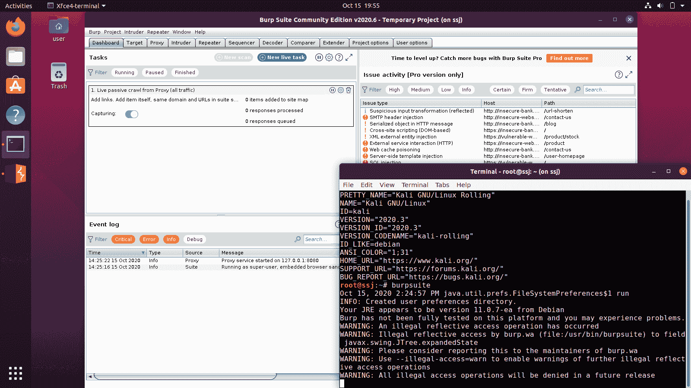
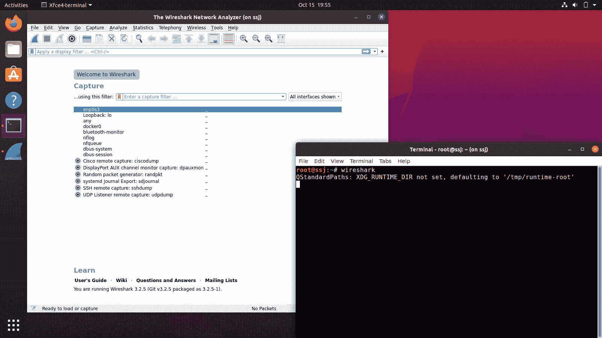
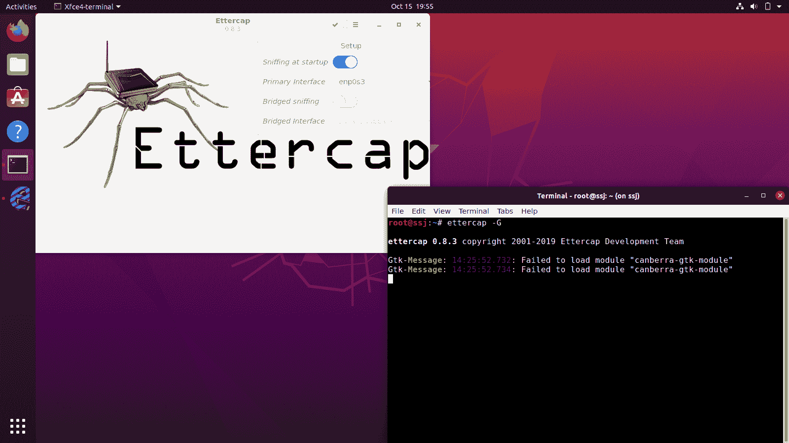
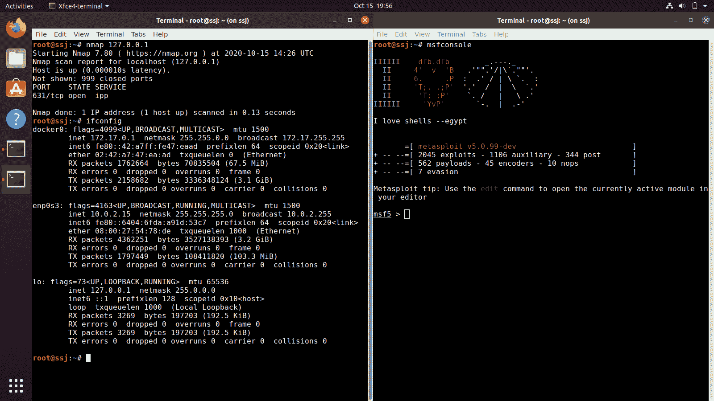
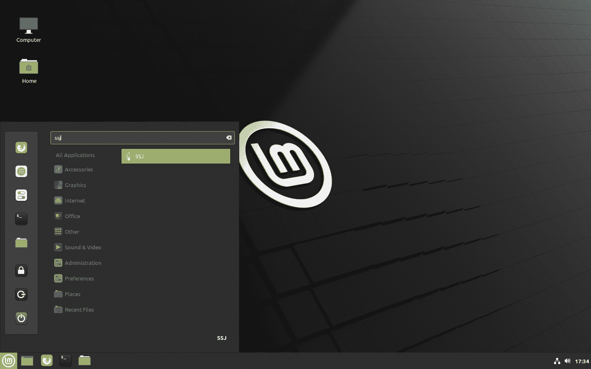
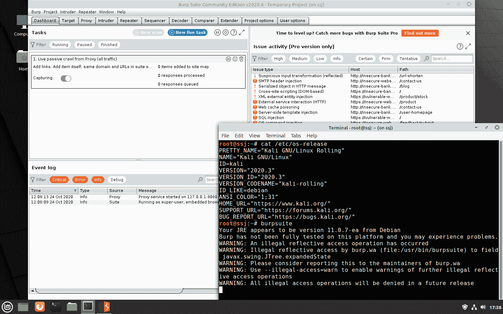
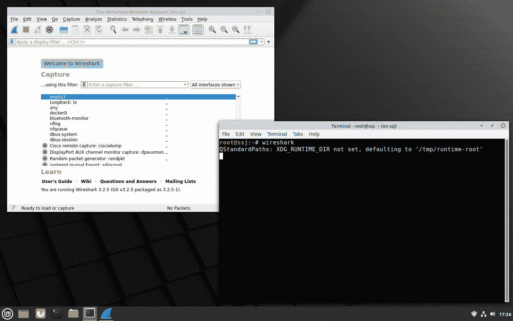
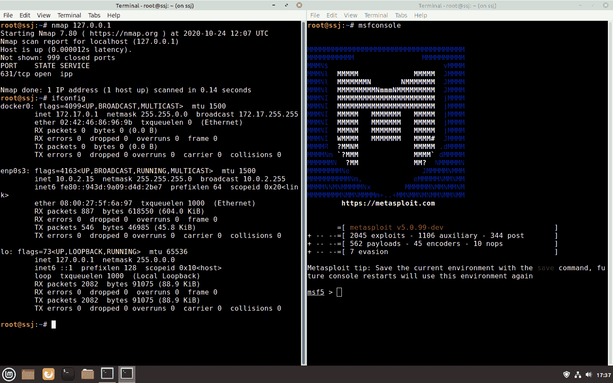

# 超级喷机:Linux 发行版变成了超级赛亚人

> 原文：<https://kalilinuxtutorials.com/ssj/>

**超级喷机**是一个愚蠢的小脚本，它利用了安装在你日常 Linux 发行版(Ubuntu，Debian 等)上的 [Docker](https://www.docker.com/) 。)并用数百种渗透测试和取证工具神奇地武装了它。所有这些都以几乎本机的性能运行(因为容器利用了主机操作系统的内核),因此在速度、性能和便利性方面是虚拟机的一个稍好的替代方案。

**技术细节**

超级喷机是一个 Docker 映像，它使用 [Kali Linux](https://www.kali.org/) 基本映像`kalilinux/kali`，并在其上安装`kali-linux-large`元包。它使用`kali.download/kali`镜和`kali-last-snapshot`分支。它还允许您运行 GUI 应用程序，如 Burpsuite、Wireshark、Ettercap 等。通过使用`--privileged`容器功能并在`xhost`中添加一个通用访问控制，可以从日常 Linux 发行版的容器中进行访问。这个脚本提取/构建 Docker 映像，并为您创建一个`.desktop`文件(应用程序启动器),启动运行容器。所以，你唯一需要做的就是，在你的应用抽屉/菜单中找到超级喷机，点击它来启动它。一个`terminator`终端会弹出，里面有你所有的测试和取证工具。执行`burpsuite`来启动代理，`wireshark`来启动包分析器等等，您可以访问 Kali Linux 中的数百个工具和包(尤其是`kali-linux-large`元包)，就在您的日常 Linux 发行版中。此外，与虚拟机相反，虚拟机要么在虚拟 NAT 后联网，要么与主机操作系统一起桥接，超级喷机按原样利用主机网络堆栈(使用`--net=host`)，这意味着超级喷机容器将像主机 Linux 分发版一样直接访问所有网络接口，并且还将共享相同的 IP 地址。

**先决条件**

*   Docker(用户必须在`docker`组中)
*   互联网连接

**安装**

*   **快速安装:**

`**wget https://raw.githubusercontent.com/thirdbyte/ssj/main/ssj_quick.sh -O /tmp/ssj.sh && chmod +x /tmp/ssj.sh && sudo /tmp/./ssj.sh**`

这可能需要不同的时间，取决于你的网速。它从重约 4G 的 Docker Hub 中提取 Docker 图像。这种方法快速、可靠，值得推荐。

运筹学

*   **构建安装:**

`**wget https://raw.githubusercontent.com/thirdbyte/ssj/main/ssj_build.sh -O /tmp/ssj.sh && chmod +x /tmp/ssj.sh && sudo /tmp/./ssj.sh**`

这可能需要不同的时间，取决于你的网速。它在本地构建映像，这需要下载`kali-linux-large`元包中所有重约 3G 到 4G 的包。这种方法速度较慢，不确定，不推荐使用，但在用户不信任预建的 Docker Hub 映像的情况下可能有意义。

**用途**

*   访问你的 Linux 发行版上的应用程序抽屉/菜单来找到超级喷机。
*   发射超级喷机。
*   将弹出一个`terminator`终端。
*   使用此终端，通过使用各自的包名执行工具来启动任何工具。举个例子:`msfconsole`、`burpsuite`、`wireshark`等。
*   您可以将任何文件保存在容器内的`/root`目录中，并在您的主机 Linux 发行版的`/home/ssj`中找到它。

**截图**

*   **测试于:** Ubuntu 20.04.1 LTS (GNOME)，Linux Mint 20 乌里雅娜(Cinnamon)
*   **注意**:下面的截图代表`xfce4-terminal`，现在被替换为`terminator`。

**插件**

*   [添加工具](https://github.com/thirdbyte/ssj-plugin-add-tools):一个方便的脚本，让你添加更多不属于`kali-linux-large`元包的工具到超级喷机。

**更新**

重做[安装](https://github.com/thirdbyte/ssj#installation)，如果你使用[添加工具](https://github.com/thirdbyte/ssj-plugin-add-tools)插件，你也需要重新执行`add-tools`脚本。

**故障排除**

*   作为一个滚动发布的发行版，Kali Linux 的库更新非常频繁。有时，当软件包被迁移到池中时，在试图使用 Build Install 命令构建映像或安装超级喷机时，您可能会发现一个`404`错误。目前解决这个问题的唯一方法是等待几个小时后再试，或者使用快速安装命令安装超级喷机。
*   因为容器以 root 用户权限运行，所以在`/root`目录中创建的文件的所有者被设置为 root。在主机 Linux 发行版上，这个目录是`/home/ssj`。在`/home/ssj`中的所有文件和子目录都需要主机 Linux 发行版的 root 用户，以防需要在这个目录中写入或删除任何数据。

**限制**

*   需要打补丁的内核的无线黑客工具，你可以在 Kali Linux 中找到的那种，将不能在超级喷机上工作。简单的原因是，超级喷机使用了您的主机 Linux 发行版的 Linux 内核，它没有被修补或修改来支持包注入。
*   超级喷机使用 Docker 的`--privileged`集装箱能力和`--net=host`网络。它还为`xhost`添加了一个通用访问控制，使 GUI 应用程序工作，但一旦超级喷机的`terminator`退出，它会立即关闭。这可能允许任何应用程序访问您的主机 Linux 发行版的 X 服务器或 GUI，特别是在超级喷机运行的时候，这对许多人来说是一个安全或隐私问题。
*   音频输出现在不工作。

[**Download**](https://github.com/thirdbyte/ssj)