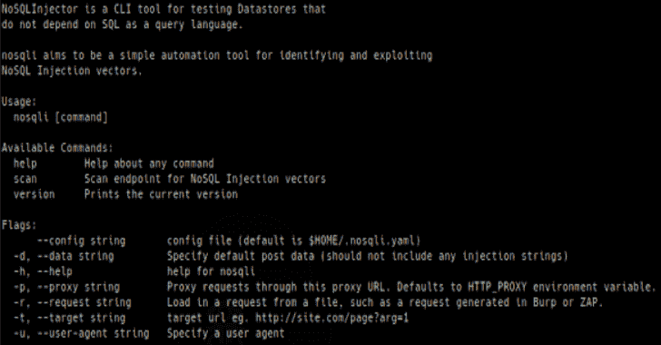

# no SQL:no SQL 注入 CLI 工具

> 原文：<https://kalilinuxtutorials.com/nosqli/>

**NoSQL1** 是 NoSQL 扫描仪和注射器。我想要一个更好的 nosql 注入工具，简单易用，完全基于命令行，可配置。为此，我开始开发 nosql——一个用 Go 编写的简单 no SQL 注入工具。

它的目标是快速、准确和高度可用，具有易于理解的命令行界面。

**特性**

nosql 目前支持 Mongodb 的 no SQL 注入检测。它运行以下测试:

*   基于错误——注入各种字符和有效载荷，搜索已知 Mongo 错误的响应
*   布尔盲注入–注入具有真/假有效载荷的参数，并尝试确定是否存在注入
*   定时注入——尝试在服务器中注入定时延迟，以测量响应。

**安装**

[为您的操作系统下载最新的二进制版本](https://github.com/Charlie-belmer/nosqli/releases)，并安装在您的路径中，或者从本地文件夹运行。

**路线图**

我计划添加数据提取功能。如果您想查看其他功能或配置选项，请提出请求或问题！

**使用 nosqli**

只需运行该命令并阅读帮助文件，它就可以自我记录下来。

**$ no sqli**

**no SQL injector**是一个 CLI 工具，用于测试
不依赖 SQL 作为查询语言的数据存储。nosqli 旨在成为一个简单的自动化工具，用于识别和利用
NoSQL 注入向量。

**用法:**
nosqli【命令】

**可用命令:**
帮助关于任何命令
扫描 NoSQL 注入向量的扫描端点
版本打印当前版本

**标志:**
–config 字符串配置文件(默认为＄HOME/. no sqli . YAML)
-d，–数据字符串指定默认 post 数据(不应包含任何默认为 HTTP_PROXY 环境变量。
-r，–从文件请求中加载请求字符串，例如在 Burp 或 ZAP 中生成的请求。
-t，–目标字符串目标 url 例如 http://site.com/page?arg=1
-u，–用户代理字符串指定用户代理

**使用“no sqli[command]–help”了解有关命令的更多信息。**

**$ no SQL 扫描**-t http://localhost:4000/user/lookup？username=test
运行基于错误的扫描…
运行基于布尔的扫描…
发现基于错误的 NoSQL 注入:
URL:http://localhost:4000/user/lookup？= &用户名=测试
参数:用户名
注入:用户名= '

您可以使用我的漏洞节点 js 应用程序或其他 nosql 注入实验室来测试该工具。

**从源构建**

如果您喜欢从源代码构建，或者没有适合您的平台的编译二进制文件，您可以通过克隆存储库、安装依赖项和手动构建项目来实现。这将需要一个最新的 Go 版本和适当的 GOPATH 环境变量。

**$ git 克隆 https://github.com/Charlie-belmer/nosqli
$ CD no sqli
$ go get。/..
$去安装
$ nosqli -h**

**运行测试**

有一个体面的测试套件包括在内。单元测试和简单的注入覆盖可以通过使用根目录中的 go test 来运行:

**去测试。/…**

还提供集成测试，针对本地运行的已知易受攻击的应用程序运行注入。要使用集成测试，安装并运行来自 [digininja](https://digi.ninja/projects/nosqli_lab.php) 的[vulnerable nodejs Mongo injection app](https://github.com/Charlie-belmer/vulnerable-node-app)和我的 [vulnerable PHP 实验室 fork](https://github.com/Charlie-belmer/nosqlilab) 。然后传入集成标志:

**去测试。/… -args -integrations=true**

如果没有找到任何一个环境，集成测试将被其中一个测试用例禁用，以加速测试运行。

[**Download**](https://github.com/Charlie-belmer/nosqli)