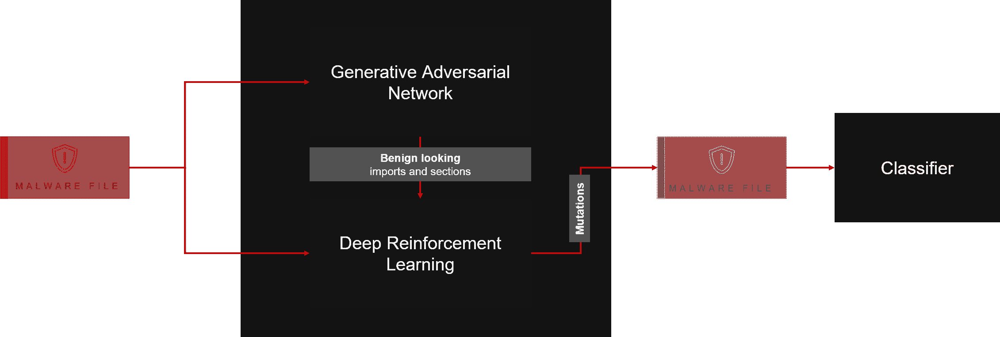

# 有害的:使用深度强化学习和 GANs 的恶意软件变异

> 原文：<https://kalilinuxtutorials.com/pesidious/>

该工具的目的是使用人工智能来变异恶意软件(仅 PE32)样本，以绕过人工智能驱动的分类器，同时保持其功能完整。在过去，在该领域中已经做了显著的工作，研究人员将强化学习或生成对抗网络视为他们选择的武器，以修改恶意软件可执行文件的状态，从而欺骗反病毒代理。我们的解决方案结合使用深度强化学习和 GANs，以克服独立使用这些方法时面临的一些限制，如下所示。

在这里找到我们工具[的完整文档](https://vaya97chandni.gitbook.io/pesidious/)

**安装说明**

> ⚠️由于该工具处理恶意软件文件，强烈建议使用虚拟机。安装工具后，请确保断开网络连接。

以下步骤将指导您完成设置环境所需的所有安装。

*   [安装并设置 Python 3.6。](https://realpython.com/installing-python/)
*   克隆存储库。git 克隆 https://github.com/CyberForce/Pesidious
*   移动到项目目录。cd 害虫
*   [使用 Python 3.6 设置和激活虚拟环境](https://docs.python.org/3/tutorial/venv.html)建议使用虚拟环境，以避免不同应用程序使用的包之间的冲突
*   确保您已经安装并设置了 pip 8.1.1。这是因为 pip 的较新版本不能很好地与 PyTorch 库一起使用。pip 安装 pip==8.1.1
*   通过安装 requirements.txt 文件，安装所有需要的库。pip install-r pip _ requirements/requirements . txt

让你的恶意软件变异

来自 GAN 的输出已经被存储为( **`RL_Features/adverarial_imports_set.pk`和`RL_Features/adverarial_sections_set.pk`** )，这将在向恶意软件添加导入和部分以进行突变时使用。

*   您可以测试样本分类器来对恶意软件文件进行评分。`**python classifier.py -d /path/to/directory/with/malware/files**`
*   运行`**mutate.py**` python 脚本来变异你的恶意软件样本。`**python mutate.py -d /path/to/directory/with/malware/files**`
*   变异后的恶意软件文件将以以下格式存储在名为 Mutated_malware 的目录中`**Mutated_malware/mutated_<name-of-the-file>**`
*   一旦恶意软件文件变异，您可以再次运行分类器来对变异的恶意软件进行评分。`**python classifier.py -d Mutated_malware/**`

**已知问题&修复**

> ⚠️警告:该路段目前正在建设中。我们对造成的任何不便表示歉意。请进入下一部分。[点击这里](https://github.com/CyberForce/Pesidious#to-do)

1.  给你一个错误。解决方案:`**pip install tqdm pip install sklearn pip install lief**`
2.  **ModuleNotFoundError:运行 **`python main_malgan.py`脚本时没有名为‘tensorboardX’**的模块出错。解决方案:`pip install tensorboardX`**
3.  **执行 import-append、section-append 时出错(未找到)**解决方案在您的终端上使用以下命令授予这些可执行文件执行权限`**cd portable-executable/ chmod 777 project-add-sections/bin/Debug/project-append-section chmod 777 project-add-imports/bin/Debug/project-append-imports**`

**用**建造

*   [py Torch](https://pytorch.org/)——基于 Torch 库的开源机器学习库。
*   [利夫](https://github.com/lief-project/LIEF)–一个跨平台的库，可以解析、修改和抽象 ELF、PE 和 MachO 格式。
*   [PE Bliss](https://github.com/BackupGGCode/portable-executable-library)–PE libarry 用于重建 PE 文件，用 C++编写。
*   [健身房——恶意软件](https://github.com/endgameinc/gym-malware/)——open ai 的健身房的恶意软件操控环境。
*   [MalwareGAN](https://github.com/ZaydH/MalwareGAN)–利用 GANs 生成恶意软件。

**作者**

*   **钱德尼·瓦亚**–*X-Force 事件响应，IBM 安全*–[Github](https://github.com/Chandni97)
*   **贝当森**–*X-Force 事件响应，IBM 安全*–[Github](http://github.com/bedangSen/)

**致谢**

*   健身房-恶意软件环境:[https://github.com/endgameinc/gym-malware](https://github.com/endgameinc/gym-malware)。修改环境以添加 GAN，并添加/更改/删除突变以提高恶意软件的隐蔽性并保持功能。
*   赖燕明([)](https://github.com/yanminglai/Malware-GAN))和
*   zayd Hammoudeh()在 Han 和 Tan 的 MalGAN 上的实现工作对我们理解架构起到了至关重要的作用。这个项目中使用的 MalGAN 的大部分实现都是从 Hammoudeh 的工作中派生出来的。

[**Download**](https://github.com/CyberForce/Pesidious)