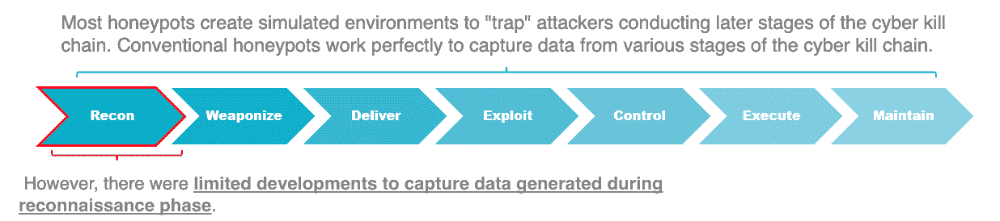
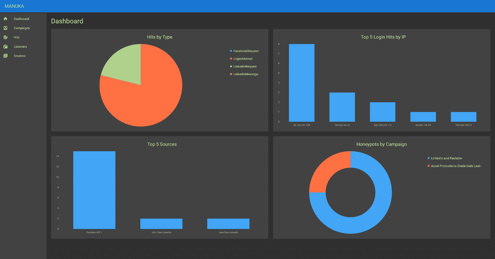
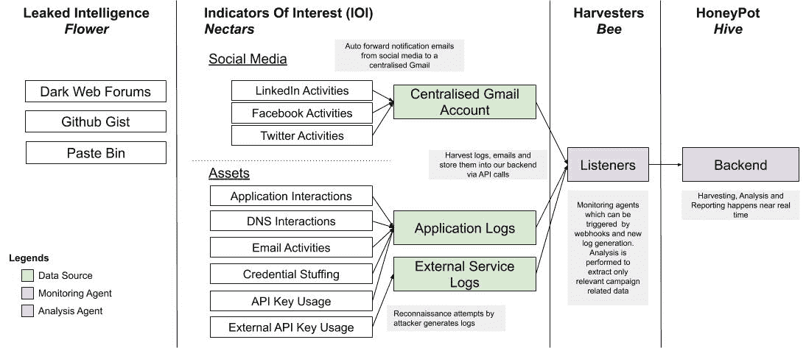
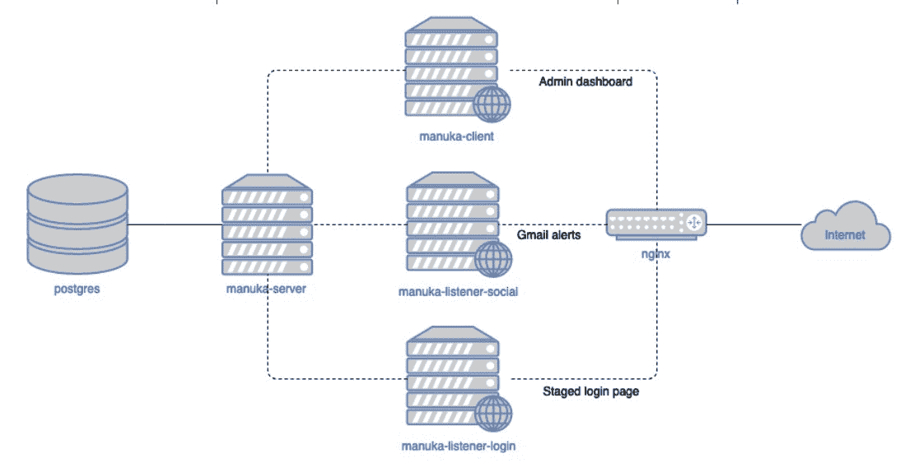

# Manuka:为蓝方队员设计的模块化 OSINT 蜜罐

> 原文：<https://kalilinuxtutorials.com/manuka/>

**Manuka** 是一个开源情报(OSINT)蜜罐，监控威胁行为者的侦察企图，并为蓝方队员生成可操作的情报。它创建了一个模拟环境，由分阶段的 OSINT 源组成，如社交媒体档案和泄露的凭据，并跟踪对手利益的迹象，密切配合米特的前 ATT & CK 框架。麦卢卡让蓝队在进攻前的侦察阶段有了额外的视野，并为防守者发出预警信号。

尽管它们在规模和复杂程度上有所不同，但大多数传统蜜罐都专注于网络。这些蜜罐在网络杀伤链的第 2 阶段(武器化)到第 7 阶段(针对目标的行动)发现攻击者，假设攻击者已经在探测网络。

Manuka 在网络杀伤链的第一阶段(侦察)进行威胁检测。尽管在网络防御上投入了数百万美元，但组织机构很容易通过一次谷歌搜索就被攻破。最近的一个例子是黑客通过公开网络上留下的缩放电话暴露了公司会议、治疗会议和大学课程。企业需要检测其外围环境中的这些威胁，但缺乏这样做的工具。

Manuka 是按比例制造的。用户可以很容易地添加新的监听器模块，并将它们插入到 Dockerized 环境中。他们可以同时协调多个活动和蜜罐，以扩大蜜罐表面。此外，用户可以快速定制和部署 Manuka，以适应不同的使用情况。Manuka 的数据旨在方便地移植到组织工作流程中的其他第三方分析和可视化工具。

由于 OSINT 技术的复杂性和广泛性，设计 OSINT 蜜罐是一个新的挑战。然而，这种工具将允许蓝队队员在其网络威胁情报战略中“左移”。

**仪表板**

**工具设计**

**架构**

Manuka 建立在以下关键条款和流程的基础上。

*   来源:可能的信息载体，如社交媒体资料、暴露的凭据和泄露的源代码。
*   监听器:监视与攻击者交互的源的服务器。
*   点击率:感兴趣的指标，如试图使用泄露的凭据登录和社交媒体上的连接。
*   蜜罐:组织成单个活动的源和收听者的组，该活动分析并跟踪一段时间内的点击。

**系统设计**

框架本身由几个 Docker 容器组成，这些容器可以部署在一台主机上。

*   manuka-server:中央 Golang 服务器，执行 CRUD 操作并接收听众的点击。
*   manuka-listener:模块化 Golang 服务器，可以执行不同的监听器角色。
*   manuka-client: React dashboard，供蓝队管理 manuka 的资源。

这些容器通过一个 docker-compose 命令进行编排。

**开发**

在开发过程中，组件在各自容器中的以下端口上运行:

*   **`manuka-client` : `3000`**
*   **`manuka-server` : `8080`**
*   **`manuka-listener` : `8080`**

为了允许客户端和服务器在没有 CORS 问题的情况下进行对话，`**localhost:8080**`代理上的一个额外的 nginx 层将 **`/api/`传递到`manuka-server`和`/`到`manuka-listener`。**

此外，`**manuka-listener**`在以下端口上运行:

*   `8081`对于阶段性登录网页
*   `8082`用于与暂存邮件交互

**要求**

请参见各个组件库以了解它们的需求。

*   `docker >= 19.03.8`
*   `docker-compose >= 1.25.4`
*   `ngok >= 2.3.35`

**配置**

*   用 Postgres 的密码在`**docker/secrets/postgres_password**`中创建一个文件。
*   为 Gmail 设置 Google 帐户，以接收来自社交媒体档案的电子邮件。
*   在[https://console.cloud.google.com/cloudpubsub](https://console.cloud.google.com/cloudpubsub)上设置谷歌云发布/订阅，以实现推送电子邮件功能(指南:[https://developers.google.com/gmail/api/guides/push](https://developers.google.com/gmail/api/guides/push))。该指南还将提供创建云项目的说明。
*   用您的项目凭证创建文件`**docker/secrets/google_credentials.json**`。
*   将在云发布/订阅上创建的话题添加到 **`docker/secrets/google_topic`。**
*   为您的 Google 帐户获取一个 oauth2 令牌。Manuka 在第一次运行时需要 oauth2 令牌。随后，它会自动刷新令牌。将令牌保存在**中`docker/secrets/google_oauth2_token.json`。**

**运行**

*   `**docker-compose -f docker-compose.yml -f docker-compose-dev.yml up --build --remove-orphans**`
*   初始化`**manuka-listener**` gmail 推送服务:
    *   初始化 ngok `**./ngok http <manuka-listener port>**`并记下 https URL。
    *   在 Google PubSub dashboard 左侧菜单上，转到*订阅* - > *<订阅名称>->*编辑订阅*，并将端点 URL 更改为*<ngok https URL>/通知*。*
    *   尝试从另一个帐户向目标 Gmail 帐户发送电子邮件。你应该在`ngrok`控制台上看到`POST /notifications 200 OK`，在对接控制台上看到`Received push notification`。

**生产**

在生产中，以下端口映射到这些服务器:

*   `8080`:`/`的`manuka-client`和`/api`的`manuka-server`
*   `80`:`/`的`manuka-listener-login`和`/notifications`的`manuka-listener-social`

这允许任何指向您的服务器的域显示为假登录页面，而管理仪表板在端口`8080`可用。此外，管理仪表板在`nginx`层受到 HTTP 基本认证的保护。

**要求**

请参见各个组件库以了解它们的需求。

*   `docker >= 19.03.8`
*   `docker-compose >= 1.25.4`
*   `ngok >= 2.3.35`

**配置**

1.  类似于开发的配置，确保所有的秘密和 Google Cloud 设置都到位。请注意，订阅 URL 现在应该位于 **`http://DOMAIN/notifications`。**
2.  将您的域名指向您的服务器 IP。
3.  将`**docker/nginx/nginx.prod.conf.example**`复制到`**docker/nginx/nginx.prod.conf**`，并用您的生产域替换`**examplecompany.com**`。
4.  运行`**init-letsencrypt.sh**`来生成您的 SSL 证书。

**运行**

*   `**COMPANY_NAME='Next Clarity Financial' NGINX_USERNAME=username NGINX_PASSWORD=password docker-compose -f docker-compose.yml -f docker-compose-prod.yml up --build --remove-orphans -d**`
    *   `NGINX_USERNAME`和`NGINX_PASSWORD`将成为您的仪表板基本认证。
    *   `COMPANY_NAME`将假冒的公司名称登录页面。

**当前支持的监听器**

*   社交监听监控脸书和 LinkedIn 上的社交活动。目前支持网络连接尝试的通知。请注意，受监控的社交媒体帐户应启用电子邮件通知。从社交媒体平台接收电子邮件通知的相应电子邮件帐户应配置为将这些电子邮件转发到集中的 gmail 帐户。
*   登录监听器监视使用蜜罐站点上泄漏的凭证的尝试登录。

[**Download**](https://github.com/spaceraccoon/manuka)