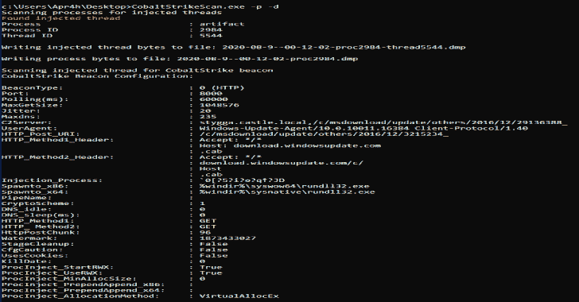
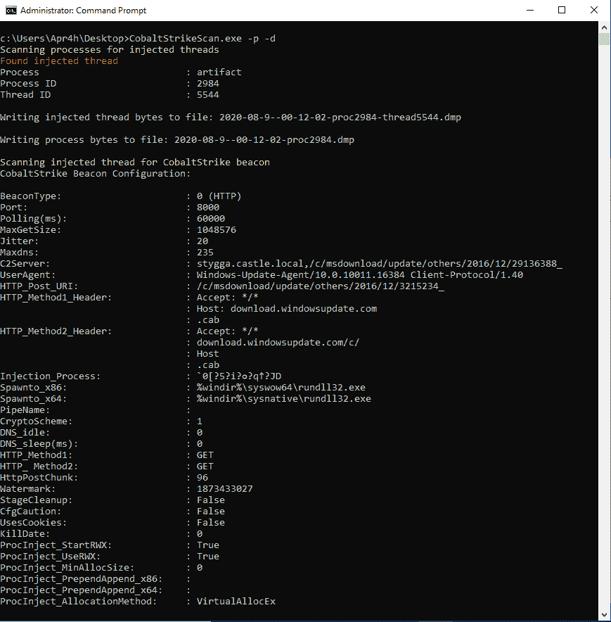

# Cobalt Strike 扫描:扫描文件或进程内存中的 CobaltStrike 信标并解析它们的配置

> 原文：<https://kalilinuxtutorials.com/cobalt-strike-scan/>

扫描文件或进程内存中的**钴击**信标并解析它们的配置。

**CobaltStrikeScan** 扫描 Windows 进程内存以寻找 DLL 注入(经典或反射注入)的证据，并对目标进程内存执行 YARA 扫描以寻找 Cobalt Strike v3 和 v4 信标签名。

或者，CobaltStrikeScan 可以对由绝对或相对路径作为命令行参数提供的文件执行相同的 YARA 扫描。

如果在文件或进程中检测到 Cobalt Strike 信标，信标的配置将被解析并显示到控制台。

**克隆此回购**

CobaltStrikeScan 包含 [GetInjectedThreads](https://github.com/Apr4h/GetInjectedThreads) 作为子模块。确保在克隆 CobaltStrikeScan 时使用`git clone --recursive https://github.com/Apr4h/CobaltStrikeScan.git`，以便子模块的代码也被下载/克隆。

**构建解决方案**

木香。Fody 被配置为将 CobaltStrikeConfigParser.dll 和 GetInjectedThreads.dll 嵌入到编译后的 ConsoleUI.exe 程序集中。ConsoleUI.exe 应该是静态的，便携式版本的 CobaltStrikeScan。要实现这一点，请确保在构建时将“活动解决方案平台”设置为 x64，并且在构建 ConsoleUI 项目之前构建 CobaltStrikeConfigParser 和 GetInjectedThreads 项目。Fody 可以找到需要嵌入的 dll。

**致谢**

该项目受到以下研究/文章的启发:

*   [SpecterOps——防守者也用图形思考](https://posts.specterops.io/defenders-think-in-graphs-too-part-1-572524c71e91)
*   [jp cert–用于检测钴撞击的易失性插件](https://blogs.jpcert.or.jp/en/2018/08/volatility-plugin-for-detecting-cobalt-strike-beacon.html)
*   [sentinel labs——APT 攻击的剖析和 CobaltStrike Beacon 的编码配置](https://labs.sentinelone.com/the-anatomy-of-an-apt-attack-and-cobaltstrike-beacons-encoded-configuration)

**要求**

*   64 位 Windows 操作系统
*   。NET 框架 4.6
*   需要 Administrator 或 SeDebugPrivilege 来扫描进程内存中注入的线程

**用途**

**-d，**-Dump-processes 在检测到注入线程时将进程内存转储到文件
**-f，**-Scan-file 扫描文件/进程转储中的 CobaltStrike 信标
**-i，**-注入线程扫描运行(64 位)进程中的注入线程(不会扫描 CobaltStrike 信标)
**-p，**-Scan-processes 扫描运行进程中的注入线程和 CobaltStrike 信标
**-v，**
**–版本**显示版本信息。

**例子**

[**Download**](https://github.com/Apr4h/CobaltStrikeScan)