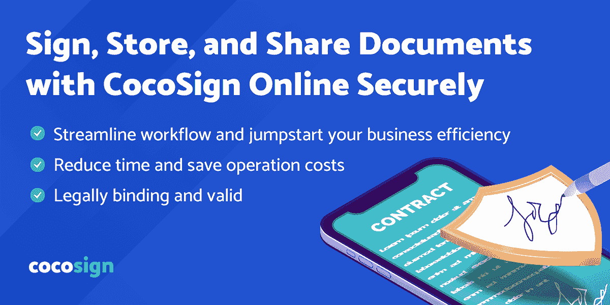

# 你的独立承包人协议应该包括哪些内容？

> 原文：<https://kalilinuxtutorials.com/what-should-be-included-in-your-independent-contractor-agreement/>

在任何商业伙伴关系中，合同都是必不可少的，但对于独立承包人来说尤其重要:

*   合法保护
*   发展权利和义务，
*   &概述要执行的服务

听起来雇佣一个独立的承包商为你工作应该很容易。你只要握握手就可以了，对吗？没有什么复杂的文件像你需要雇用员工。

不一定。就像在任何其他商业伙伴关系中一样，为了避免冲突和潜在的诉讼，有必要定义合作的条件。在这种形式的合同中，你可以加入一些重要的词语。

# 什么是独立承包商？

独立承包人(IC)拥有自己的公司或业务，向人们提供服务。基本的规则是，如果付款人对工作的结果有权力，但没有什么将被执行或如何执行。

通常按项目与客户打交道的小企业主是独立承包商，通常被称为顾问或自由职业者。为了承包商和客户的安全，在编制工作方案时，应制定全面的法律合同协议。

# 与 IC 的交易包括什么？

解释你的协议的时刻是工作关系的开始，最简单的方法就是把一切都写下来。如果你不把它写下来，你将会在假设上工作，而这些认知会导致复杂，最终会导致昂贵而耗时的诉讼。

独立承包人协议必须包括几个重要部分。

## **关于项目的一切**

描述将要执行的工作的细节。“这确保了所有各方就项目的性质达成一致。例如，承包商和客户的责任都包括哪些内容。如果有书面合同就更好了。您也可以在 coSign 上使用[书面独立承包商协议表格。](https://cocosign.com/agreement-template/independent-contractor/)

CocoSign 是一家声誉良好的 SAAS 提供商，帮助其用户使用免费的商业合同，并在安全的环境中在线签名。

## **了解术语**

这是每一份合同的重要部分，它定义了有关各方的名称和细节。它还提供了关于项目和/或要开展的活动的日期和目标的信息。

要获得一些模板或根据需要使用它们，请访问 CocoSign。为了[了解更多信息](https://cocosign.com/features/)您可以访问网站&选择满足您所有需求并包含所有内容(需求、条款和合同的其他条款)的所需模板。

## **权利和义务**

独立承包商通常负责支付自己的社会福利、税收和健康保险。请在协议中记住这一点，以免除客户的任何责任:“承包商承担纳税申报和保险责任的所有责任。”

## **终止条款**

每份合同都应包含终止条款，允许客户或承包商提前 30 天发出书面通知，终止工作关系。“合同还应该包含违约条款:“如果在约定的付款日期后 30 天内获得赔偿，合同将无故终止。

## **合同期限**

工作安排的长度应在每份合同中具体规定。即使您没有项目完成的确切时间表，也可以估计估计的时间线或包括日期以标记交付阶段:

例如，承包商将与内部营销人员协调，以汇集研究成果，并创建一个年度全彩色研究。此外，预计完成时间表为 2 至 2.5 个月。

## **支付信息**

必须在合同中规定付款方式(根据完成的目标，在项目完成时，如果有约定的付款，等等)。

作为最佳实践，您可以创建 25%的初始付款和 75%的成功完成付款。

## **其他福利**

合同应提供一份声明，澄清承包商同意养老金或退休福利、健康保险、假期工资、病假工资、假期工资或通常由雇主提供的其他附加福利没有资格或无权享受。

## **保险**

合同措辞应明确规定公司不会向承包商提供责任保险、汽车责任保险或其他一般保险。

公司的责任保险单不会赔偿承包商。如果承包商对任何损坏或失败负责，该条款为您提供了保险。

# **结论**

对于你的每一个自由职业者，建立一个独立承包商安排将有助于确定要执行的工作，保护你在独立承包商为你的公司创造的资产中的利益，并为独立承包商-客户伙伴关系带来一致性，这是你和你的新自由职业者的目的。