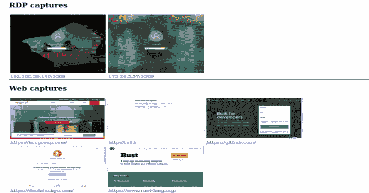
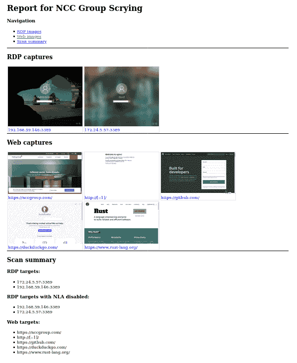

# 水晶球:一个在一个地方收集 RDP、网络和 VNC 截图的工具

> 原文：<https://kalilinuxtutorials.com/scrying/>

[](https://1.bp.blogspot.com/-cZpa6XBIy2E/X6BW6xT62PI/AAAAAAAAH6g/FOsC3WQ2jPA4EivGo58Z7RdovceBsN-8wCLcBGAsYHQ/s728/scrying-report%25281%2529.png)

水晶球是一个新工具，可以在一个地方收集 RDP、网络和 VNC 的截图。

这个工具仍在开发中，应该是最有用的，但还没有完成。请将任何 bug 或功能请求归档为 GitHub 问题

**注意事项**

*   网络截屏依赖于安装的 Chromium 或 Google Chrome

**动机**

自从目击者最近[放弃了对 RDP](https://github.com/FortyNorthSecurity/EyeWitness/issues/422#issuecomment-539690698) 的支持，就没有一个可以捕捉 RDP 截图的 CLI 工具了。Nessus 仍然可以工作，但是很难取出图像，而且它们没有包含在导出文件中。

我认为这是一个很好的机会来编写一个新的工具，比以前的工具更强大。查看功能列表！

**安装**

对于网络截屏来说，目前需要安装 Chromium 或 Google Chrome。为您的操作系统安装`pacman -S chromium`或等效软件。

从[的发布选项卡](https://github.com/nccgroup/scrying/releases)下载最新版本。有一个 Debian 包可用于使用它们的发行版(用`sudo dpkg -i scrying*.deb`安装)，以及用于 Windows、Mac 和其他 Linuxes 的压缩二进制文件。

**用途**

抓取单个网页、RDP 服务器或 VNC 服务器:

**$水晶石-t http://example.com
$水晶石-t rdp://192.0.2.1
$水晶石-t 2001:db8::5-mode web
$水晶石-t 2001:db8::5-mode RDP
$水晶石-t 192.0.2.2
$水晶石-t vnc://[2001:db8::53]:5901**

从 nmap 输出中自动抓取屏幕截图:

**$ nmap -iL targets.txt -p 80，443，8080，8443，3389-oX targets . XML
$ scrying–nmap targets . XML**

为图像选择不同的输出目录:

**$ scrying-t 2001:db8::3–output-dir/tmp/scrying _ outputs**

从目标文件运行:

**$ cat targets . txt**
http://example.com
RDP://192 . 0 . 2 . 1
2001:db8::5
**$ scyring-f targets . txt**

通过 web 代理运行:

**$水晶石-t http://example.com–网络代理 http://127.0.0.1:8080
$水晶石-t http://example.com–网络代理 socks5://\[::1\]:1080**

图像文件以 PNG 格式保存在以下目录结构中:

```
output
├── report.html
├── rdp
│   └── 192.0.2.1-3389.png
├── vnc
│   └── 192.0.2.1-5900.png
└── web
    └── https_example.com.png 
```

请看`output/report.html`的报道！

**特性**

旁边有记号的功能已经实现，其他功能有待完成

*   ✔️自动决定是否应该将输入视为网址或 RDP 服务器
*   如果输出目录不存在，✔️会自动创建输出目录
*   ✔️使用从主机/IP 获得的一致且唯一的文件名保存图像
*   ✔️完全支持 IPv6 和 IPv4 文字以及主机名
*   ✔️从文件中读取目标并决定它们是 RDP 还是 HTTP 或者使用提示
*   ✔️巧妙地从 Nmap 和 Nessus 输出中解析目标
*   ✔️http——在无头模式下使用 chrome/chrome
*   ✔️完全跨平台支持–在 Linux、Windows 和 Mac 上测试
*   ✔️制作了一个 HTML 报告，以便轻松浏览结果
*   ✔️越南公司
*   RDP-主要用于工作，不支持“普通 RDP”模式，参见 [#15](https://github.com/nccgroup/scrying/issues/15)
*   视频流–跟踪问题 [#5](https://github.com/nccgroup/scrying/issues/5)
*   文件名中的时间戳选项
*   从 msf services -o csv 输出中读取目标
*   RDP 用户名的光学字符识别，无论是现场或图像目录
*   NLA/授权测试凭据
*   解析 Dirble JSON 输出以抓取整个网站的截图——等待 [nccgroup/dirble#51](https://github.com/nccgroup/dirble/issues/51)

**示例 HTML 报告**

[**Download**](https://github.com/nccgroup/scrying)