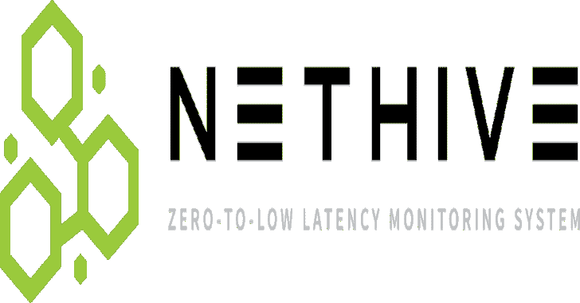
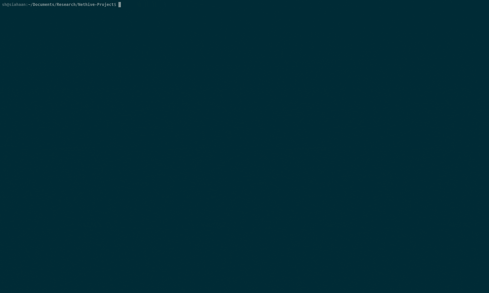

# Nethive 项目:SIEM 和 CVSS 基础设施的重组和协作

> 原文：<https://kalilinuxtutorials.com/nethive-project/>

Nethive 项目提供了一个安全信息和事件管理(SIEM)基础设施，由 T2 CVSS 自动测量系统授权。

**特性**

*   机器学习支持的 SQL 注入检测
*   基于 Chrome XSS 审计器的服务器端 XSS 检测
*   由 Auditbeat 支持的利用后检测
*   Bash 命令历史跟踪器
*   对检测到的攻击进行 CVSS 测量
*   由 Elasticsearch 和 Logstash 支持的实时日志存储
*   基本系统监控
*   足智多谋的仪表板 UI
*   通过电子邮件通知可疑活动

**安装**

安装前，请确保安装了 **[必备软件](https://github.com/chrisandoryan/Nethive-Project/blob/master/doc/user_guide.md#pre-requisites)** 。

您可以使用以下命令从 PyPi 软件包管理器安装 Nethive:

【即将推出！]

**或**

您可以使用最新的存储库安装 Nethive:

**$ git 克隆 https://github.com/chrisandoryan/Nethive-Project.git
$ CD Nethive-Project/
$ sudo bash install . sh
$ sudo pip 3 install-r requirements . txt**

如果以上任何一项失败，请确保安装了所有依赖项。更多详细信息，请参考[安装指南](https://github.com/chrisandoryan/Nethive-Project/blob/master/doc/user_guide.md)。

**快速启动**

*   获取并启动 **nethive-cvss** docker 容器`**$ git clone https://github.com/Falanteris/docker-nethive-cvss/ $ cd docker-nethive-cvss/ $ docker build -t nethive-cvss . $ ./cvss**`
*   启动 **Nethive** 并复制默认配置`**$ cd Nethive-Project/ $ cp .env.example .env**`
*   激活所有 **Nethive** 处理引擎:`**$ sudo python3 main.py**` 。
    在菜单提示上，选择**【3】运行这个东西**，然后等待引擎初始化。
*   启动 Nethive UI 服务器`**$ cd Nethive-Project/dashboard/ $ npm install && npm start**`
*   转到 [http://localhost:3000/](http://localhost:3000/)

[**Download**](https://github.com/chrisandoryan/Nethive-Project)