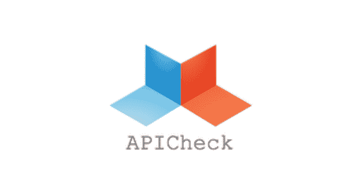
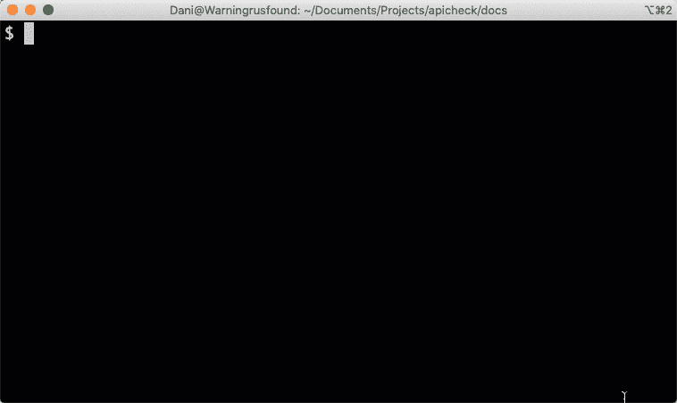

# API check:REST API 的 DevSecOps 工具集

> 原文：<https://kalilinuxtutorials.com/apicheck/>

`**APICheck**`是一个为测试 REST APIs 而设计和创建的完整工具集。

为什么选择 APICheck？

APICheck 不仅关注安全测试和黑客用例。该项目的目标是成为`DevSecOps`周期的完整工具集。

这些工具针对不同的用户配置文件:

*   开发商
*   系统管理员
*   安全工程师和渗透测试人员

APICheck **是一个环境**，用于集成现有的 HTTP APIs 工具并轻松创建执行链。设计时考虑了**集成第三方工具**。

APICheck 由一组工具组成，这些工具可以相互连接以实现不同的功能，具体取决于它们的连接方式。它允许你**创建执行链**

此页面包含当前可用工具的列表及其简要描述。

**作者** : APICheck 由 [BBVA 创新安全实验室](https://www.bbva.com/en/welcome-bbva-labs/)团队开发。

**执照**

APICheck 是开源软件，可以在 Apache 2 许可下使用。

[**Download**](https://github.com/BBVA/apicheck)