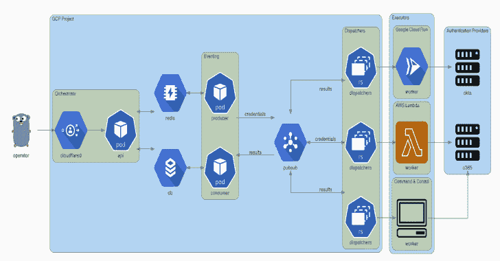

# Trident:自动密码喷射工具

> 原文：<https://kalilinuxtutorials.com/trident/>

[](https://1.bp.blogspot.com/-QmEIMmDRtEk/X6MPXxZn3BI/AAAAAAAAH8I/7SzrwvASUWYtjCnCbyw0YUaulcGDnoAvwCLcBGAsYHQ/s728/Architecture%25281%2529.png)

**Trident** 项目是为满足以下要求而开发的自动化密码喷涂工具:

*   能够部署在多个云平台/执行提供商上
*   根据目标帐户锁定策略安排喷洒活动的能力
*   出于操作安全目的，增加身份验证尝试来源的 IP 池的能力
*   快速扩展功能以包括新遇到的身份认证平台的能力

**架构**

> 该图表是使用[图表](https://diagrams.mingrammer.com)生成的。Go gopher 由 [Renee French](http://reneefrench.blogspot.com/) 设计，并由[CC 3.0](https://creativecommons.org/licenses/by/3.0)授权。

**部署**

部署 trident 需要一个 Google Cloud 项目、一个域名(用于 orchestrator API)和该域的 Cloudflare 访问配置。Cloudflare 访问用于对 orchestrator API 的请求进行身份验证。

brew 安装 cloud flare/cloud flare/cloud flare
brew 安装 terraform

cd 平台
cloudflared 登录
平台初始化
平台计划
平台应用

**安装**

Trident 在[发布](https://github.com/praetorian-inc/trident/releases)页面有一个命令行界面。或者，您可以通过`go get`下载并安装`trident-client`:

GO111MODULE=on 去找 github.com/praetorian-inc/trident/cmd/trident-client

**用途**

**配置**

`**trident-client**`二进制文件向编排器发送 API 请求。它从`**~/.trident/config.yaml**`中读取，格式如下:

orchestrator-URL:https://trident.example.org
提供商:
okta:
子域:示例
adfs:
域:adfs.example.org
o365:
域:login.microsoft.com

**活动**

使用有效的`config.yaml`，`trident-client`可用于创建密码喷涂活动，如下所示:

trident-client campaign-u usernames . txt-p passwords . txt–间隔 5s–窗口 120s

`**--interval**`选项允许操作员在凭证尝试之间插入延迟。`**--window**`选项允许操作员设置活动的硬停止时间。其他参数记录如下:

**用法:**
trident-CLI campaign[Flags]

**Flags:**
-a，–auth-provider string 这是您正在攻击的认证平台(默认为“okta”)
-h，–help campaign
-I，–interval duration 请求将在它们之间的这个间隔内发生(默认为 1s)
-b，–not before string 请求不会在此时间之前开始(默认为“2020-09-09T22:31:

**结果**

`results`子命令可用于查询结果表。此子命令有几个选项，但默认显示所有活动的所有有效凭据。

```
$ trident-client results
+----+-------------------+------------+-------+
| ID | USERNAME          | PASSWORD   | VALID |
+----+-------------------+------------+-------+
|  1 | alice@example.org | Password1! | true  |
|  2 | bob@example.org   | Password2! | true  |
|  3 | eve@example.org   | Password3! | true  |
+----+-------------------+------------+-------+
```

*   其他参数记录如下:

**用法:**
trident-CLI results[Flags]

**Flags:**
-f，–filter string 对 db 结果进行过滤(在 json 中指定)(默认为' {"valid":true}')
-h，–help 对结果的帮助
-o，–output-format string 输出格式(table，csv，JSON)(默认为" table")
-r，–return string 您希望从结果中看到的字段列表(逗号分隔的字符串)(默认")

[**Download**](https://github.com/praetorian-inc/trident)