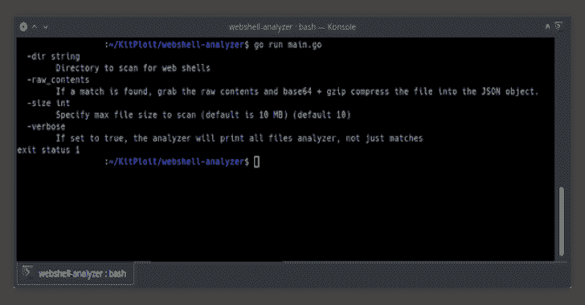

# Webshell 分析器:Web Shell 扫描器和分析器

> 原文：<https://kalilinuxtutorials.com/webshell-analyzer/>

**Webshell analyzer** 是一个跨平台的独立二进制程序，专门用于识别、解码和标记被怀疑是 Webshell 的文件。web shell analyzer 是 web shell scanner 项目(【http://github.com/tstillz/webshell-scan】)的老大哥，它只通过 regex 扫描文件，没有解码或属性分析。

### 特征

*   跨平台，静态编译二进制。
*   JSON 输出
*   目前支持大部分`PHP`、`ASP/X`web shell。`JSP/X`、`CFM`等类型正在酝酿中。
*   递归、多线程扫描，能够快速遍历嵌套目录
*   能够处理多层模糊的 web 外壳，如 base64、gzinflate 和 char 代码。
*   支持前置/后置操作，为分析引擎提供分层去混淆和解码功能
*   带有模块化接口的可调正则表达式逻辑，可轻松扩展分析仪的功能
*   可调属性标记
*   匹配时捕获原始内容
*   理论体系
*   针对 web shell 回购测试:[https://github.com/tennc/webshell](https://github.com/tennc/webshell)

**前/后动作**

扫描的每个文件都可以通过先行和/或后继操作运行:

*   **预解码:**执行匹配前调用的函数，如 base64 解码或字符串替换。
*   **后期解码:**进行匹配后调用的函数，如 url 去伪存真。

`PreDecodeActions`函数背后的思想是使用正则表达式识别匹配字符串或模式，获取其原始匹配内容，执行定义的解码/清除步骤，并将最终输出发送回分析引擎进行重新扫描/处理。一个非常简单的例子就是 Base64 解码。为了针对 base64 编码的 web shell 检查任何检测逻辑，我们必须首先删除 base64 的任何/所有层。为此，我们可以使用以下预解码操作:

{
名称:" PHP_Base64Decode "，
Regex: *regexp。MustCompile( `(?i)(?:=|\s+)(base64_decode\('('?\"?[A-Za-z0-9+\/=]+'?\"?))`)，
DataCapture: *regexp。MustCompile( `(?i)((?:'|")[A-Za-z0-9+\/=]+(?:'|"))`)，
预解码动作:[]cm。动作{
{功能:cm。StringReplace，Arguments: []interface{}{"\ "，""，-1}}，
{Function: cm。StringReplace，Arguments:[]接口{}{ " ' "，""，-1}}，
}，
函数:[]cm。Base_Func{cm。DecodeBase64}，
}，

**检测**

检测是一个带有名称和描述的正则表达式。该模型背后的想法是使检测模块化和可扩展，并与实际检测保持一致。检测与属性共享相同的格式，负属性不能生成检测，它们只能向现有的检测添加上下文。让我们看看下面的示例检测逻辑块:

{
名称:" Generic_Embedded_Executable "，
描述:"查找与 PE 文件关联的神奇字节"，
Regex: *regexp。MustCompile( `(?i)(?:(?:0x)?4d5a)`)，
}，

基于正则表达式，我们可以看到它正在寻找一个基于神奇的头字节`4D 5A`的嵌入式 Windows PE 文件。如果找到，这将导致检测，并为该文件生成 JSON 报告。目前，检测是基于文件扩展名或一般适用于所有文件类型。例如，PHP 的解码例程在`cm.GlobalMap.Function_Php`下定义，任一属性的标签在`cm.GlobalMap.Tags_Php`下定义。`cm.GlobalMap.Tags_Generics`下的功能`cm.GlobalMap.Function_Generics`和标签适用于所有 web shell 扩展。

**属性**

属性标记是我创建的一个新概念，它将“上下文”添加到现有的 web shell 检测中。单独的属性*目前不能*自己生成检测。在传统的扫描引擎中，扫描器仅在检测到 web 外壳时发出警报，但很少或根本不提供 web 外壳可能具有的功能(属性)的附加上下文。属性标签的工作原理与检测逻辑相同，但是它们仅在检测被识别后显示，并且不能自行生成检测。查看下面的示例逻辑:

厘米。GlobalMap.Tags_Php = []cm。TagDef{
{
名称:" PHP_Database_Operations "，
描述:"查找用于与数据库交互的常用 PHP 函数。"，
Regex: *regexp。MustCompile( `(?i)(?:'mssql_connect|mysql_exec\()`)，
属性:true，
}，
}

我们看到在 struct `Tags_Php`下，我们创建了一个新的 PHP 标签。当在扫描过程中发现匹配时，会检查`Attribute`标志，如果设置为`True`，检测到的 web shell 会将标签`PHP_Database_Operations`与频率和匹配的文本块一起附加到其 JSON 报告中，如下面的输出示例所示:

{
" file path ":"/testers/1 . PHP "，
"size": 66109，
" MD5 ":" 6793 D8 ebab 93 e 5a 0 f 91 e5a 331221 f 331 "，
"时间戳":{
"出生":" 2019-02-03 02:22:22 "，
"已创建":" 2020-07-29 02:50:15 "
" tags ":{
" Generic _ Embedding _ Code _ C ":{
" bind(":2，
"listen(": 2
}，
" PHP _ Banned _ Function ":{
" exec(":3，
"get_current_user(": 1，
"getmyuid(": 1，【T33 ")" link(":7，
"listen(": 2，
"passthru

这些标签不仅有助于定义 web shell 能做什么，而且有助于 IR 顾问等团队执行实时响应约定，这是潜在的下一步工作的支点。

**要求**

没有！只需为您的操作系统下载二进制文件，提供您希望扫描的目录(其他参数是可选的)，然后让它自行分解。

**运行二进制程序**

不带参数运行`wsa`会显示以下选项:

/Users/beastmode$。/wsa
选项:
-dir string
扫描 web shells 的目录
-raw_contents
如果找到匹配，抓取原始内容，base64 + gzip 将文件压缩到 JSON 对象中。
-size int
指定要扫描的最大文件大小(默认为 10 MB)(默认为 10)
-verbose bool
如果设置为 true，分析器将打印分析器的所有文件，而不仅仅是匹配的文件

唯一需要的参数是`dir`。如果愿意，您可以覆盖其他程序默认值。

分析仪的输出将被写入控制台(标准输出)。下面的例子(为了获得最佳结果，将 stdout 发送到一个 json 文件，并离线检查/提交进程):

Linux:。/wsa-dir/opt/www
Windows:wsa.exe-dir C:\ Windows \ Inetput \ wwwroot

# # #带 STDOUT 和完整 web shell 文件编码压缩:Linux:。/wsa-dir/opt/www-raw _ contents = true>scan _ results . JSON

分析器完成后，它会将整体扫描指标输出到 STDOUT，如下例所示:

{"scanned":311，" matches":122，" noMatches":189，" directory ":"/web shell-master/PHP "，" scanDuration ":1.475773737833333，" systemInfo":{"hostname":"Beast "，" envVars":[""]，" username":"beastmode "，" userID ":" 501 ", " realName ":" The Beast "，" userHomeDir ":"/Users/Beast mode " } }

**从源代码构建项目**

如果您决定修改源代码，您可以使用以下命令构建项目:

**cd <项目路径>**

**# # Windows**
GOOS = Windows go arch = 386 go build-o wsa32.exe main . go
GOOS = Windows go arch = amd64 go build-o wsa64.exe main . go

**# # Linux**
GOOS = Linux go arch = amd64 go build-o wsa _ Linux 64 main . go

[**Download**](https://github.com/tstillz/webshell-analyzer)