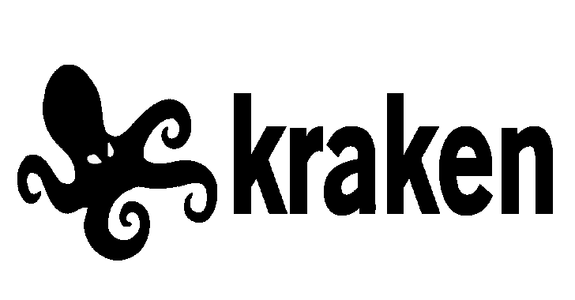
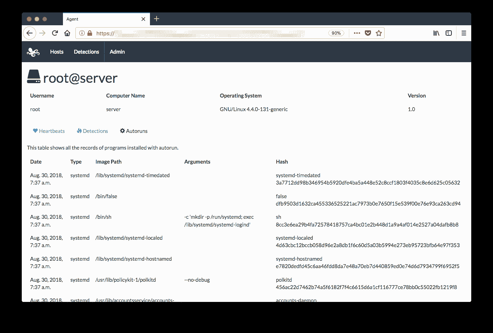

# 北海巨妖:用 Go 编写的跨平台 Yara 扫描仪

> 原文：<https://kalilinuxtutorials.com/kraken/>

北海巨妖是一个简单的跨平台 Yara 扫描仪，可用于 Windows、Mac、FreeBSD 和 Linux。它主要用于事件响应、研究和临时检测(*而非*用于端点保护)。以下是核心功能:

*   使用提供的 Yara 规则扫描正在运行的可执行文件和正在运行的进程的内存(利用 [go-yara](https://github.com/hillu/go-yara) )。
*   扫描为自动运行安装的可执行文件(利用 [go-autoruns](https://github.com/botherder/go-autoruns) )。
*   用提供的 Yara 规则扫描文件系统。
*   向配备了基于 Django 的 web 界面的远程服务器报告任何检测。
*   连续运行并定期检查新的自动运行，扫描任何新执行的进程。北海巨妖将在本地 SQLite3 数据库中存储事件，并将保留自动运行和检测到的可执行文件的副本。

一些功能仍在开发中或即将完成:

*   安装程序和启动器在启动时自动启动北海巨妖。
*   从服务器下载更新的 Yara 规则。

**截图**

**如何使用？**

使用任何可用选项启动北海巨妖:

**kraken 之圣:**
–后端字符串指定要连接到后端的特定主机名(覆盖默认设置)
–守护程序启用守护程序模式(这也将启用报告标志)
–调试启用调试日志
–文件夹字符串指定要扫描的特定文件夹(覆盖默认的完整文件系统)
–无自动运行禁用自动运行扫描
–无文件系统禁用文件系统扫描
–无进程禁用正在运行的进程扫描
–报告启用向后端报告事件

**用户指南**

有关如何安装、使用和构建北海巨妖的详细信息，您应该参考[用户指南](https://kraken.gitbook.io/user-guide/)。文档的原始源文件可在[这里](https://github.com/botherder/kraken-docs)获得，请在那里打开与文档相关的任何问题或拉式请求。

**执照**

北海巨妖以 GNU 通用公共许可证 v3.0 版本发布，版权归 T2 所有。

[**Download**](https://github.com/botherder/kraken)